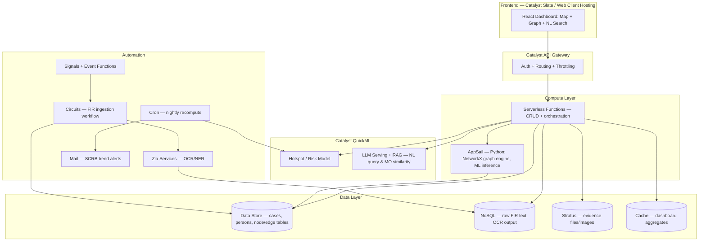
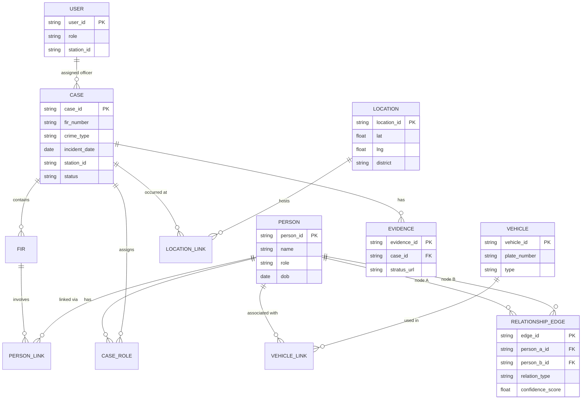

# CaseGraph — Karnataka Crime Intelligence Platform
**Datathon 2026 · Karnataka State Police × Hack2skill**
**Project Blueprint & Prototype Plan**
Team: Phoenix Coder · Round: Idea/Documentation Submission (11-day window)

> *One-liner:* CaseGraph turns fragmented, Excel-based crime records into a connected, queryable intelligence layer — geospatial hotspots, criminal link networks, and a natural-language investigation assistant, built entirely on the mandatory Zoho Catalyst stack.

---

## 0. How to use this document

This is written to double as (a) your idea-submission document for the current round and (b) the actual build spec for the prototype round after shortlisting. It's scoped for a 2-person, technically strong team working over ~11 days — not a 300-page enterprise fantasy. Anything speculative/beyond-scope is clearly labeled in Section 16 so you never confuse "nice slide" with "thing to actually build."

---

## 1. Executive Summary

**Problem (from the official brief):** Karnataka's SCRB manages crime data in Excel-based silos, with no systematic link analysis, no predictive/proactive tooling, and fragmented visibility across districts and stations.

**Solution:** CaseGraph is a single platform where:
1. Raw station-level data (including messy Excel exports) gets ingested and normalized.
2. Analysts see **geospatial hotspots** with time-layered patterns.
3. Investigators see a **criminal network graph** linking suspects, victims, locations, and vehicles across cases.
4. Anyone can **ask the platform questions in plain English** and get a filtered, explainable answer instead of building a pivot table.

**Why this can place top 3:** Judges have already seen plenty of "heatmap + ARIMA forecast" Streamlit dashboards for this exact brief (see Section 4). Very few will attempt real link analysis or a working NL assistant *and* get the mandatory Catalyst mapping right. Execution + compliance is your edge, not idea novelty.

---

## 2. Problem Statement (aligned to the official challenge)

- Data silos & manual Excel-based processes at station level.
- No AI-driven discovery of behavioral patterns, social interactions, or criminal networks.
- SCRB receives fragmented, delayed information — no state-wide comprehensive view.
- Policing is reactive; no systematic hotspot/trend detection for proactive deployment.

---

## 3. Naming — verdict + shortlist

You asked for something unique. Several options floating around (including ones I'd have naively suggested) already collide with real, named things in India:

| Rejected | Why |
|---|---|
| Project Trinetra | Already a real, nationally-covered AI predictive-policing project run by Akola Police, Maharashtra |
| Any "Netra"-based name | NETRA is DRDO's actual (and controversial) internet mass-surveillance system — wrong association for a citizen-centric pitch |
| Kavach / KavachAI | Already India's train-collision-avoidance system *and* CERT-In's cybersecurity app |
| Sentinel Intelligence Platform | Collides with Microsoft Sentinel, a major enterprise security product |
| Rakshak-anything | Generic + a near-identical-sounding Karnataka police hackathon project ("Rakshekanetra") already exists |

**Recommended: CaseGraph** — plain, explains itself in one sentence to a jury, low collision risk.
**Alternates, ranked:** CrimeLoom (weaving fragmented data into one fabric) · Setu Intelligence (bridge, between stations/districts/SCRB) · Vigil OS · CrimeAtlas.

I can only verify surface web/GitHub presence, not trademark registries — do a quick manual check before you lock it in. Find-and-replace "CaseGraph" throughout this doc if you pick a different one.

---

## 4. Competitive Landscape & Differentiation

| Existing project found | What it does | Gap CaseGraph closes |
|---|---|---|
| "Rakshekanetra" (Streamlit, built for Karnataka Police) | Google Maps + ML hotspot/crime prediction dashboard | No link/network analysis, no GenAI, not on the mandatory Catalyst stack |
| "karnataka_state_police_hackathon" repo (Flask) | ARIMA crime forecasting + heatmaps | Single-model forecasting only; no case-linking, no messy-data ingestion |
| predspot / GraphTrace (academic Python libraries) | KDE-based spatial hotspot detection algorithms | We borrow the *technique* (KDE + temporal features), not a finished product |
| Project Trinetra (Akola Police, Maharashtra) | Real, deployed repeat-offender risk scoring, with explicit anti-profiling safeguards | Different state; offender-risk only, no combined geospatial + network + NL-assistant platform |

**Takeaway:** the "hotspot dashboard" idea alone is table stakes this year. Link analysis + NL assistant + clean Catalyst compliance is your differentiation.

---

## 5. Feature Set (prioritized — you said "all three," so here's how to sequence it safely)

### P0 — Core (must work live in the demo, build first)
- **Data ingestion pipeline**: upload messy Excel/CSV station registers → validation → normalized schema. This directly attacks the brief's stated pain point and is a great "chaos → order" demo beat.
- **Auth & roles**: constable / SHO / SP / SCRB analyst see different dashboard views (Catalyst Authentication).
- **Base dashboard**: filters by district, station, crime type, date range.

### P1 — Differentiators (the three "wow" features, build in this order for risk management)
1. **Geospatial hotspot map** (safest, most standard — build first as your guaranteed-working fallback)
   - KDE-based hotspot detection + time-layered clustering (day/night patterns)
   - "Emerging trend" pulse indicator when a crime category spikes vs. historical baseline
2. **Criminal network / link-analysis graph** (medium difficulty, highest differentiation)
   - Node-edge graph of suspects/victims/locations/vehicles across cases
   - Community detection (Louvain) to surface possible gang structures
   - MO (modus operandi) matching to flag repeat-offender patterns across jurisdictions
3. **GenAI natural-language investigation assistant** (highest wow, highest risk — build last, scope it narrowly)
   - Officer types a plain-English query → converted to structured filters over Data Store
   - MO-similarity search: paste a new FIR narrative, get ranked similar past cases
   - **Fallback if time runs short:** ship a scoped keyword/template query bar instead of a fully open LLM chat — still demoable, much lower risk of live-demo failure.

### P2 — Nice-to-have if time allows
- Auto-generated PDF intelligence brief for SCRB (Catalyst SmartBrowz)
- Socio-economic overlay layer (population density, urbanization indicators)
- "Case Health Score" — simple rule-based or lightweight ML score on investigation completeness

### Explainability & ethics (don't skip — judges will ask)
- "Why this hotspot / why this risk score" panel showing contributing factors
- Explicit note (like Project Trinetra) that scores never use caste, religion, or community as features — human judgment stays central, AI only assists

---

## 6. System Architecture

**Key architectural decision:** Catalyst has no native graph database. Building link analysis on an external Neo4j instance would violate the "Catalyst is mandatory, third-party alternatives may affect submission validity" rule. Instead: node/edge tables live in **Data Store**, graph algorithms (centrality, community detection) run via **NetworkX inside AppSail**, and the result is rendered client-side with an open-source graph library (Cytoscape.js or react-force-graph — both MIT-licensed).

---

## 7. Data Model (draft — pending the official ERD)

> ⚠️ The Resources page links an official **"Entity Relationship Diagram — Database Design Document."** I don't have that file's contents, only your screenshot. Pull that PDF/doc from the portal and reconcile it against the draft below before you build — this is the single most important thing to fetch before writing code.

---

## 8. AI/ML Pipeline Design

### 8.1 Spatiotemporal Hotspot Prediction
- Preprocess: clean lat/lng, bucket by time-of-day + day-of-week.
- Hotspot detection: Kernel Density Estimation (KDE) over a grid, re-evaluated per period (the same core technique used in the academic `predspot`/`GraphTrace` approaches referenced in Section 4).
- Forecasting layer: gradient-boosted model (XGBoost/LightGBM) or Catalyst QuickML AutoML on engineered seasonal/trend features to project next-period risk per grid cell.
- Output: risk score per district/station, rendered as a heat layer + "emerging trend" pulse when current-period counts exceed historical baseline by a threshold.

### 8.2 Criminal Network / Link Analysis
- Build node/edge tables from case data: person↔person (co-accused, same address, same phone), person↔location (repeat locations), person↔vehicle.
- Run centrality (degree/betweenness) and community detection (Louvain) via NetworkX in AppSail to surface potential gang clusters and key "connector" individuals.
- Render with Cytoscape.js/react-force-graph; clicking a node drills into linked cases and MO history.

### 8.3 GenAI Natural-Language Investigation Assistant
- User query → Catalyst QuickML LLM serving, prompted to output a structured filter (crime type, location, date range, entities) rather than free text — this keeps it reliable and demo-safe.
- Structured filter executes against Data Store; results render on the existing dashboard (reuses your P0 filter UI — low extra engineering cost).
- MO similarity: embed FIR narratives (sentence-transformer style model), nearest-neighbor search for similar past cases — this is the RAG piece.

---

## 9. Zoho Catalyst Mapping (mandatory compliance table)

| Capability used | Catalyst service | Notes |
|---|---|---|
| Dashboard/SPA | Slate / Web Client Hosting | React frontend |
| API & business logic | Serverless Functions + API Gateway | Node.js or Python |
| Graph algorithms, ML inference | AppSail | Python: NetworkX, scikit-learn |
| Relational data (cases, persons, edges) | Data Store | Core schema, Section 7 |
| Raw/unstructured text, OCR output | NoSQL | Raw FIR text before parsing |
| Evidence files | Stratus | Photos, scanned documents |
| Hot dashboard aggregates | Cache | Precomputed hotspot layers |
| Hotspot/risk model | QuickML (AutoML/pipeline) | Section 8.1 |
| NL assistant + MO similarity | QuickML (LLM Serving/RAG) | Section 8.3 |
| OCR on scanned registers | Zia Services | Feeds ingestion pipeline |
| Auto-generated SCRB reports | SmartBrowz | P2 feature |
| Login/roles | Authentication | Section 5, P0 |
| Nightly hotspot recompute | Cron | Automation layer |
| New-FIR → OCR → link → alert workflow | Circuits + Signals | Event-driven ingestion |
| SCRB spike alerts | Mail | Trend alert notifications |
| CI/CD | Pipelines | If time allows |

Everything in this table maps to a service from the official capability list — no third-party substitutes, so this satisfies the mandatory-deployment rule directly.

---

## 10. Tech Stack Summary

- **Frontend:** React + Tailwind, Leaflet or deck.gl (maps), Cytoscape.js or react-force-graph (network graph), Recharts (charts)
- **Backend:** Catalyst Serverless Functions (Node.js for CRUD/API), Catalyst AppSail (Python/FastAPI for NetworkX + ML)
- **Data:** Catalyst Data Store (relational core), Catalyst NoSQL (raw/unstructured), Catalyst Stratus (files)
- **AI:** Catalyst QuickML (hotspot model + LLM/RAG)
- **Libraries to lean on (open source, MIT-licensed, no Catalyst conflict since they run inside your own compute):** NetworkX, scikit-learn/XGBoost, spaCy (NER on FIR text), sentence-transformers (embeddings), Cytoscape.js/react-force-graph, Folium/Leaflet

---

## 11. Open-Source Building Blocks Worth Reusing (don't reinvent these)

- **KDE-based hotspot technique:** conceptually the same approach as `predspot` (Araujo et al.) and `GraphTrace` — reuse the *method*, write your own implementation to keep it clean for submission.
- **Graph visualization:** react-force-graph or Cytoscape.js — both handle thousands of nodes smoothly in-browser, free and MIT-licensed.
- **Public data for demo/testing:** since real KSP data won't be available, use NCRB's published crime statistics or a synthetic dataset generated to match your Section 7 schema — do **not** scrape or use any dataset tied to real identifiable individuals for a public demo.

---

## 12. 11-Day Execution Plan (2-person team, both strong across web/ML/cloud)

| Days | Person A (web/full-stack lead) | Person B (ML/data lead) |
|---|---|---|
| 1 | Catalyst project setup, Data Store schema, Auth | Synthetic dataset generation matching schema |
| 2–3 | Dashboard shell, filters, map view | Excel/CSV ingestion pipeline + validation |
| 4–5 | Wire hotspot layer into map (P1.1) | Build KDE + forecasting model, QuickML pipeline |
| 6–7 | Graph UI (Cytoscape.js), node/edge CRUD | NetworkX centrality/community detection in AppSail |
| 8–9 | NL query bar UI + result rendering | QuickML LLM/RAG integration, MO similarity search |
| 10 | Full Catalyst-compliance pass (Section 9 checklist), polish, explainability panel | Same — joint QA pass together |
| 11 | Record demo, write/rehearse pitch, submit | Same |

Work in parallel tracks, sync daily. If Days 8–9 slip, fall back to the scoped keyword-filter version of the NL assistant (Section 5) rather than cutting it entirely — partial credit for a working simple version beats a broken ambitious one.

---

## 13. Ethical, Legal & Governance Notes

- No use of caste, religion, or community as model features — explicit design constraint, worth stating in the pitch (mirrors Project Trinetra's public safeguard).
- Data retention/anonymization notes for demo data — don't use real personal data for a public hackathon demo.
- Note DPDP Act (India's data protection law) awareness as a one-paragraph compliance statement — you don't need a full legal section, just show you thought about it.
- AI outputs are decision-*support*, not decision-*making* — human officer always in the loop.

---

## 14. Demo/Pitch Script Outline (~5–7 min)

1. Problem in 30 seconds (Excel silos, reactive policing) — use the SCRB's own language from the brief.
2. Live demo: upload a messy Excel file → watch it populate the dashboard (chaos→order beat).
3. Hotspot map: show a live emerging-trend pulse.
4. Network graph: click a suspect node, show linked cases across two "districts" — the moment judges remember.
5. NL assistant: type a real investigator-style question, get instant filtered results.
6. Close with the Catalyst compliance table (Section 9) — show you took the mandatory constraint seriously.
7. One slide: "Where this goes next" (Section 16) — ambition without overpromising.

---

## 15. Risks & Mitigations

| Risk | Mitigation |
|---|---|
| QuickML LLM/RAG setup takes longer than expected | Fallback to template/keyword filter bar (Section 5) |
| Real KSP data unavailable | Use synthetic dataset matching the official ERD schema |
| Live demo network/API failure | Record a backup video walkthrough alongside the live demo |
| Graph gets visually cluttered with too many nodes | Cap demo dataset to a curated, illustrative case cluster |
| Judges question AI bias in risk scoring | Have the explainability panel + no-profiling statement ready |

---

## 16. Vision / Future Roadmap (explicitly NOT built now — pitch-deck ambition only)

Clearly separated so you never confuse this with your actual build list: state-wide rollout across all Karnataka stations, cross-state crime correlation, national crime knowledge graph, drone/CCTV/body-camera integration, edge AI, federated intelligence across states. Mention in one slide as long-term vision — do not attempt to architect or build any of this for the submission.

---

## 17. Open Items — Things to Do Before/While Building

- [ ] Pull the official ERD/Database Design Document from the Resources page and reconcile against Section 7
- [ ] Claim your Zoho Catalyst credits early (link on the Resources page) so you're not blocked on Day 1
- [ ] Confirm final product name (Section 3) and do a manual trademark/App-store sanity check
- [ ] Confirm whether this round wants a written doc only, or also a working link/repo — re-check the Submissions tab as the deadline approaches
- [ ] Decide on synthetic vs. NCRB-derived demo dataset

---

*Prepared as a working blueprint — edit freely, this is meant to be a living build doc, not a static submission PDF.*
