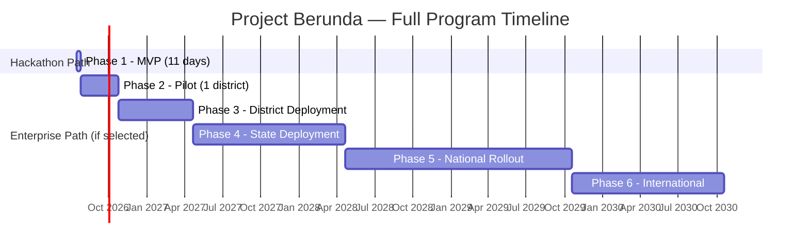

# Project Berunda — Complete Roadmap
## Companion document 4 of 5 — Karnataka State Police Datathon 2026

This covers **both** paths you asked for: the 11-day hackathon path (what you and your teammate actually build and demo) and the long-term enterprise path (what this becomes if KSP adopts it). They're the same roadmap — the hackathon is just Phase 1 of it, which is itself the strongest pitch you can make ("this isn't a hackathon toy, this is Phase 1 of a real rollout plan").

---

## Timeline Overview

*(Durations for Phases 2-6 are planning-level estimates, not commitments — real timelines depend on procurement, legal review, and budget cycles outside your control. What matters for judging purposes is that the phases are sequenced sensibly and each has a clear exit criterion, below.)*

---

## Phase 1 — MVP (Hackathon Build, 11 Days, 2 People)

**Goal:** a working, demoable slice that touches every architectural layer — not a mockup with fake data behind it.

| Day | Work | Owner |
|---|---|---|
| 1-2 | Catalyst project setup; real schema migrated into Data Store; synthetic data generated (Faker/indic-faker) — a few thousand FIRs with deliberately planted repeat-offender, shared-vehicle, and hotspot patterns | Both (setup), Person A leads data |
| 3-4 | FIR intake + English NER as a Catalyst Function; **`PersonEntity` resolution — the load-bearing piece, prioritize over polish elsewhere** | Person A |
| 5-6 | Risk scoring via Zia AutoML; hotspot aggregation; anomaly z-score check | Person A |
| 7-8 | Link-analysis graph traversal + dashboard front-end (Investigator Console, Hotspot Map, Network Graph) | Person B |
| 9 | "Ask Berunda" RAG demo; Fairness Auditor basic parity check | Person B |
| 10 | Auth wired in, API Gateway in front of everything, audit logging live | Both |
| 11 | Demo script, recording/deck, final documentation pass | Both |

**Exit criterion for Phase 1:** a judge can watch, live, a synthetic FIR go in → get resolved to an existing `PersonEntity` with 3 prior cases → see a risk score with visible feature-importance → see that score's underlying features exclude caste/religion → see the case on the hotspot map → ask "Ask Berunda" a plain-English question and get a grounded answer back.

**Full detail:** see companion doc `Project_Berunda_Implementation_Plan.md`.

---

## Phase 2 — Pilot (Post-Hackathon, ~3 Months, If Selected)

**Scope:** one district, real (not synthetic) data under a data-sharing MOU with that district's SP office.

- Kannada NLP added to the FIR intake pipeline (AI4Bharat/indic models)
- MO fingerprinting (embedding similarity) live
- Serial-incident correlator live
- Push notifications for hotspot alerts
- First real CCTNS data-bridge integration (read-only ingestion, one district)
- First sitting of the human governance review board (Section 13.3 of the Blueprint) — this is where "human-in-the-loop" stops being a design principle and starts being a scheduled meeting

**Exit criterion:** the pilot district's SCRB liaison can point to at least one real case where the link-analysis graph surfaced a connection an investigator hadn't already found manually.

**Key risk:** data-sharing MOU approval timeline is outside your control — start that conversation in parallel with Phase 1, not after.

---

## Phase 3 — District Deployment (~6 Months)

**Scope:** expand from 1 pilot district to a small cluster (e.g. 3-5 districts).

- Migrate the graph/link-analysis layer from join-table traversal to a dedicated graph database (Neo4j)
- Move from RBAC to ABAC (district-scoped access control)
- Blockchain-anchored evidence chain-of-custody (upgrading the Phase 1 hash-chain)
- Event-driven architecture (Catalyst Signals + Circuits) replacing Phase 1's direct-call orchestration
- Full observability stack (structured logging, tracing)

**Exit criterion:** the system handles multi-district queries (e.g., a suspect active across two districts) without manual data reconciliation between district teams.

---

## Phase 4 — State Deployment (~12 Months)

**Scope:** all Karnataka districts, full historical backfill.

- 30-year historical data ingestion and cold-tier archival
- State-wide SCRB Command View live, replacing the current Excel-based quarterly reporting
- OSINT monitoring agent activated — **only after** a completed legal review (this is a hard gate, not a target date to push past)
- Full AI governance board process operating on a regular cadence, not just at model-launch time

**Exit criterion:** SCRB can generate its statutory reporting (including the SC/ST-Act and communal-crime aggregate statistics from Section 6.2 of the Blueprint) directly from Berunda instead of manual compilation.

---

## Phase 5 — National Rollout (~18 Months)

**Scope:** other states adopt the open-core platform.

- Cross-state correlation — **contingent on inter-state data-sharing agreements**, a policy dependency, not an engineering one
- Deep NCRB/ICJS integration
- National Crime Knowledge Graph, federated across adopting states with each state retaining data sovereignty over its own records

**Exit criterion:** at least one additional state has an independently-run instance of the platform, proving the open-core model actually transfers rather than being Karnataka-locked.

---

## Phase 6 — International Adaptation (~12 Months)

**Scope:** generalize beyond the India-specific FIR structure.

- Localization framework for other legal systems and languages
- Crime-ontology layer decoupled from IPC/BNS-specific classification

**Exit criterion:** honestly, this is the one phase where "exit criterion" is somewhat theoretical for a datathon submission — treat it as the ambition statement it is, not a plan you're accountable to.

---

## Risks & Dependencies (Across All Phases)

| Risk | Affects | Mitigation |
|---|---|---|
| Data-sharing MOUs take longer than expected | Phase 2, 4-5 | Start the conversation during Phase 1, not after winning |
| Legal review for OSINT/voice ingestion stalls | Phase 2-4 | Treat as a hard gate — do not soft-launch these features without sign-off |
| Sustained IT budget for AppSail/observability scale-up | Phase 3+ | Budget ask should be phased alongside district rollout, not a single lump sum |
| Governance-board bandwidth isn't actually staffed | All phases past Phase 1 | Name a specific role/headcount for this in any pilot proposal — an unstaffed governance process is worse than admitting you don't have one yet |
| Team attrition (you're 2 people) | Phase 2+ | Open-core release (Section 17 of the Blueprint) is partly an insurance policy here — a documented, contributable codebase survives a founding team leaving in a way a closed one doesn't |

---

## Success Metrics by Phase

| Phase | Primary metric |
|---|---|
| 1 (Hackathon) | Live demo completes end-to-end without a manual data patch mid-demo |
| 2 (Pilot) | ≥1 investigator-confirmed "we wouldn't have found that manually" link |
| 3 (District) | Cross-district query resolution time (target: minutes, not the current days) |
| 4 (State) | SCRB statutory reports generated directly from the platform, not Excel |
| 5 (National) | ≥1 independently-operated state instance |
| 6 (International) | Not applicable to this submission — documented as ambition |
