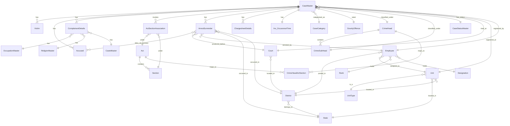
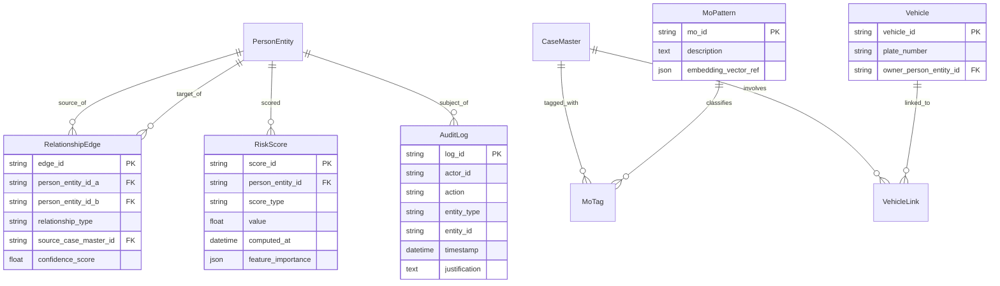

# Project Berunda — Database & ER Schema Reference
## Companion document 5 of 5 — Karnataka State Police Datathon 2026

This is a standalone extract of the database design from the full Enterprise Blueprint, meant to be worked from directly by whoever is building the backend — no need to scroll through the full 19-section document while coding against it.

---

## 6. Data Architecture & Database Design

> **This section now reflects your actual dataset.** The Police FIR ER diagram you shared (Karnataka Police Department, confidential schema) replaces the placeholder from the first draft. Reading it closely changed two things about the design — both explained below (6.2 and 6.3) — which is exactly the kind of detail that separates a team that skimmed the dataset from a team that engineered around it.

### 6.1 Real Schema — Karnataka Police FIR System

**Core transactional entities and how they relate:**



**Detailed column definitions — core case tables:**

| Table | Key columns | Notes |
|---|---|---|
| **CaseMaster** (PK: `CaseMasterID`) | `CrimeNo`, `CaseNo`, `CrimeRegisteredDate`, `PolicePersonID` (FK→Employee), `PoliceStationID` (FK→Unit), `CaseCategoryID`, `GravityOffenceID`, `CrimeMajorHeadID`, `CrimeMinorHeadID`, `CaseStatusID`, `CourtID` | `CrimeNo` is structurally meaningful, not a random ID: **1-digit Case-Category code + 4-digit District ID + 4-digit Police-Station(Unit) ID + 4-digit Year + 5-digit running serial**, e.g. `104430006202600001` = FIR. `CaseNo` is the last 9 digits (`YYYY` + 5-digit serial). Parse `CrimeNo` at ingestion time — it's a free district/station/year filter you get for nothing. |
| **Inv_OccuranceTime** (1:1 with CaseMaster) | `IncidentFromDate`, `IncidentToDate`, `InfoReceivedPSDate`, `latitude`, `longitude`, `BriefFacts` | This is your entire geospatial + free-text NLP surface. `latitude`/`longitude` feed the hotspot agent (8.6) directly; `BriefFacts` feeds the NER agent (8.1). |
| **ComplainantDetails** (PK: `ComplainantID`) | `CaseMasterID` FK, `ComplainantName`, `AgeYear`, `OccupationID`, `ReligionID`, `CasteID`, `GenderID` | **See 6.2 — `ReligionID`/`CasteID` need explicit governance handling, not just storage.** |
| **Victim** (PK: `VictimMasterID`) | `CaseMasterID` FK, `VictimName`, `AgeYear`, `GenderID`, `VictimPolice` (bit) | `VictimPolice` flags cases where the victim is a police officer — useful as a filter for a dedicated "crimes against on-duty officers" view. |
| **Accused** (PK: `AccusedMasterID`) | `CaseMasterID` FK, `AccusedName`, `AgeYear`, `GenderID`, `PersonID` (display label, e.g. "A1", "A2") | **See 6.3 — this table is scoped per-case, not per-person globally.** |
| **ArrestSurrender** (PK: `ArrestSurrenderID`) | `CaseMasterID` FK, `ArrestSurrenderTypeID`, `ArrestSurrenderDate`, State/District/Unit FKs, `IOID` (FK→Employee), `CourtID`, `AccusedMasterID` FK, `IsAccused`, `IsComplainantAccused` | Links to Accused via the `inv_arrestsurrenderaccused` junction table for multi-accused arrest events. |
| **ChargesheetDetails** (PK: `CSID`) | `CaseMasterID` FK, `csdate`, `cstype` (`A`=Chargesheet, `B`=False Case, `C`=Undetected), `PolicePersonID` FK | `cstype` is a genuinely useful field — it's your ground truth for case-outcome-based model evaluation (e.g., did the risk score correlate with eventual chargesheet vs. false-case outcomes). |
| **ActSectionAssociation** | `CaseMasterID`, `ActID`→`Act.ActCode`, `SectionID`→`Section.SectionCode`, display order fields | Many-to-many bridge between cases and legal sections. |

**Master/lookup tables** (simpler reference data — one row each, referenced by FK from the tables above):

| Table | Purpose |
|---|---|
| `Act` / `Section` | Legal act and section catalog (IPC/BNS/NDPS etc.), with a mapping table `CrimeHeadActSection` linking crime heads to applicable acts/sections |
| `CrimeHead` / `CrimeSubHead` | Two-level crime classification (e.g. "Crimes Against Body" → "Murder") — this is your `crime_type` taxonomy for every dashboard filter |
| `CasteMaster` / `ReligionMaster` / `OccupationMaster` | Demographic lookups referenced by `ComplainantDetails` — see 6.2 |
| `CaseStatusMaster` | Case status lookup (Under Investigation, Charge Sheeted, Closed, etc.) |
| `GravityOffence` | Offence severity lookup (Heinous / Non-Heinous) |
| `CaseCategory` | FIR / UDR / PAR / Zero-FIR category lookup |
| `Court` / `District` / `State` | Jurisdiction hierarchy |
| `Unit` / `UnitType` | Police-station/circle-office hierarchy, self-referencing via `ParentUnit` |
| `Rank` / `Designation` / `Employee` | Officer roster, with `KGID` (Karnataka Government ID) as the real-world employee identifier |

### 6.2 Critical Governance Note — `CasteID` and `ReligionID`

The real schema stores caste and religion **on the complainant**, not the accused. This is not an oversight to flag as a "bug" — India's SC/ST (Prevention of Atrocities) Act and NCRB's own published crime statistics (both the state's `data.gov.in`-hosted crime reviews and NCRB's national "crimes against SC/ST" datasets) require exactly this kind of recording, precisely so that crimes against these communities can be tracked and protected against. **The field exists for a protective, legally-mandated reason.** The design responsibility isn't to remove it — it's to make sure it's never repurposed into something it wasn't meant for.

Concretely, Berunda enforces:
- **Hard feature exclusion:** `CasteID` and `ReligionID` are never in the input feature set for the Repeat-Offender Risk Scoring Agent (8.5) or any predictive model — they describe the *complainant* in a protective-statistics context, and there is no legitimate reason for any predictive model in this system to consume them at all.
- **Access-restricted, not general-purpose:** these two columns are visible only to a narrow "Statutory Compliance Reporting" role that generates the legally-required SC/ST-Act and communal-crime aggregate statistics — never surfaced in the Investigator Console, the link-analysis graph, or an "Ask Berunda" free-text answer.
- **Aggregate-only outward reporting:** the only outward-facing use of these fields is the same kind of aggregate, community-protective statistic NCRB itself already publishes (e.g., district-wise counts of crimes against SC/ST) — never an individual-level correlation feeding back into who gets flagged or watched.
- **Audited by design:** the Governance & Bias-Audit Agent (8.13) specifically checks that no deployed model's feature-importance report references these fields or an obvious proxy for them (surname, specific micro-locality used as a stand-alone feature, etc.).

Most competing teams will either (a) not notice these fields at all, or (b) throw the entire schema into a generic dashboard without a second thought about what "caste" showing up in a filter dropdown actually implies. Naming this explicitly, and showing the architectural control around it, is a real and rare point of maturity in a submission like this — it's worth saying so directly in your presentation, not just building it silently.

### 6.3 The Real Technical Challenge This Schema Reveals

Here's the thing the original hackathon brief's language ("data silos... independent silos... hidden relationships") actually cashes out to once you look at the real schema: **`Accused.AccusedMasterID` and `Victim.VictimMasterID` are scoped per case, not per person.** If "Suresh Kumar, age 34" is accused in three separate FIRs across two districts, he gets three separate `AccusedMasterID` rows with no field anywhere linking them to each other. The schema, as given, has no concept of "this is the same human being across cases" — which means the single most-hyped feature in every team's pitch ("we connect suspects across cases!") is not something you get by querying the given schema. You have to build it.

This is genuinely the most valuable thing you can build, and it's worth being explicit that you understood this rather than assuming the graph "just comes from the data":

**`PersonEntity`** (new table, Berunda-added) — a deduplicated, cross-case identity:
```
PersonEntity {
    person_entity_id PK
    canonical_name
    canonical_age_estimate
    canonical_address
    canonical_phone_encrypted
    role_hint  -- accused / victim / complainant / witness, can be multiple over time
}
PersonEntityLink {
    link_id PK
    person_entity_id FK
    source_table       -- 'Accused' | 'Victim' | 'ComplainantDetails'
    source_record_id   -- AccusedMasterID / VictimMasterID / ComplainantID
    case_master_id FK
    match_confidence    -- output of the entity-resolution step below
}
```

**Entity-resolution logic (feeds the Link Analysis Agent, 8.3, which now has an explicit first stage it didn't have in the first draft):** blocking on (name similarity via phonetic match — useful given transliteration variance in Kannada/English names — + age band + address/locality overlap), scored with a simple weighted-similarity function for Phase 1 (✅ BUILDABLE), upgradeable to a learned entity-resolution model (the same problem OpenAleph's FollowTheMoney-based tooling solves at OCCRP) once volume justifies it (🔭 VISION).

### 6.4 Additional Schema Extensions Berunda Adds

Beyond `PersonEntity`, the government schema has no relationship graph, no predictive scores, and no AI-decision audit trail — these remain as designed in the first draft, now explicitly wired to real keys instead of placeholders:



### 6.5 Storage Tiering Strategy

| Data | Store | Note |
|---|---|---|
| `CaseMaster` and all case-linked tables (real schema) | Catalyst Data Store | Mirrors the relational structure of the source system directly — no re-modeling needed for the system-of-record layer |
| `PersonEntity`, `RelationshipEdge`, `RiskScore`, `MoTag`, `AuditLog` (Berunda additions) | Catalyst Data Store, separate schema/namespace | Kept logically separate from the source-of-record tables so the AI layer can be rebuilt/retrained without ever touching or risking the official case record |
| `Inv_OccuranceTime.BriefFacts` full text, OSINT captures | Catalyst NoSQL | Free-text, irregular shape |
| Evidence files | Catalyst Stratus | Unchanged from first draft |
| Jurisdiction/lookup tables (`District`, `Unit`, `Court`, etc.) | Catalyst Cache | Rarely change, heavily read — perfect cache candidates |

### 6.6 Extended Intelligence Data Layers (Roadmap)

Reconciling the broader "everything a real platform would eventually need" wishlist against what's legal, feasible, and actually wise to build:

| Layer | Examples | Feasibility |
|---|---|---|
| Location intelligence enrichment | Nearby police station/hospital/school/ATM/highway distance, computed from `Inv_OccuranceTime.latitude/longitude` against OpenStreetMap POIs | ✅ BUILDABLE (OSM Overpass API is free) |
| Time intelligence | Weekday/weekend/festival/holiday flag derived from `IncidentFromDate` | ✅ BUILDABLE (a static calendar lookup — genuinely useful for the anomaly/hotspot agents, and nearly free to add) |
| Vehicle data | Plate, owner, GPS history | 🧩 STRETCH for plate/owner (via the new `Vehicle` table); GPS history is 🔭 VISION and requires the vehicle to actually be instrumented or the data to come from a legal RTO/traffic-camera integration |
| Phone intelligence (CDR, IMEI, tower location) | Call detail records, device linkage | 🔭 VISION, **and explicitly gated on lawful process** — CDR access in India requires authorization under the Indian Telegraph Act/CrPC, not an engineering decision. Document the integration point; do not build a demo that pretends to have this data |
| Financial intelligence | Bank/UPI transaction linkage | 🔭 VISION, same lawful-process gating (PMLA-authorized access) |
| Social/OSINT intelligence | Public posts, dark web monitoring | 🔭 VISION — see Agent 8.10; human-reviewed leads only, never auto-profiling |
| Environmental/socio-economic context | Weather, population density, literacy (aggregate, non-caste) | ✅ BUILDABLE via IMD/Census aggregate data |
| **Caste-linked socio-economic correlation (SECC)** | — | ❌ **Not recommended, at any depth.** See 6.2 and 6.7 — correlating caste-linked datasets with crime, even in aggregate "for research," reproduces exactly the discriminatory-profiling failure mode Section 13 exists to prevent. Leave it out and say why in your writeup. |

### 6.7 Data Sourcing & Synthetic Data Strategy for the Demo

You cannot legally obtain most of the sensitive real-world data above, and you shouldn't try to fake having it either. Here's the actual sourcing plan:

1. **The hackathon dataset (this real ER schema) is primary.** Everything else supplements it.
2. **Karnataka's own published crime statistics** — the State Crime Records Bureau publishes district-wise IPC/SLL crime reviews on `karnataka.data.gov.in` under the National Data Sharing and Accessibility Policy, updated as recently as 2025-2026 crime-review releases. These are useful for two things: sanity-checking that your synthetic data's district-level distribution looks realistic, and populating the SCRB State Command dashboard with real baseline numbers even before your synthetic case-level data is layered on top.
3. **OpenStreetMap (Overpass API)** — free, no auth required for reasonable use, for police stations, hospitals, schools, ATMs, highways — the entire location-enrichment layer in 6.6.
4. **Bhuvan (ISRO/NRSC)** — a free, public-domain Indian geoportal with WMS/WFS map layers, already used in collaboration with agencies like the Karnataka Forest Department — useful if you want a "nearby forest/terrain" layer without relying on a foreign satellite-imagery provider.
5. **Synthetic records for anything sensitive** — generate with **Faker** (which ships an `en_IN` locale for Indian names/banks/addresses) or **indic-faker**, a newer library purpose-built for generating realistic Indian names, addresses, and text across eight native scripts including Kannada — exactly what your bilingual NER demo (8.1) needs test data for. Plant a handful of deliberate patterns (one repeat offender across 4 synthetic cases, one shared-vehicle link across 3 cases, one manufactured hotspot week) — a few thousand well-planted records will demo the relationship graph and hotspot detection far more clearly to a judge than a hundred thousand undifferentiated random rows.
6. **What to leave out:** SECC or any caste-linked dataset, for the reasons in 6.2/6.6. Population density, literacy, and urbanization from the regular Census are fine and useful; caste-correlated analysis is not, regardless of framing.

### 6.8 Indexing & Query Notes

- Composite index on `CaseMaster (CrimeMajorHeadID, CrimeRegisteredDate, PoliceStationID)` — this is the filter combination every dashboard view will hit first.
- Parse and index the district/station/year components embedded in `CrimeNo` at ingestion time (6.1) rather than re-parsing the string on every query.
- Full-text index on `Inv_OccuranceTime.BriefFacts`.
- Index `PersonEntityLink.person_entity_id` and `RelationshipEdge`'s two person-FK columns — these carry the link-analysis query load.
- `ComplainantDetails.CasteID` / `ReligionID` should **not** be indexed for general search — indexing signals "this is meant to be filtered/searched on," which cuts against the access-restriction posture in 6.2. Keep lookups on these two columns limited to the compliance-reporting role's dedicated, audited query path.

---
