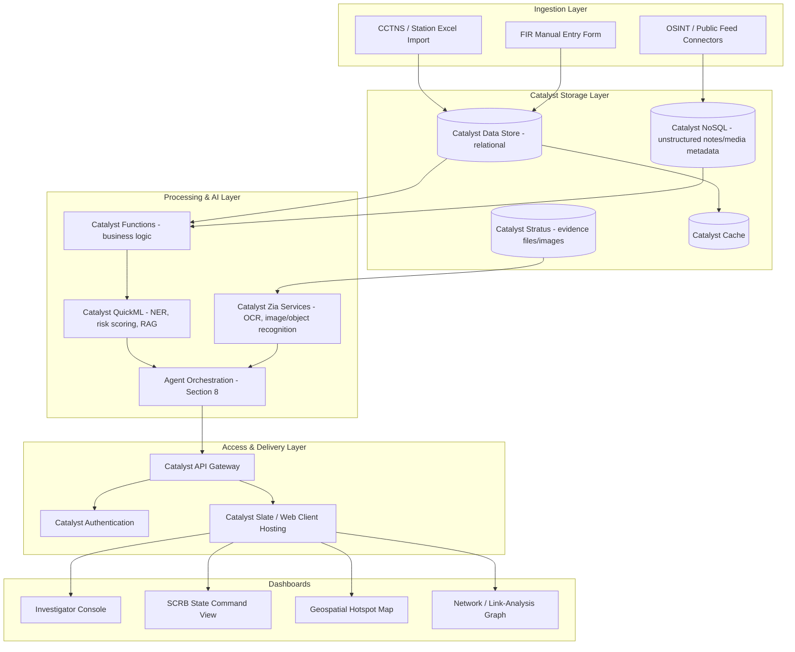
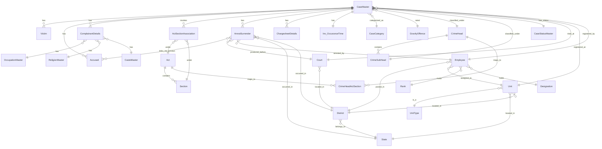
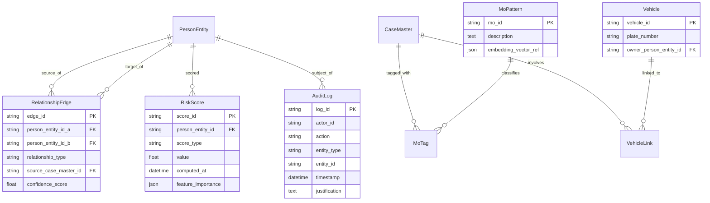
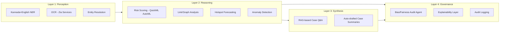

# Project Berunda
## An AI-Native Crime Intelligence Operating System for Karnataka State Police

**Submission for:** Datathon 2026 — "AI-Driven Crime Analytics & Visualization Platform" (Hack2Skill × Karnataka State Police)
**Team:** Phoenix Coder (2 members)
**Document type:** Full enterprise blueprint + hackathon-executable core (Phase 1 sections are marked ✅ BUILDABLE; forward-looking sections are marked 🔭 VISION)
**Mandatory deployment target:** Catalyst by Zoho
**Revision:** v2 — Section 6 (Database Design) now built from the actual Karnataka Police FIR ER diagram, not a placeholder schema; see 19.4 for what changed.

---

> **A note on how to read this document.** You asked for the maximal, no-detail-spared version — so that's what follows. But a 2-person team has ~11 days until submission closes, not 11 months. Every section below is tagged so you always know what to actually *build* versus what to *write and present as roadmap*:
> - ✅ **BUILDABLE** — realistic for 2 people in the time you have; this is your demo.
> - 🧩 **STRETCH** — doable if Phase 1 goes fast; nice-to-have for the live demo.
> - 🔭 **VISION** — real, detailed, defensible design — but documented, not built, for this submission. This is what makes the doc read like an enterprise blueprint instead of a hackathon README.
>
> Judges score on innovation, impact, technical depth, scalability, and presentation — a small working system backed by a document like this outperforms either a toy demo with no depth, or 40 pages of prose with nothing running behind it.

---

## Table of Contents

1. Executive Summary
2. Market & Competitive Research
3. Stakeholders
4. Requirements
5. Enterprise Architecture
6. Data Architecture & Database Design
7. AI Architecture
8. Agent Ecosystem
9. Signature AI Features
10. Data Science Methodology
11. Visualization & Dashboards
12. Security Architecture
13. Governance, Ethics & Bias Mitigation
14. DevOps & Deployment
15. Catalyst by Zoho — Mandatory Service Mapping
16. Implementation Roadmap
17. Open Source & Reference Stack
18. Ten-Year Vision
19. Appendix: Naming, Research Notes & References

---

## 1. Executive Summary

### 1.1 Mission
Give the Karnataka State Police (KSP) and the State Crime Records Bureau (SCRB) one living, queryable picture of crime across the state — replacing the current reality of fragmented Excel sheets with a system that connects every FIR, person, location, and case to every other one, in real time, in both Kannada and English.

### 1.2 Vision
Project Berunda is named after the *Gandaberunda* — the two-headed mythical bird that is Karnataka's own state emblem, printed on every KSRTC bus and government letterhead in the state. The two heads are the design metaphor for the platform itself: one head watches backward across 30 years of historical case data to find hidden connections; the other watches forward, forecasting where and when the next incident is statistically likely, so patrols can be proactive instead of reactive.

### 1.3 The Problem, Precisely
- **Data silos.** Crime data lives in independent station-level Excel sheets and legacy CCTNS entries that don't talk to each other.
- **No relationship intelligence.** A suspect involved in five incidents across three districts currently looks like five unrelated case files, because nothing cross-references people, vehicles, and locations across cases.
- **Reactive posture.** Without pattern discovery, patrol deployment and resource allocation happen after crime spikes, not before.
- **SCRB blindness.** The state bureau receives whatever fragments individual stations choose to report, not a live, structured feed.

### 1.4 Why Existing Systems Don't Solve This
| System | What it does well | Where it falls short for KSP's stated problem |
|---|---|---|
| **CCTNS** (national) | Standardized FIR digitization, national interoperability | Built for record-keeping and inter-state lookup, not analytics, link-analysis, or prediction — it is a system of record, not a system of intelligence |
| **NCRB / ICJS** | National crime statistics, judiciary-police-prison data exchange | Aggregate, retrospective reporting cadence (annual/quarterly), not a live investigator-facing tool |
| **Palantir Gotham** | Best-in-class entity resolution and link analysis at scale | Proprietary, extremely expensive, closed-source, not deployable under an open-source/Catalyst-mandatory constraint |
| **IBM i2 Analyst's Notebook** | Mature link-chart analysis, used by many law enforcement agencies globally | Desktop-centric, license-per-seat, no native AI/ML or geospatial prediction layer, no open API for a modern cloud-native stack |
| **PredPol**-style predictive policing tools | Hotspot forecasting | Widely criticized for feedback-loop bias (over-policing already over-policed areas) with no published bias-mitigation methodology |

**Berunda's positioning:** it does not try to replace CCTNS — it sits on top of it as an intelligence layer, ingesting CCTNS/station data and adding the three things none of the above provide together in one open, Catalyst-native package: (1) cross-case relationship graphs, (2) explainable predictive risk scoring with built-in bias auditing, and (3) bilingual (Kannada + English) natural-language investigation support.

### 1.5 Expected Impact
- **Investigators:** minutes instead of days to see every prior incident connected to a suspect, vehicle, or location.
- **SCRB:** a live, drillable state map instead of a quarterly PDF.
- **Citizens:** faster case resolution via better-targeted patrol deployment, and a governance model designed from day one to avoid profiling by identity markers.
- **Government:** an open-core system Karnataka can own and extend, instead of a recurring-license dependency on a closed foreign platform.

---

## 2. Market & Competitive Research

### 2.1 Detailed Comparison Matrix

| Capability | CCTNS | NCRB/ICJS | Palantir Gotham | IBM i2 | DataWalk / CrimeTracer-class tools | PredPol-style | **Project Berunda** |
|---|:---:|:---:|:---:|:---:|:---:|:---:|:---:|
| FIR digitization & national lookup | ✅ | ✅ | — | — | — | — | Ingests from CCTNS |
| Cross-case link analysis / network graphs | ❌ | ❌ | ✅ | ✅ | ✅ | ❌ | ✅ |
| Predictive hotspot forecasting | ❌ | ❌ | ✅ | ❌ | Partial | ✅ | ✅ (with bias audit) |
| Repeat-offender risk scoring | ❌ | ❌ | ✅ | ❌ | ✅ | Partial | ✅ (explainable) |
| Bilingual regional-language NLP (Kannada) | ❌ | ❌ | ❌ | ❌ | ❌ | ❌ | ✅ |
| Cross-case entity resolution (same person, different case IDs) | ❌ | ❌ | ✅ | ✅ | ✅ | ❌ | ✅ (Section 6.3) |
| Open source / state-owned | ✅ | ✅ | ❌ | ❌ | ❌ | ❌ | ✅ |
| Real-time interactive dashboards | ❌ | ❌ | ✅ | Partial | ✅ | Partial | ✅ |
| Built-in fairness/bias governance | ❌ | ❌ | Undisclosed | ❌ | Undisclosed | Widely criticized | ✅ (by design) |
| Cost model | Govt-funded | Govt-funded | Enterprise license (high) | Per-seat license | Enterprise license | SaaS license | Open-core on Catalyst |

*(DataWalk and SoundThinking's CrimeTracer are recent commercial examples of exactly the "graph + AI + natural-language query, logged for audit" category Berunda is designed as an open, Catalyst-native equivalent of — useful to know they exist, and useful that neither is open-source, India-deployable, or bilingual.)*

### 2.2 What "Superior" Actually Means Here
Berunda doesn't out-engineer Palantir on raw capability — no 2-person hackathon team could claim that credibly, and a judge who knows the space would immediately discount an overclaim. Berunda's real edge is **fit**: it is the only option in the table that is simultaneously (a) open-source and state-owned, (b) natively bilingual for Karnataka, and (c) designed with bias auditing as a first-class citizen rather than a bolt-on — three things none of the closed enterprise platforms prioritize because they weren't built for an Indian state police context.

### 2.3 Know Your Opponents — What Almost Every Other Team Will Submit
Realistically, most teams at this datathon will independently converge on the same shortlist, because it's the obvious reading of the brief:

- A crime dashboard with charts
- A heatmap
- A basic crime-type prediction model
- A network/relationship graph
- An AI chatbot over the case data

All five are necessary — Berunda has all five — but none of them are differentiating on their own, because everyone will have them. What's actually rare, based on this research pass, is a team that: (1) read the *real* government ER diagram closely enough to notice it has no cross-case identity model and built the entity-resolution layer that fixes it (Section 6.3); (2) explicitly designed around the caste/religion fields in the real schema instead of either ignoring them or naively exposing them (Section 6.2); (3) supports Kannada, not just English; and (4) can name, with specifics, why it isn't PredPol (Section 13.1) rather than just claiming "ethical AI" as a slide bullet. That combination — not the chatbot, not the heatmap — is the actual pitch.

---

## 3. Stakeholders

| Stakeholder | Primary need from Berunda |
|---|---|
| Investigating Officers (IOs) | Fast cross-referencing of suspects/vehicles/locations across cases |
| Station House Officers (SHOs) | Local dashboard: what's happening in my jurisdiction right now |
| SCRB | State-wide drillable analytics, trend alerts, statutory reporting |
| Superintendents of Police (district-level) | Resource deployment recommendations, hotspot maps |
| Cyber Crime Cells | OSINT and digital-evidence correlation tooling |
| Forensic Labs | Evidence metadata linkage, chain-of-custody tracking |
| Judiciary / Courts | Structured case timelines (read-only, access-controlled) |
| Home Ministry / DGP Office | State-level KPI dashboards |
| Women Safety Wing | Crime-against-women pattern and hotspot views |
| Traffic Police | Vehicle-linked incident cross-referencing |
| Citizens (indirect) | Faster resolution, transparent governance safeguards |
| NGOs / Researchers (restricted, anonymized access) | Aggregate trend data for policy research |

---

## 4. Requirements

### 4.1 Functional Requirements (excerpt — full list in Section 8/9 per module)
- FR1: Ingest FIR/incident records (structured import + manual entry) in English and Kannada.
- FR2: Automatically extract entities (persons, locations, vehicles, weapons, organizations) from free-text FIR narrative.
- FR3: Maintain a relationship graph connecting persons↔incidents↔locations↔vehicles with confidence scores.
- FR4: Compute an explainable repeat-offender risk score per person, with feature-importance breakdown.
- FR5: Render spatiotemporal hotspot maps with drill-down from state → district → station jurisdiction.
- FR6: Detect anomalous spikes in a crime category vs. historical baseline and alert SCRB.
- FR7: Provide natural-language query over the case corpus ("show me all robbery cases linked to this vehicle") via RAG.
- FR8: Maintain immutable audit logs for every AI-assisted decision surfaced to an officer.
- FR9: Role-based dashboards per stakeholder type (Section 3).

### 4.2 Non-Functional Requirements
| Category | Requirement |
|---|---|
| Scalability | Architecture must not structurally block scaling to 10M+ records / 30 years of history (Phase 1 demo can run on a sample dataset) |
| Availability | 99.5%+ target at state-deployment maturity (not a Phase-1 concern) |
| Security | Encryption at rest and in transit; RBAC; audit logging on all sensitive reads |
| Compliance | DPDP Act 2023 / DPDP Rules 2025 alignment (Section 13.4) |
| Accessibility | Kannada + English UI and NLP from day one |
| Explainability | No "black box" score may reach an officer's screen without a feature-importance breakdown |
| Human-in-the-loop | The system never auto-triggers action; it only informs. All watchlist/patrol decisions remain human-made and logged |

### 4.3 Assumption Flag (resolved)
~~This document assumes a generic crime-record schema...~~ — **superseded.** Section 6 now reflects the real Karnataka Police FIR ER diagram you shared (CaseMaster/Accused/Victim/ComplainantDetails and the full lookup hierarchy). One residual ambiguity worth a human check: whether `Inv_OccuranceTime` is a genuinely separate table (as the relationship matrix states) or a continuation of `CaseMaster`'s column list split across a PDF page-break — flagged again in Section 19.4.

---

## 5. Enterprise Architecture

### 5.1 Architectural Style
Berunda uses a **modular microservices** approach on top of **event-driven** communication, deliberately kept simpler than full CQRS/event-sourcing for Phase 1 (that complexity is real, but premature for a 2-person team — it's documented here as the Phase 3+ evolution, not the MVP).

- ✅ BUILDABLE (Phase 1): Functions-based microservices, direct REST calls, a single Data Store schema, synchronous ingestion.
- 🔭 VISION (Phase 3+): Full event-driven mesh with Catalyst Signals, CQRS read/write separation for the analytics layer, event sourcing for full audit replay.

### 5.2 High-Level System Diagram



### 5.3 Design Decisions & Trade-offs

| Decision | Chosen approach | Alternative considered | Why chosen |
|---|---|---|---|
| Backend compute | Catalyst Functions for stateless logic, AppSail for the always-on API layer | Full Kubernetes microservices | Catalyst deployment is mandatory for this submission; Functions/AppSail cover the same architectural role at far lower operational overhead for a 2-person team |
| Primary data store | Catalyst Data Store (relational, SQL) | Pure NoSQL / document store | Crime records are highly relational (person-incident-location); relational integrity matters more than write-throughput at this stage |
| Unstructured notes/media metadata | Catalyst NoSQL | Force everything into SQL | Beat notes, OSINT captures, and free-text vary in shape; forcing a rigid schema on them early would slow ingestion |
| Graph/network layer | Computed in-application over relational join tables for Phase 1; dedicated graph DB (Neo4j) as Phase 3 upgrade | Standing up a graph DB immediately | A join-table model is enough to demo relationship discovery at hackathon scale; a real graph DB earns its complexity only once record volume is large |
| LLM / RAG | Catalyst QuickML's built-in LLM serving (Qwen models) + RAG over the knowledge base | Self-hosted open-weight LLM | Mandatory-Catalyst constraint, plus QuickML already ships this natively - no reason to rebuild it |
| API layer | Catalyst API Gateway in front of Functions | Custom Express/FastAPI gateway | Gateway is a listed mandatory-mapping capability (#18); using it directly also gets you throttling/auth for free |

---

## 6. Data Architecture & Database Design

> **This section now reflects your actual dataset.** The Police FIR ER diagram you shared (Karnataka Police Department, confidential schema) replaces the placeholder from the first draft. Reading it closely changed two things about the design — both explained below (6.2 and 6.3) — which is exactly the kind of detail that separates a team that skimmed the dataset from a team that engineered around it.

### 6.1 Real Schema — Karnataka Police FIR System

**Core transactional entities and how they relate:**



**Detailed column definitions — core case tables:**

| Table | Key columns | Notes |
|---|---|---|
| **CaseMaster** (PK: `CaseMasterID`) | `CrimeNo`, `CaseNo`, `CrimeRegisteredDate`, `PolicePersonID` (FK→Employee), `PoliceStationID` (FK→Unit), `CaseCategoryID`, `GravityOffenceID`, `CrimeMajorHeadID`, `CrimeMinorHeadID`, `CaseStatusID`, `CourtID` | `CrimeNo` is structurally meaningful, not a random ID: **1-digit Case-Category code + 4-digit District ID + 4-digit Police-Station(Unit) ID + 4-digit Year + 5-digit running serial**, e.g. `104430006202600001` = FIR. `CaseNo` is the last 9 digits (`YYYY` + 5-digit serial). Parse `CrimeNo` at ingestion time — it's a free district/station/year filter you get for nothing. |
| **Inv_OccuranceTime** (1:1 with CaseMaster) | `IncidentFromDate`, `IncidentToDate`, `InfoReceivedPSDate`, `latitude`, `longitude`, `BriefFacts` | This is your entire geospatial + free-text NLP surface. `latitude`/`longitude` feed the hotspot agent (8.6) directly; `BriefFacts` feeds the NER agent (8.1). |
| **ComplainantDetails** (PK: `ComplainantID`) | `CaseMasterID` FK, `ComplainantName`, `AgeYear`, `OccupationID`, `ReligionID`, `CasteID`, `GenderID` | **See 6.2 — `ReligionID`/`CasteID` need explicit governance handling, not just storage.** |
| **Victim** (PK: `VictimMasterID`) | `CaseMasterID` FK, `VictimName`, `AgeYear`, `GenderID`, `VictimPolice` (bit) | `VictimPolice` flags cases where the victim is a police officer — useful as a filter for a dedicated "crimes against on-duty officers" view. |
| **Accused** (PK: `AccusedMasterID`) | `CaseMasterID` FK, `AccusedName`, `AgeYear`, `GenderID`, `PersonID` (display label, e.g. "A1", "A2") | **See 6.3 — this table is scoped per-case, not per-person globally.** |
| **ArrestSurrender** (PK: `ArrestSurrenderID`) | `CaseMasterID` FK, `ArrestSurrenderTypeID`, `ArrestSurrenderDate`, State/District/Unit FKs, `IOID` (FK→Employee), `CourtID`, `AccusedMasterID` FK, `IsAccused`, `IsComplainantAccused` | Links to Accused via the `inv_arrestsurrenderaccused` junction table for multi-accused arrest events. |
| **ChargesheetDetails** (PK: `CSID`) | `CaseMasterID` FK, `csdate`, `cstype` (`A`=Chargesheet, `B`=False Case, `C`=Undetected), `PolicePersonID` FK | `cstype` is a genuinely useful field — it's your ground truth for case-outcome-based model evaluation (e.g., did the risk score correlate with eventual chargesheet vs. false-case outcomes). |
| **ActSectionAssociation** | `CaseMasterID`, `ActID`→`Act.ActCode`, `SectionID`→`Section.SectionCode`, display order fields | Many-to-many bridge between cases and legal sections. |

**Master/lookup tables** (simpler reference data — one row each, referenced by FK from the tables above):

| Table | Purpose |
|---|---|
| `Act` / `Section` | Legal act and section catalog (IPC/BNS/NDPS etc.), with a mapping table `CrimeHeadActSection` linking crime heads to applicable acts/sections |
| `CrimeHead` / `CrimeSubHead` | Two-level crime classification (e.g. "Crimes Against Body" → "Murder") — this is your `crime_type` taxonomy for every dashboard filter |
| `CasteMaster` / `ReligionMaster` / `OccupationMaster` | Demographic lookups referenced by `ComplainantDetails` — see 6.2 |
| `CaseStatusMaster` | Case status lookup (Under Investigation, Charge Sheeted, Closed, etc.) |
| `GravityOffence` | Offence severity lookup (Heinous / Non-Heinous) |
| `CaseCategory` | FIR / UDR / PAR / Zero-FIR category lookup |
| `Court` / `District` / `State` | Jurisdiction hierarchy |
| `Unit` / `UnitType` | Police-station/circle-office hierarchy, self-referencing via `ParentUnit` |
| `Rank` / `Designation` / `Employee` | Officer roster, with `KGID` (Karnataka Government ID) as the real-world employee identifier |

### 6.2 Critical Governance Note — `CasteID` and `ReligionID`

The real schema stores caste and religion **on the complainant**, not the accused. This is not an oversight to flag as a "bug" — India's SC/ST (Prevention of Atrocities) Act and NCRB's own published crime statistics (both the state's `data.gov.in`-hosted crime reviews and NCRB's national "crimes against SC/ST" datasets) require exactly this kind of recording, precisely so that crimes against these communities can be tracked and protected against. **The field exists for a protective, legally-mandated reason.** The design responsibility isn't to remove it — it's to make sure it's never repurposed into something it wasn't meant for.

Concretely, Berunda enforces:
- **Hard feature exclusion:** `CasteID` and `ReligionID` are never in the input feature set for the Repeat-Offender Risk Scoring Agent (8.5) or any predictive model — they describe the *complainant* in a protective-statistics context, and there is no legitimate reason for any predictive model in this system to consume them at all.
- **Access-restricted, not general-purpose:** these two columns are visible only to a narrow "Statutory Compliance Reporting" role that generates the legally-required SC/ST-Act and communal-crime aggregate statistics — never surfaced in the Investigator Console, the link-analysis graph, or an "Ask Berunda" free-text answer.
- **Aggregate-only outward reporting:** the only outward-facing use of these fields is the same kind of aggregate, community-protective statistic NCRB itself already publishes (e.g., district-wise counts of crimes against SC/ST) — never an individual-level correlation feeding back into who gets flagged or watched.
- **Audited by design:** the Governance & Bias-Audit Agent (8.13) specifically checks that no deployed model's feature-importance report references these fields or an obvious proxy for them (surname, specific micro-locality used as a stand-alone feature, etc.).

Most competing teams will either (a) not notice these fields at all, or (b) throw the entire schema into a generic dashboard without a second thought about what "caste" showing up in a filter dropdown actually implies. Naming this explicitly, and showing the architectural control around it, is a real and rare point of maturity in a submission like this — it's worth saying so directly in your presentation, not just building it silently.

### 6.3 The Real Technical Challenge This Schema Reveals

Here's the thing the original hackathon brief's language ("data silos... independent silos... hidden relationships") actually cashes out to once you look at the real schema: **`Accused.AccusedMasterID` and `Victim.VictimMasterID` are scoped per case, not per person.** If "Suresh Kumar, age 34" is accused in three separate FIRs across two districts, he gets three separate `AccusedMasterID` rows with no field anywhere linking them to each other. The schema, as given, has no concept of "this is the same human being across cases" — which means the single most-hyped feature in every team's pitch ("we connect suspects across cases!") is not something you get by querying the given schema. You have to build it.

This is genuinely the most valuable thing you can build, and it's worth being explicit that you understood this rather than assuming the graph "just comes from the data":

**`PersonEntity`** (new table, Berunda-added) — a deduplicated, cross-case identity:
```
PersonEntity {
    person_entity_id PK
    canonical_name
    canonical_age_estimate
    canonical_address
    canonical_phone_encrypted
    role_hint  -- accused / victim / complainant / witness, can be multiple over time
}
PersonEntityLink {
    link_id PK
    person_entity_id FK
    source_table       -- 'Accused' | 'Victim' | 'ComplainantDetails'
    source_record_id   -- AccusedMasterID / VictimMasterID / ComplainantID
    case_master_id FK
    match_confidence    -- output of the entity-resolution step below
}
```

**Entity-resolution logic (feeds the Link Analysis Agent, 8.3, which now has an explicit first stage it didn't have in the first draft):** blocking on (name similarity via phonetic match — useful given transliteration variance in Kannada/English names — + age band + address/locality overlap), scored with a simple weighted-similarity function for Phase 1 (✅ BUILDABLE), upgradeable to a learned entity-resolution model (the same problem OpenAleph's FollowTheMoney-based tooling solves at OCCRP) once volume justifies it (🔭 VISION).

### 6.4 Additional Schema Extensions Berunda Adds

Beyond `PersonEntity`, the government schema has no relationship graph, no predictive scores, and no AI-decision audit trail — these remain as designed in the first draft, now explicitly wired to real keys instead of placeholders:



### 6.5 Storage Tiering Strategy

| Data | Store | Note |
|---|---|---|
| `CaseMaster` and all case-linked tables (real schema) | Catalyst Data Store | Mirrors the relational structure of the source system directly — no re-modeling needed for the system-of-record layer |
| `PersonEntity`, `RelationshipEdge`, `RiskScore`, `MoTag`, `AuditLog` (Berunda additions) | Catalyst Data Store, separate schema/namespace | Kept logically separate from the source-of-record tables so the AI layer can be rebuilt/retrained without ever touching or risking the official case record |
| `Inv_OccuranceTime.BriefFacts` full text, OSINT captures | Catalyst NoSQL | Free-text, irregular shape |
| Evidence files | Catalyst Stratus | Unchanged from first draft |
| Jurisdiction/lookup tables (`District`, `Unit`, `Court`, etc.) | Catalyst Cache | Rarely change, heavily read — perfect cache candidates |

### 6.6 Extended Intelligence Data Layers (Roadmap)

Reconciling the broader "everything a real platform would eventually need" wishlist against what's legal, feasible, and actually wise to build:

| Layer | Examples | Feasibility |
|---|---|---|
| Location intelligence enrichment | Nearby police station/hospital/school/ATM/highway distance, computed from `Inv_OccuranceTime.latitude/longitude` against OpenStreetMap POIs | ✅ BUILDABLE (OSM Overpass API is free) |
| Time intelligence | Weekday/weekend/festival/holiday flag derived from `IncidentFromDate` | ✅ BUILDABLE (a static calendar lookup — genuinely useful for the anomaly/hotspot agents, and nearly free to add) |
| Vehicle data | Plate, owner, GPS history | 🧩 STRETCH for plate/owner (via the new `Vehicle` table); GPS history is 🔭 VISION and requires the vehicle to actually be instrumented or the data to come from a legal RTO/traffic-camera integration |
| Phone intelligence (CDR, IMEI, tower location) | Call detail records, device linkage | 🔭 VISION, **and explicitly gated on lawful process** — CDR access in India requires authorization under the Indian Telegraph Act/CrPC, not an engineering decision. Document the integration point; do not build a demo that pretends to have this data |
| Financial intelligence | Bank/UPI transaction linkage | 🔭 VISION, same lawful-process gating (PMLA-authorized access) |
| Social/OSINT intelligence | Public posts, dark web monitoring | 🔭 VISION — see Agent 8.10; human-reviewed leads only, never auto-profiling |
| Environmental/socio-economic context | Weather, population density, literacy (aggregate, non-caste) | ✅ BUILDABLE via IMD/Census aggregate data |
| **Caste-linked socio-economic correlation (SECC)** | — | ❌ **Not recommended, at any depth.** See 6.2 and 6.7 — correlating caste-linked datasets with crime, even in aggregate "for research," reproduces exactly the discriminatory-profiling failure mode Section 13 exists to prevent. Leave it out and say why in your writeup. |

### 6.7 Data Sourcing & Synthetic Data Strategy for the Demo

You cannot legally obtain most of the sensitive real-world data above, and you shouldn't try to fake having it either. Here's the actual sourcing plan:

1. **The hackathon dataset (this real ER schema) is primary.** Everything else supplements it.
2. **Karnataka's own published crime statistics** — the State Crime Records Bureau publishes district-wise IPC/SLL crime reviews on `karnataka.data.gov.in` under the National Data Sharing and Accessibility Policy, updated as recently as 2025-2026 crime-review releases. These are useful for two things: sanity-checking that your synthetic data's district-level distribution looks realistic, and populating the SCRB State Command dashboard with real baseline numbers even before your synthetic case-level data is layered on top.
3. **OpenStreetMap (Overpass API)** — free, no auth required for reasonable use, for police stations, hospitals, schools, ATMs, highways — the entire location-enrichment layer in 6.6.
4. **Bhuvan (ISRO/NRSC)** — a free, public-domain Indian geoportal with WMS/WFS map layers, already used in collaboration with agencies like the Karnataka Forest Department — useful if you want a "nearby forest/terrain" layer without relying on a foreign satellite-imagery provider.
5. **Synthetic records for anything sensitive** — generate with **Faker** (which ships an `en_IN` locale for Indian names/banks/addresses) or **indic-faker**, a newer library purpose-built for generating realistic Indian names, addresses, and text across eight native scripts including Kannada — exactly what your bilingual NER demo (8.1) needs test data for. Plant a handful of deliberate patterns (one repeat offender across 4 synthetic cases, one shared-vehicle link across 3 cases, one manufactured hotspot week) — a few thousand well-planted records will demo the relationship graph and hotspot detection far more clearly to a judge than a hundred thousand undifferentiated random rows.
6. **What to leave out:** SECC or any caste-linked dataset, for the reasons in 6.2/6.6. Population density, literacy, and urbanization from the regular Census are fine and useful; caste-correlated analysis is not, regardless of framing.

### 6.8 Indexing & Query Notes

- Composite index on `CaseMaster (CrimeMajorHeadID, CrimeRegisteredDate, PoliceStationID)` — this is the filter combination every dashboard view will hit first.
- Parse and index the district/station/year components embedded in `CrimeNo` at ingestion time (6.1) rather than re-parsing the string on every query.
- Full-text index on `Inv_OccuranceTime.BriefFacts`.
- Index `PersonEntityLink.person_entity_id` and `RelationshipEdge`'s two person-FK columns — these carry the link-analysis query load.
- `ComplainantDetails.CasteID` / `ReligionID` should **not** be indexed for general search — indexing signals "this is meant to be filtered/searched on," which cuts against the access-restriction posture in 6.2. Keep lookups on these two columns limited to the compliance-reporting role's dedicated, audited query path.

---

## 7. AI Architecture

### 7.1 Design Philosophy
Berunda is **AI-assisted, not AI-automated**. Every model output that reaches a human is a *recommendation with a visible reason*, never an autonomous action. This isn't just an ethical stance — it's also the more defensible engineering choice for a government submission, since "the AI decides" is both a harder sell to judges and a real accountability risk in a policing context.

### 7.2 Layers



- **Perception layer** turns raw text/images into structured entities. ✅ BUILDABLE (Phase 1): English NER via spaCy-style pipeline deployed as a Catalyst Function; Kannada NER as 🧩 STRETCH using an AI4Bharat/IndicNLP model if time allows, otherwise documented as Phase 2.
- **Reasoning layer** is where the actual predictive/analytical value lives — risk scores, hotspot clusters, anomaly flags, link discovery. ✅ BUILDABLE for a reduced feature set on sample data; 🔭 VISION at full 10M-record, 30-year scale.
- **Synthesis layer** is the natural-language interface — "ask the case corpus a question in plain English or Kannada, get a cited answer." ✅ BUILDABLE as a thin RAG demo over a small document set using Catalyst QuickML's LLM serving + RAG.
- **Governance layer** is not optional and not last — it runs alongside every other layer, logging and checking outputs. ✅ BUILDABLE as a lightweight rule-based fairness check in Phase 1 (Section 13.2); 🔭 VISION as a full learned bias-detection model at scale.

### 7.3 Why Not "100 Agents" for Real
Document 2's brief calls for 100+ specialized agents. At true enterprise/national scale that's a legitimate target-state architecture — but naming 100 agents in a hackathon doc without being able to explain any of them in depth reads as padding to an experienced judge, not ambition. Section 8 below specifies **13 real agents in full depth** — enough to cover FIR intake, link analysis, prediction, dashboards, and governance end-to-end — plus the extensibility pattern that lets the same framework scale toward the full agent mesh described in Document 2 (documented in 7.4).

### 7.4 Agent Extensibility Pattern (how you get from 13 to 100+ later)
Every agent in Berunda follows one contract: `input schema -> tool calls -> model call -> output schema + confidence + audit entry`. Because every agent obeys the same contract and registers itself with the same orchestrator, adding a new specialized agent (e.g., a future Drone-Feed Agent or Dark-Web Monitoring Agent) is a matter of implementing that contract, not redesigning the system. This is the actual mechanism — not just a claim — by which the platform scales from 13 agents at hackathon stage to a full agent ecosystem at national deployment.

---

## 8. Agent Ecosystem

Each agent below is specified with Purpose, Inputs, Outputs, Tools, Underlying model, and a feasibility tag.

### 8.1 FIR Intake & Bilingual NLP Agent
- **Purpose:** Convert raw FIR text (Kannada or English) into structured entities.
- **Inputs:** Free-text FIR narrative, station metadata.
- **Outputs:** Extracted persons, locations, vehicles, weapons, organizations with confidence scores; writes to `PERSON_INCIDENT_LINK`, `VEHICLE_INCIDENT_LINK`.
- **Tools:** spaCy/AI4Bharat NER models, Catalyst Zia keyword extraction.
- **Model:** Fine-tuned multilingual NER (English fully supported Phase 1; Kannada 🧩 STRETCH).
- **Decision flow:** text -> language detect -> NER -> entity resolution against existing `PERSON`/`VEHICLE` records -> confidence-scored link write.
- **Feasibility:** ✅ BUILDABLE (English), 🧩 STRETCH (Kannada).

### 8.2 Case Triage & Prioritization Agent
- **Purpose:** Rank incoming cases by urgency/severity for SHO attention.
- **Inputs:** Crime type, location risk score, historical resolution time for similar cases.
- **Outputs:** Priority score + one-line justification.
- **Tools:** Rule-based scoring (Phase 1) -> QuickML classification model (Phase 2).
- **Feasibility:** ✅ BUILDABLE.

### 8.3 Link Analysis / Network Agent
- **Purpose:** Build and query the person-incident-location-vehicle relationship graph; surface "this suspect connects to 4 other open cases."
- **Stage 0 (the part most teams will skip):** entity resolution. As Section 6.3 lays out, `Accused`/`Victim`/`ComplainantDetails` rows are scoped per-case in the real schema — there is no native "same person across cases" identity. This agent's first job is deduplicating raw case-level person records into `PersonEntity` rows (name/age/address fuzzy match) *before* any graph edge gets built. Skipping this stage is why a naive implementation of this feature would silently produce nothing — every case's "suspect" would look unique.
- **Inputs:** `PersonEntity`, `PersonEntityLink`, `RelationshipEdge`, `VehicleLink` tables (Section 6.3/6.4).
- **Outputs:** Graph traversal results for the Link-Analysis dashboard (Section 11).
- **Tools:** Entity resolution (blocking + weighted similarity) then in-application graph traversal (Phase 1) -> Neo4j/NetworkX community-detection (Phase 3).
- **Model:** Rule-based similarity scoring + non-ML graph algorithms (degree centrality, shortest path) Phase 1; learned entity-resolution model + graph embeddings Phase 3.
- **Feasibility:** ✅ BUILDABLE (entity resolution + core traversal on synthetic/sample data), 🔭 VISION (learned embeddings/community detection at scale).

### 8.4 MO (Modus Operandi) Pattern-Matching Agent
- **Purpose:** Flag incidents that share a modus operandi with prior cases, even across districts.
- **Inputs:** `description_english`/`description_kannada`, crime type, method-of-entry/approach fields.
- **Outputs:** `MO_TAG` entries with match confidence.
- **Tools:** Text embedding similarity (sentence-transformers) over `MO_PATTERN.embedding_vector_ref`.
- **Feasibility:** 🧩 STRETCH — a simplified keyword/embedding-similarity version is buildable; full trajectory-level MO clustering is 🔭 VISION.

### 8.5 Repeat-Offender Risk Scoring Agent
- **Purpose:** Produce an explainable risk score per known offender, based on offense history and recency — never on identity markers.
- **Inputs:** Prior incident count, recency, offense-type diversity, resolution outcomes.
- **Outputs:** `RISK_SCORE` row with `feature_importance` JSON.
- **Tools:** Catalyst QuickML AutoML (classification/regression) — feature importance and model explanation are native QuickML features.
- **Hard constraint (non-negotiable):** caste, religion, community, and other identity/proxy variables are explicitly excluded from the feature set, and this exclusion is documented and testable (Section 13.2).
- **Feasibility:** ✅ BUILDABLE on sample data.

### 8.6 Spatiotemporal Hotspot Agent
- **Purpose:** Cluster incidents by time + location to surface emerging hotspots.
- **Inputs:** `LOCATION`, `reported_at`, `crime_type`.
- **Outputs:** Hotspot polygons/heatmap layers for the geospatial dashboard.
- **Tools:** Simple density clustering (Phase 1: grid/hexbin aggregation, e.g. the same approach Kepler.gl's hexbin layer uses) -> DBSCAN/spatio-temporal clustering (Phase 2+).
- **Feasibility:** ✅ BUILDABLE.

### 8.7 Anomaly Detection Agent
- **Purpose:** Alert when a crime category spikes vs. its historical baseline in a region.
- **Inputs:** Rolling counts per (district, crime_type, week).
- **Outputs:** Alert record + magnitude of deviation.
- **Tools:** Simple statistical z-score/rolling-average deviation (Phase 1) -> QuickML anomaly/forecasting model (Phase 2).
- **Feasibility:** ✅ BUILDABLE.

### 8.8 Evidence & Chain-of-Custody Agent
- **Purpose:** Track evidence handoffs and flag custody gaps.
- **Inputs:** Evidence upload events, custody transfer logs.
- **Outputs:** Custody hash chain, gap alerts.
- **Tools:** Hash chaining stored in `EVIDENCE.custody_hash`; Catalyst Stratus for the underlying files.
- **Feasibility:** 🧩 STRETCH (basic hash-chain demo is buildable; full blockchain-anchored version is 🔭 VISION, see 12.4).

### 8.9 Case Summary / Investigation Assistant Agent ("Ask Berunda")
- **Purpose:** Natural-language Q&A over the case corpus — "summarize all open cases linked to vehicle KA-05-XXXX."
- **Inputs:** User query (English or Kannada), retrieved case documents.
- **Outputs:** Cited, grounded natural-language answer.
- **Tools:** Catalyst QuickML LLM serving (Qwen 2.5-14B-Instruct) + RAG over the case knowledge base — both features QuickML ships natively.
- **Feasibility:** ✅ BUILDABLE as a scoped demo (small document set, English-first).

### 8.10 OSINT / Public-Source Monitoring Agent
- **Purpose:** Pull relevant public-source signals (news, public social posts about local incidents) into the intelligence picture.
- **Inputs:** Public web/news feeds.
- **Outputs:** Candidate leads for human review only — never auto-added to a person's profile.
- **Tools:** Scheduled scraping (Catalyst Cron/Job Scheduling) + entity matching against existing records.
- **Feasibility:** 🔭 VISION for this submission (real OSINT ingestion raises data-provenance and privacy questions that deserve more than hackathon-timeline treatment — documented honestly rather than faked for the demo).

### 8.11 Cross-Case / Serial-Incident Correlation Agent
- **Purpose:** Surface multi-case links a human might miss (e.g., same MO + adjacent geography + overlapping time window across three "unrelated" open cases).
- **Inputs:** Outputs of 8.3, 8.4, 8.6.
- **Outputs:** "These 3 cases may be connected" suggestion with supporting evidence links, for human review.
- **Feasibility:** 🧩 STRETCH — buildable as a rules-based combination of the other agents' outputs; full serial-crime-detection ML is 🔭 VISION.

### 8.12 Natural-Language Dashboard Query Agent
- **Purpose:** Let a non-technical officer type/speak a question and get a chart or map back.
- **Inputs:** Natural-language query.
- **Outputs:** Generated query against the Data Store + rendered chart/map.
- **Tools:** QuickML LLM serving translating intent -> parameterized query template (not free-form SQL generation, to avoid injection risk).
- **Feasibility:** 🧩 STRETCH.

### 8.13 Governance & Bias-Audit Agent
- **Purpose:** Continuously check that risk-scoring outputs don't correlate with excluded identity variables or their proxies (e.g., surname patterns, neighborhood-as-proxy-for-community), and that every AI-assisted decision surfaced to a human has a logged justification.
- **Inputs:** Model feature sets, `RISK_SCORE` distributions, `AUDIT_LOG`.
- **Outputs:** Fairness report, flagged proxy-variable warnings.
- **Tools:** Statistical parity checks (Phase 1, simple); learned fairness auditing (Phase 3+).
- **Feasibility:** ✅ BUILDABLE as a real, if simple, check — and this is one of your strongest differentiators to actually demo, because almost no competing team will bother.

---

## 9. Signature AI Features

These are the "beyond the brief" ideas — each one is tagged for feasibility so the doc stays honest about what's demoed live vs. designed on paper.

| Feature | What it does | Feasibility |
|---|---|---|
| **Bilingual FIR Understanding** | Reads Kannada or English FIR narrative and extracts structured entities either way | ✅ BUILDABLE (English) / 🧩 STRETCH (Kannada) |
| **Explainable Repeat-Offender Score** | Every risk score ships with a feature-importance breakdown an officer can actually read | ✅ BUILDABLE |
| **"Ask Berunda" Investigation Assistant** | Plain-language Q&A over the case corpus, grounded and cited, in Kannada or English | ✅ BUILDABLE (English demo) |
| **Hidden-Link Discovery** | Surfaces a suspect/vehicle/location connection across cases that looks unrelated in isolated records | ✅ BUILDABLE |
| **Crime Hotspot Pulse Map** | District -> station drill-down heatmap with time-of-day layering | ✅ BUILDABLE |
| **Fairness Auditor** | Ongoing check that risk scores don't proxy for identity variables | ✅ BUILDABLE |
| **MO Fingerprinting** | Groups incidents by shared method, even across districts | 🧩 STRETCH |
| **Serial-Incident Correlator** | Flags "these 3 open cases might be one actor" | 🧩 STRETCH |
| **Living Case Timeline** | Auto-reconstructed chronological view of a case from all linked records | 🧩 STRETCH |
| **Cross-State Correlation** | Matching MO/entities against other states' CCTNS data | 🔭 VISION — requires inter-state data-sharing agreements, a policy dependency, not just an engineering one |
| **Autonomous Draft Intelligence Reports** | Auto-drafted (human-reviewed, never auto-sent) weekly SCRB briefing | 🔭 VISION |
| **Crime Simulation Sandbox** | "What if resource X moved to district Y" scenario modeling | 🔭 VISION |
| **Living Criminal Digital Twin** | Full behavioral profile across time — this is powerful and also the single feature most likely to raise real profiling/privacy concerns if built without very strict governance; documented deliberately as 🔭 VISION with a governance-first design note, not built |

**Honest note on the more speculative items:** several ideas in the original brief (digital twin, autonomous report generation, cross-state correlation) are genuinely interesting but carry real privacy and due-process implications if implemented naively. Presenting them as researched, governance-aware roadmap items — rather than claiming they're built — is both more credible to a judging panel and the responsible way to handle them.

---

## 10. Data Science Methodology

### 10.1 Model Selection by Task

| Task | Phase 1 approach | Scaled approach |
|---|---|---|
| Repeat-offender risk scoring | Logistic regression / gradient-boosted trees via Catalyst QuickML AutoML | XGBoost/LightGBM with hyperparameter search, monitored drift |
| Hotspot forecasting | Grid/hexbin aggregation + rolling averages | Spatio-temporal clustering (DBSCAN variants), Bayesian spatial models |
| Anomaly detection | Z-score deviation from rolling baseline | Isolation Forest / seasonal-decomposition-based anomaly models |
| MO similarity | Sentence-embedding cosine similarity | Fine-tuned domain embedding model + graph neural network over the MO co-occurrence graph |
| NER (entity extraction) | spaCy pipeline (English), AI4Bharat model (Kannada) | Fine-tuned transformer NER on Karnataka-specific FIR corpus |
| Case Q&A | RAG over small curated set via QuickML LLM serving | Full knowledge-graph-augmented RAG (GraphRAG) over the complete case corpus |

### 10.2 Evaluation & Monitoring
- Every model ships with a **feature-importance report** (native to QuickML) reviewed before deployment.
- **Fairness metrics** (demographic parity proxy-check, Section 13.2) computed alongside standard accuracy/F1/precision-recall — a model that scores well on accuracy but fails the fairness check does not ship.
- **Drift monitoring:** scheduled (Catalyst Cron) re-evaluation against a held-out recent window; alert if performance or fairness metrics degrade beyond threshold.
- **Retraining cadence:** quarterly at pilot scale, or triggered by drift-alert.

---

## 11. Visualization & Dashboards

### 11.1 Dashboard Inventory

| Dashboard | Primary user | Core visual elements |
|---|---|---|
| Investigator Console | IO / SHO | Case list, linked-entity panel, "Ask Berunda" query box |
| Geospatial Hotspot Map | SCRB, district SP | District -> station drill-down heatmap, time-of-day slider, red-pulse alert markers for spikes |
| Network / Link-Analysis Graph | IO, cyber cell | Node-link graph: persons/vehicles/locations, edge thickness = confidence |
| State Command View | SCRB, DGP office | KPI tiles, trend lines, cross-district comparison |
| Fairness & Audit Dashboard | Governance officer | Score-distribution-by-group parity charts, audit log search |

### 11.2 Implementation Notes
- Geospatial layer: hexbin/heatmap rendering pattern modeled on **Kepler.gl** (MIT-licensed, built for exactly this kind of large-scale geospatial visualization) — can be embedded directly or reimplemented lightweight inside the Catalyst-hosted web client.
- Network graph: force-directed layout (D3.js or a lightweight vis-network component).
- All dashboards served via Catalyst Slate / Web Client Hosting, behind Catalyst Authentication + API Gateway.
- UI text and NLP query box support both Kannada and English labels from Phase 1, even where backend Kannada NLP is still 🧩 STRETCH — the interface commitment to bilingual support should be visible even before every backend model is.

---

## 12. Security Architecture

### 12.1 Identity & Access
- **Authentication:** Catalyst Authentication (built-in) for all users; MFA required for any account with access to person-level (not aggregate) records.
- **Authorization:** RBAC as the Phase 1 baseline (Investigator / SHO / SCRB / Admin / Governance-Auditor roles), with a documented path to ABAC (attribute-based, e.g. "district-scoped access only") as the Phase 3 upgrade for state-wide deployment.
- **Zero Trust framing:** every service-to-service call is authenticated (no implicit trust from network position), even internally between Catalyst Functions — practically enforced via the API Gateway sitting in front of all Functions rather than allowing direct function-to-function calls that bypass auth.

### 12.2 Data Protection
- Encryption at rest (Catalyst Data Store/Stratus native encryption) and in transit (TLS everywhere, enforced at the API Gateway and Domain Mappings layer).
- Sensitive fields (`id_proof_number`, precise home address of victims/witnesses) stored encrypted at the column level, not just at the storage-volume level.
- Secrets (API keys, model credentials) never hardcoded — stored via Catalyst's secrets management, rotated on a defined schedule.

### 12.3 Audit & Immutable Logging
- Every read of a person-level record by an investigator, and every AI-assisted recommendation surfaced to a human, writes an `AUDIT_LOG` row: who, what, when, why.
- `AUDIT_LOG` is append-only at the application layer for Phase 1; a hash-chained (tamper-evident) version is the Phase 3 target — this is the same pattern as evidence chain-of-custody (8.8) and can share the same hashing utility.

### 12.4 Evidence Integrity
- ✅ BUILDABLE: SHA-256 hash chain over evidence custody events, stored in `EVIDENCE.custody_hash`, verifiable on demand.
- 🔭 VISION: anchoring that hash chain to a permissioned blockchain ledger for cross-agency tamper-evidence — genuinely useful at state scale, genuinely overkill to build for a demo, and honestly presented as such rather than name-dropped without substance.

### 12.5 Standards Alignment
- **OWASP Top 10** — input validation, injection prevention (parameterized queries only; the NL-to-query agent in 8.12 explicitly avoids free-form SQL generation for this reason), secure session handling.
- **ISO 27001 / NIST** — referenced as the target control framework for the state-deployment phase; Phase 1 implements the practical subset relevant to a web app handling sensitive personal data (access control, encryption, logging, incident response plan).
- **DPDP Act 2023 / DPDP Rules 2025** — see Section 13.4 for the specific, current legal framing.

---

## 13. Governance, Ethics & Bias Mitigation

### 13.1 Why This Section Is Not Decorative
Predictive policing tools have a well-documented failure mode: they learn from historical enforcement patterns, which can themselves reflect uneven policing intensity across neighborhoods — and then the tool recommends more enforcement in the same places, reinforcing the original pattern. A credible submission has to name this risk directly and show a concrete mitigation, not just an "Ethics ✅" checkbox.

### 13.2 Concrete Bias Mitigation Design
- **Feature exclusion list (hard constraint):** caste, religion, community name, and any field that acts as a strong proxy for them (e.g., surname alone, specific micro-neighborhood as a standalone feature) are excluded from every predictive model's feature set. This is enforced in code (a checked allow-list of permitted features per model), not just written policy. **This is not hypothetical for Berunda:** the real schema's `ComplainantDetails.CasteID`/`ReligionID` fields (Section 6.2) are the concrete case this rule exists for — recorded for legitimate SC/ST-Act and communal-crime statutory reporting, hard-excluded from every model, and access-restricted to a dedicated compliance-reporting role.
- **Parity monitoring:** the Governance & Bias-Audit Agent (8.13) computes score-distribution comparisons across recorded demographic groups where legally captured, on a read-only basis, purely to detect disparate model behavior — never as a model input.
- **Human-in-the-loop, always:** no score or flag from Berunda ever triggers an automatic action (no auto-adding to a watchlist, no auto-dispatch). Every use is advisory, and every use is logged with the acting officer's justification.
- **Right to explanation:** any officer using a risk score can see the feature-importance breakdown behind it, in the dashboard itself, not buried in a technical report.

### 13.3 AI Governance Structure (target-state, documented as 🔭 VISION for process, ✅ BUILDABLE for the technical hooks)
- **Model Registry:** every deployed model version, its training data window, and its fairness-check results logged.
- **Human review board:** before any new predictive model moves from pilot to production, a review board (SCRB + legal + an independent ethics reviewer) signs off — this is a process commitment, documented here as the intended operating model rather than something a hackathon submission can itself demonstrate.
- **Versioning & rollback:** any model version can be rolled back to the prior version if a fairness or accuracy regression is detected post-deployment.

### 13.4 Legal Compliance — DPDP Act 2023
India's data protection law is the Digital Personal Data Protection Act, 2023, which became operationally concrete once the DPDP Rules 2025 were notified in November 2025, with compliance obligations phasing in over roughly the following year and a half. Section 17 of the Act allows the Central Government to exempt specified government instrumentalities from most of the Act's provisions when processing is necessary for sovereignty, security, or public order — a provision directly relevant to a state police intelligence platform. Berunda's design choice is to build as if the stricter, non-exempted obligations apply anyway (purpose limitation, storage limitation, security safeguards, breach notification) — both because that's the more defensible long-term position for public trust, and because it's the harder, more credible engineering story to tell a judging panel.

---

## 14. DevOps & Deployment

### 14.1 Pipeline
- **CI/CD:** Catalyst Pipelines for build/test/deploy automation, triggered on every commit to the main branch.
- **Infrastructure as Code:** Catalyst's project-config-as-code (catalyst-config) checked into version control alongside application code — the Catalyst-native equivalent of a Terraform-style IaC approach, since standing up a separate Terraform layer would be redundant with Catalyst's own project provisioning.
- **Environments:** separate Catalyst projects for Dev / Staging / Production, promoted through Pipelines.

### 14.2 Observability
- ✅ BUILDABLE: Catalyst's built-in Functions logs and API Gateway request metrics, reviewed manually during the hackathon window.
- 🔭 VISION: Prometheus/Grafana-style dashboards and OpenTelemetry tracing once the system runs on always-on AppSail services at pilot scale — genuinely valuable at that stage, not necessary to fake for a demo.

### 14.3 Deployment Strategy
- Phase 1: single-environment direct deploy via Catalyst Pipelines.
- Phase 3+: blue-green or canary rollout for model updates specifically (since a bad model version is the highest-risk deployment type in this system, given Section 13's governance commitments) — documented as the intended pattern, not built now.

---

## 15. Catalyst by Zoho — Mandatory Service Mapping

Full mapping against the required capability table from your Resources tab, plus per-module rationale, alternatives, and scaling notes.

| # | Capability | Catalyst Service | Berunda module using it | Why this service | Future-enterprise alternative | Scaling note |
|---|---|---|---|---|---|---|
| 1 | Serverless functions/backend logic | Catalyst Serverless (Functions) | All agent logic (Section 8), business rules | Mandatory; matches the stateless-agent contract in 7.4 | Kubernetes microservices | Functions scale automatically per-invocation; revisit only past very high sustained throughput |
| 2 | Docker image deployment | Catalyst AppSail (custom OCI runtime) | Any custom ML runtime not natively supported by QuickML (e.g. a custom Kannada NER container) | Needed if a Phase 2 Kannada model requires a custom runtime | Self-managed container host | Fine as-is through state-deployment scale |
| 3 | Full web app in managed runtime | Catalyst AppSail (managed runtime) | Always-on API layer for the dashboard backend | Needed for persistent connections the pure-Functions model doesn't fit well | Traditional VM-hosted app server | Vertical scale first, then horizontal |
| 4 | Frontend / SPA / static site | Catalyst Slate / Web Client Hosting | All dashboards (Section 11) | Mandatory hosting target | Vercel/Netlify-style host | CDN-backed, scales natively |
| 5 | Custom domain + SSL | Catalyst Domain Mappings | Public-facing SCRB/investigator portal | Mandatory | Cloudflare/manual cert management | No change needed at scale |
| 6 | Relational database | Catalyst Data Store | Core schema (Section 6) | Crime records are highly relational | Managed PostgreSQL | Partition by district/year at national scale |
| 7 | Unstructured/semi-structured data | Catalyst NoSQL | Beat notes, OSINT captures, free-text metadata | Schema flexibility for irregular field-collected data | MongoDB Atlas | Shard by station/date at scale |
| 8 | Object/blob storage | Catalyst Stratus | Evidence files, scanned FIRs, photos | Mandatory S3-style store | AWS S3/MinIO | Lifecycle policies for cold-tier archival |
| 9 | Cache | Catalyst Cache | Jurisdiction lookups, session data | Reduces repeated Data Store hits on hot paths | Redis | Straightforward horizontal scale |
| 10 | Full-text search | Catalyst Data Store (native full-text) | FIR narrative search | Native capability, no extra service | Elasticsearch | Elasticsearch becomes worth the operational cost past a few million documents |
| 11 | Text LLMs / RAG / knowledge bases | Catalyst QuickML (LLM Serving, RAG) | Ask Berunda (8.9), NL dashboard query (8.12) | Mandatory; ships Qwen-model serving + RAG natively | Self-hosted open-weight LLM | Scale via QuickML's managed serving tier |
| 12 | No-code ML pipelines | Catalyst QuickML | Risk scoring, anomaly detection pipeline setup | Mandatory; avoids hand-rolling ML infra | Kubeflow/MLflow pipeline | Sufficient through pilot scale |
| 13 | Automated model training (tabular) | Catalyst Zia AutoML | Repeat-offender risk model (8.5) | Mandatory; native AutoML with feature importance | XGBoost/LightGBM custom training | Custom training justified only once feature engineering outgrows AutoML's defaults |
| 14 | OCR / Face / Text / Image / Barcode / ID | Catalyst Zia Services | Scanned FIR OCR, evidence photo tagging | Mandatory | Google Vision API | Sufficient at all demonstrated scales |
| 15 | Voice/speech services | Catalyst Zia Services | 🔭 VISION: voice FIR intake in Kannada | Mandatory when built | AI4Bharat speech models self-hosted | Deferred to Phase 2+ |
| 16 | PDF/report generation, headless browser | Catalyst SmartBrowz | Auto-generated case summary PDFs, SCRB weekly report exports | Mandatory | Puppeteer self-hosted | Sufficient at all scales |
| 17 | User auth / login | Catalyst Authentication | All role-based access (Section 12.1) | Mandatory | Auth0/Okta | Add SSO/SAML at state-deployment scale |
| 18 | API routing/throttling/auth | Catalyst API Gateway | Front door for all Functions/dashboards | Mandatory; also your Zero Trust enforcement point (12.1) | Kong/Apigee | Add rate-limit tiers per stakeholder class at scale |
| 19 | OAuth tokens for 3rd-party services | Catalyst Connections | Future CCTNS API bridge, OSINT feed auth | Needed once real CCTNS integration is pursued | Manual token management | N/A |
| 20 | Scheduled jobs/cron | Catalyst Cron / Job Scheduling | Anomaly baseline recompute, drift-check, OSINT polling | Mandatory | Airflow | Sufficient through pilot scale |
| 21 | Reacting to in-project events | Catalyst Signals + Event Functions | 🔭 VISION: real-time alert-on-insert pipeline | Needed for the full event-driven Phase 3 architecture (5.1) | Kafka + custom consumers | Deferred past Phase 1 |
| 22 | Cross-app event bus | Catalyst Signals | 🔭 VISION: multi-district event routing at state scale | Same as above | Kafka | Deferred |
| 23 | Multi-step workflow orchestration | Catalyst Circuits | 🔭 VISION: multi-agent orchestration with branching (7.4 at scale) | Phase 1 orchestration is simple direct calls; Circuits earns its complexity once the agent count grows | Temporal/Airflow | Deferred |
| 24 | Transactional email | Catalyst Mail | Alert notifications to SHOs/SCRB | Mandatory | SendGrid | Sufficient at all scales |
| 25 | Push notifications | Catalyst Push Notifications | 🧩 STRETCH: mobile hotspot-alert push | Mandatory when built | Firebase Cloud Messaging | Sufficient at all scales |
| 26 | CI/CD | Catalyst Pipelines | Section 14.1 | Mandatory | GitHub Actions + Terraform | Sufficient at all scales |

---

## 16. Implementation Roadmap

### 16.1 Phase 1 — MVP (your actual 11-day build, 2 people)
**Goal: a working, demoable slice that touches every layer of the architecture, not a mockup.**

| Day range | Work |
|---|---|
| Day 1-2 | Catalyst project setup; real schema (Section 6.1) migrated into Data Store; synthetic data generated with Faker/indic-faker (Section 6.7) — a few thousand FIRs with deliberately planted repeat-offender, shared-vehicle, and hotspot patterns |
| Day 3-4 | FIR intake + English NER (8.1) as a Catalyst Function; **`PersonEntity` resolution (8.3's Stage 0, Section 6.3) — this is the load-bearing piece, prioritize it over polish elsewhere** |
| Day 5-6 | Risk scoring (8.5) via Zia AutoML on `PersonEntity`-linked history; hotspot aggregation (8.6) using `Inv_OccuranceTime` lat/long; anomaly z-score check (8.7) |
| Day 7-8 | Link-analysis graph traversal (8.3) + dashboard front-end (Investigator Console, Hotspot Map, Network Graph) on Slate/Web Client Hosting |
| Day 9 | "Ask Berunda" RAG demo (8.9) over a small curated case set; Fairness Auditor (8.13) basic parity check confirming `CasteID`/`ReligionID` never surface outside the compliance-reporting path (Section 6.2) |
| Day 10 | Auth (Catalyst Authentication) wired in, API Gateway in front of everything, audit logging live |
| Day 11 | Demo script, recording/deck, final documentation pass |

**Two-person split suggestion:** one person owns Data/Backend (Sections 6, 8.1-8.8, 14), the other owns AI/Frontend (Sections 8.9-8.13, 11) — with a shared checkpoint at Day 6 and Day 9 to integrate.

### 16.2 Phase 2 — Pilot (post-hackathon, if selected)
Kannada NLP, MO fingerprinting, serial-incident correlator, push notifications, real CCTNS data-bridge pilot with one district.

### 16.3 Phase 3 — District Deployment
Event-driven architecture (Signals/Circuits), graph database migration (Neo4j), ABAC access control, blockchain-anchored evidence chain, full observability stack.

### 16.4 Phase 4 — State Deployment
Full 30-year historical data ingestion and archival tiering, state-wide SCRB command view, OSINT monitoring agent (with legal review completed), full governance board process live.

### 16.5 Phase 5 — National Rollout
Cross-state correlation (contingent on inter-state data-sharing agreements), NCRB/ICJS deep integration, national crime knowledge graph.

### 16.6 Phase 6 — International Adaptation
Localization framework for other states'/countries' languages and legal frameworks, generalized crime-ontology layer decoupled from India-specific FIR structure.

**Risks & dependencies across phases:** data-sharing MOUs (Phase 4-5), legal review for OSINT/voice ingestion (Phase 2-4), sustained state IT budget for AppSail/observability scale-up (Phase 3+), and — the risk worth naming explicitly — sustained governance-board bandwidth, since the fairness commitments in Section 13 only mean something if the human review process is actually staffed and followed at scale.

---

## 17. Open Source & Reference Stack

| Tool | License | Role in Berunda |
|---|---|---|
| **OpenAleph** (OCCRP) + **FollowTheMoney** schema | MIT / Open source | Reference model for the entity/relationship ontology in Section 6 — don't reinvent this, adapt it |
| **Kepler.gl** | MIT | Reference implementation pattern for the geospatial hotspot/heatmap dashboard (Section 11) |
| **Neo4j Community Edition** / **NetworkX** | GPL/community + BSD | Phase 3 graph-database upgrade path for link analysis (8.3) |
| **spaCy** | MIT | English NER pipeline (8.1) |
| **AI4Bharat / IndicNLP** models | Various open licenses | Kannada NLP (8.1, Phase 2 Kannada support) |
| **sentence-transformers** | Apache 2.0 | MO similarity embeddings (8.4) |
| **scikit-learn / XGBoost / LightGBM** | BSD/Apache | Reference models behind the scenes of Zia AutoML choices, useful for offline experimentation before committing to a QuickML config |
| **Faker** (`en_IN` locale) / **indic-faker** | MIT | Synthetic data generation for the demo dataset (Section 6.7) — indic-faker specifically generates realistic Indian names/text across 8 native scripts including Kannada |
| **OpenStreetMap + Overpass API** | ODbL (data), free to query | Location-intelligence enrichment — police stations, hospitals, schools, ATMs, highways (Section 6.6) |
| **Bhuvan** (ISRO/NRSC) | Public domain / freeware | Geospatial/satellite layers for the mapping dashboard (Section 6.7); already integrated with agencies like the Karnataka Forest Department |
| **karnataka.data.gov.in** (SCRB's own open crime-review releases) | NDSAP (Open Government Data) | Real, published district-wise crime baselines to validate the demo's numbers look realistic (Section 6.7) |

**Open-core strategy for the project itself:** publish the core schema, agent contracts (7.4), and non-sensitive dashboard components as an open GitHub repo under Apache 2.0, with a `CONTRIBUTING.md`, issue templates, and a plugin pattern for new agents — matching Document 2's "open core" ask, scoped so it's genuinely maintainable by a small team rather than promising a full community governance model you can't yet staff.

---

## 18. Ten-Year Vision (🔭 VISION — presented as researched roadmap, not commitment)

- **Edge AI on body-worn/patrol-vehicle cameras** for real-time, on-device object/plate recognition, feeding back only structured events (not raw video) to preserve privacy-by-design.
- **Drone-feed integration** for large-event crowd/incident monitoring, with the same governance-first framing as OSINT (8.10) — human-reviewed, never autonomous.
- **Smart-city sensor fusion** (traffic cameras, IoT) as additional, clearly-labeled-confidence input signals to the hotspot model, not silent ground truth.
- **National Crime Knowledge Graph**, federated across states with each state retaining data sovereignty — technically and politically the hardest item on this list, flagged honestly as such.
- **Responsible-AI maturity model**: a public, versioned record of every fairness audit result, so the governance commitments in Section 13 remain a living practice, not a one-time hackathon claim.

---

## 19. Appendix: Naming, Research Notes & References

### 19.1 Why "Project Berunda"
Named for the *Gandaberunda* — the two-headed mythical bird that is the official emblem of the Government of Karnataka, visible on KSRTC buses and state letterhead across the state. It is not a generic Sanskrit buzzword; it is *specifically* Karnataka's own symbol, which makes it both distinctive and locally resonant to the judging panel. The two heads map directly onto the platform's dual posture: one head reviewing history (link analysis, MO patterns), the other watching forward (hotspot/risk prediction).

### 19.2 Names checked and rejected (with reasons)
| Name | Status | Reason |
|---|---|---|
| Trinetra | ❌ Rejected | Already in live use: UP Police's "Trinetra 2.0" app with a CrimeGPT module, and separately Akola Police's unrelated "Project Trinetra" for predictive policing |
| Kavach | ❌ Rejected | Already in live use: NIC's government "Kavach Authentication" app, and the Shark-Tank-funded "AI Kavach" fraud-protection product |
| Vajra / Rakshak | ❌ Rejected | Common, already-used Indian security/govt branding terms |
| NetrAstra | ✅ Clean (backup option) | No collisions found; more generic/pan-India-sounding if you want a non-Karnataka-specific alternative |
| CrimeGraph / CaseGraph | ⚠️ Usable but generic | No exact product collision, but the space is full of near-identical names (CrimeStat, CrimeView, CrimeTracer) — it won't stand out the way Berunda does. Note: your uploaded advice file was itself titled `CaseGraph_Datathon2026_Blueprint.md` — if that was just a working filename rather than a deliberate name choice, Berunda remains the stronger pick |
| **Berunda** | ✅ Clean (recommended) | No tech/software collisions; uniquely tied to Karnataka's own state identity |

### 19.3 Key External References Consulted
- CCTNS / NCRB / ICJS — existing Indian government crime-record systems, used as the comparison baseline in Section 2.
- OCCRP OpenAleph and the FollowTheMoney data schema — open source investigative-data platform used as the reference model for the entity/relationship design in Section 6.
- Kepler.gl (Uber / OpenJS Foundation) — open source geospatial visualization library referenced for the hotspot dashboard pattern in Section 11.
- DataWalk and SoundThinking's CrimeTracer — real commercial law-enforcement graph/AI platforms referenced in the competitive analysis (Section 2.3).
- Zoho Catalyst QuickML documentation — confirmed native LLM serving, RAG, and AutoML with feature-importance capabilities referenced throughout Sections 7-8 and 15.
- India's Digital Personal Data Protection Act, 2023 and DPDP Rules 2025 — referenced for the compliance framing in Section 13.4.
- Karnataka's own open crime-review datasets on `data.gov.in`/`karnataka.data.gov.in`, Bhuvan (ISRO/NRSC), OpenStreetMap, and Faker/indic-faker — referenced for the data-sourcing strategy in Section 6.7.
- Publicly reported critiques of predictive-policing systems (e.g. PredPol-style feedback-loop bias) — referenced in Section 13.1 as the reason the governance layer isn't decorative.

### 19.4 What to double-check before you build
1. ~~The actual ER diagram/dataset~~ — **done.** Section 6 now reflects the real Karnataka Police FIR schema you shared. Worth a final human check: confirm `Inv_OccuranceTime` is genuinely a separate table (as the relationship matrix states) rather than a continuation of `CaseMaster`'s column list, since the page-break in the PDF made that slightly ambiguous.
2. **Exact submission format** (video demo? live deploy link? GitHub repo? slide deck?) — check your Submissions/Interactions dashboard tabs directly, since that's behind your login and wasn't visible to cross-reference here.
3. **Judging rubric specifics for this exact datathon**, if published anywhere on your dashboard beyond what's generically true of Hack2Skill events — weight your Day 10-11 polish time accordingly.

---

*End of document. Project Berunda — Team Phoenix Coder — Datathon 2026.*
