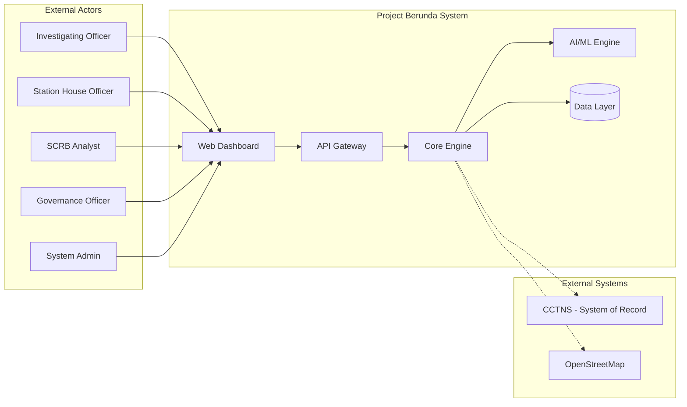
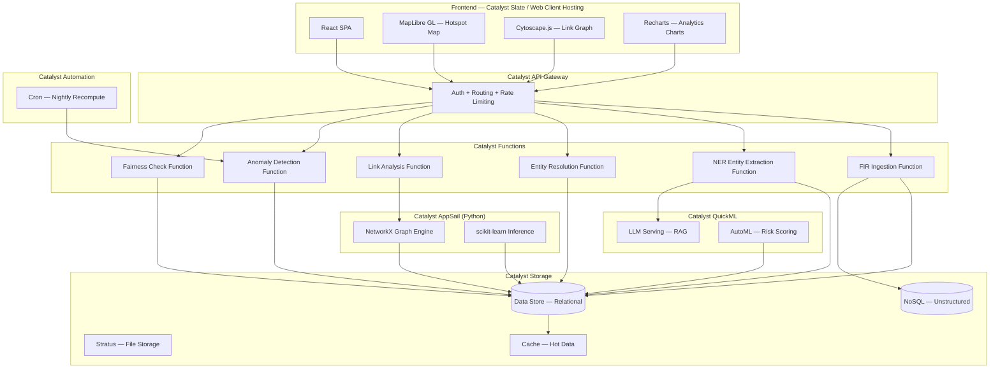
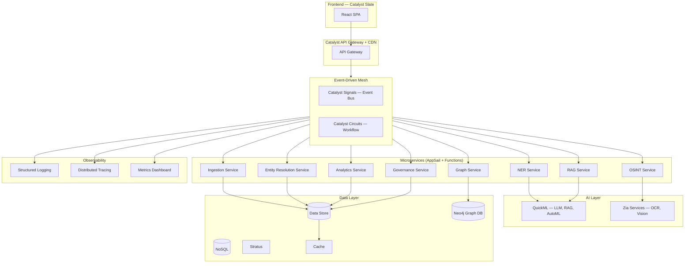

# System Context and Container Architecture

[//]: # (Document ID: BERUNDA-ARCH-001 | Status: DRAFT | Classification: PUBLIC)

---

## System Context Diagram

## Phase 1 Container Diagram

## Target State Container Diagram (Phase 3+)

