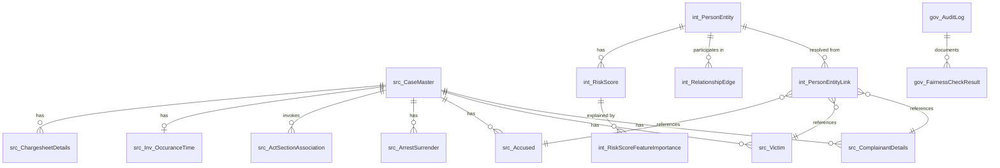

# Data Architecture

[//]: # (Document ID: BERUNDA-DATA-001 | Version: 1.0 | Status: DRAFT | Classification: INTERNAL | Owner: Berunda Team | Audience: Developers, Data Engineers, QA | Source: ERD PDF + ADR-003 + ADR-004 | Last Verified: 2026-07-17 | Review: Monthly)

---

## 1. Overview

The Berunda data architecture follows a **Three-Zone Model** that separates source-of-record data from computed/derived data and from audit/governance data. This separation is enforced by ADR-003 (Source of Record vs Intelligence Layer).

| Zone | Schema | Purpose | Mutability |
|------|--------|---------|------------|
| **Source Zone** | `src_` | Mirrors the official FIR ERD schema; authoritative case record | Insert-only after ingestion; never modified by AI |
| **Intelligence Zone** | `int_` | Berunda extensions: resolved entities, relationships, risk scores, patterns | Computed and updated by AI/analytics pipelines |
| **Governance Zone** | `gov_` | Audit logging, fairness checks, data provenance | Append-only |

## 2. Zone Details

### 2.1 Source Zone (`src_`)

Contains all tables from the Police FIR ER Diagram (PDF). These tables are the authoritative record of FIR data.

**Tables:** CaseMaster, ComplainantDetails, Victim, Accused, ArrestSurrender, inv_arrestsurrenderaccused, Inv_OccuranceTime, ActSectionAssociation, Act, Section, CrimeHeadActSection, CrimeHead, CrimeSubHead, CasteMaster, ReligionMaster, OccupationMaster, CaseStatusMaster, Court, District, State, Unit, UnitType, Rank, Designation, Employee, CaseCategory, GravityOffence, ChargesheetDetails

**Rules:**
- Data enters only via FIR Ingestion (FR-001, FR-002)
- No AI/analytics function writes to this zone
- Deletion is not permitted via application; only via database admin with documented reason

### 2.2 Intelligence Zone (`int_`)

Contains all Berunda-derived entities. These are computed, resolved, or inferred from source data.

**Tables:** PersonEntity, PersonEntityLink, RelationshipEdge, VehicleLink, RiskScore, RiskScoreFeatureImportance, MoPattern, MoPatternLink, AnomalyAlert, HotspotLayer, RAGCorpusChunk

**Rules:**
- Population is triggered by AI/analytics functions (NER, Entity Resolution, Risk Scoring, etc.)
- Records may be updated as new evidence arrives (e.g., PersonEntity merge)
- All updates are logged to the Governance Zone

### 2.3 Governance Zone (`gov_`)

Contains audit and governance records. This zone is append-only at the application layer.

**Tables:** AuditLog, FairnessCheckResult, DataProvenanceRecord

**Rules:**
- No update or delete operations via application code
- Retention: per Data Governance policy (see DATA_GOVERNANCE_RETENTION_AND_PROVENANCE.md)

## 3. Entity Relationship Overview



## 4. Data Storage Implementation

| Data Type | Catalyst Service | Justification |
|-----------|-----------------|---------------|
| Structured relational data (all zones) | Catalyst Data Store (MySQL-compatible) | Required for ACID transactions and referential integrity across 27+ source tables |
| Unstructured FIR narrative text | Catalyst NoSQL (MongoDB-compatible) | BriefFacts field contains variable-length narrative; document model suits NLP workflows |
| Synthetic data generation scripts | Catalyst Stratus (file storage) | Static file hosting for seed data scripts |
| RAG corpus chunks | Catalyst NoSQL + Catalyst Cache | NoSQL for persistence, Cache for hot retrieval |
| Graph algorithm intermediate results | In-memory (Catalyst Cache) | NetworkX operates on Data Store data; intermediate matrices are ephemeral |
| Audit logs | Catalyst Data Store (append-only) | Relational model supports complex querying by Governance Officer |

## 5. Data Flow Patterns

### 5.1 Ingestion Flow
```
External CSV/Excel → Ingestion Function → Validate → Insert into src_ tables → 
Trigger NER → Extract entities → Write int_PersonEntityLink → 
Trigger Entity Resolution → Update int_PersonEntity
```

### 5.2 Analytics Flow (Nightly Cron)
```
Cron Trigger → Anomaly Detection Function → Read src_CaseMaster →
Compute z-scores → Write int_AnomalyAlert → Update int_HotspotLayer
```

### 5.3 Audit Flow
```
Any Function → Construct AuditLog record → Write to gov_AuditLog → 
(if AI output) → Write to gov_FairnessCheckResult
```

## 6. Data Volume Estimates (MVP Dataset)

| Entity | Estimated Records | Growth Rate |
|--------|-------------------|-------------|
| src_CaseMaster | 2,000 - 5,000 | Static (synthetic) |
| int_PersonEntity | 3,000 - 8,000 | Grows with entity resolution |
| int_RelationshipEdge | 5,000 - 15,000 | Grows with relationship discovery |
| gov_AuditLog | 20,000 - 50,000 | ~10 records per case |

## 7. Migration Path (Phase 3+)

| Component | Phase 1 | Phase 3+ |
|-----------|---------|----------|
| Graph storage | Relational join tables | Dedicated graph DB (Neo4j) |
| Entity resolution | Rule-based | Learned model |
| Event integration | Synchronous function calls | Catalyst Signals event bus |
| Analytics | Catalyst Data Store + Cache | CQRS with read replicas |

## 8. Named Conventions

| Convention | Rule | Example |
|------------|------|---------|
| Source tables | Prefix `src_` + original name | `src_CaseMaster` |
| Intelligence tables | Prefix `int_` | `int_PersonEntity` |
| Governance tables | Prefix `gov_` | `gov_AuditLog` |
| Primary keys | `{table_name}ID` (camelCase) | `CaseMasterID` |
| Foreign keys | Same name as referenced PK | `CaseMasterID` |
| Audit timestamps | `CreatedAt`, `UpdatedAt` | All tables |
| Soft delete flag | `IsActive` (BIT) | All lookup tables |
