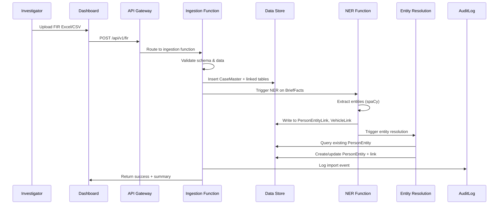
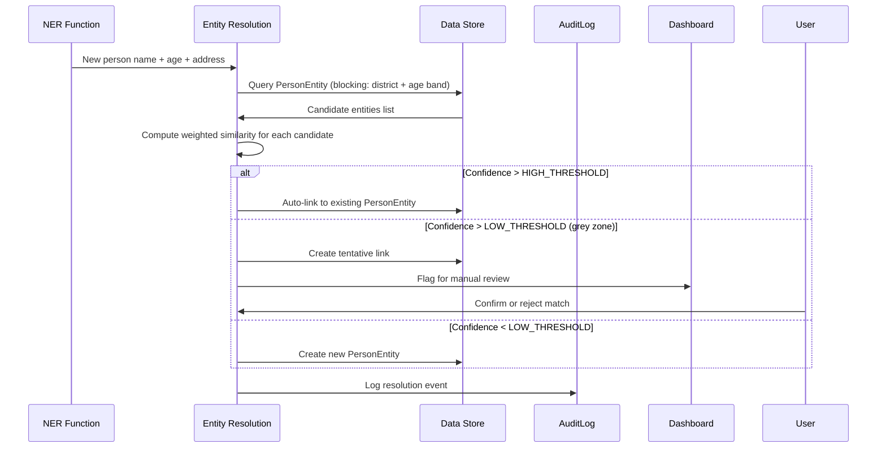
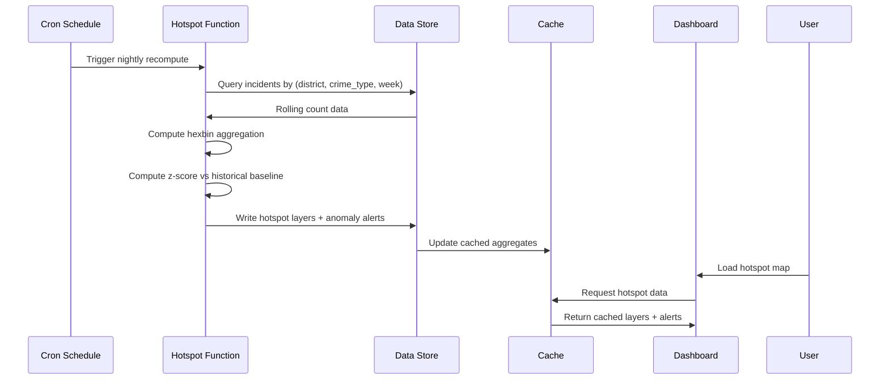
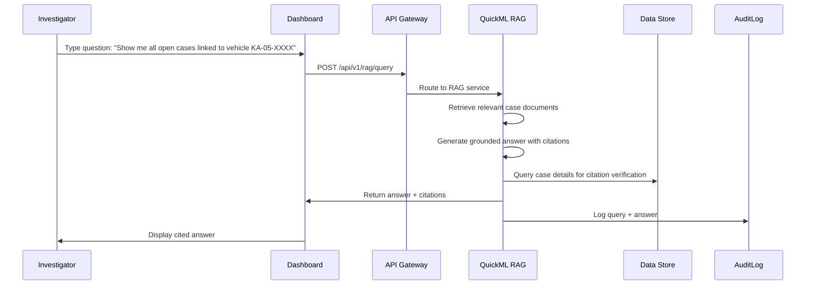
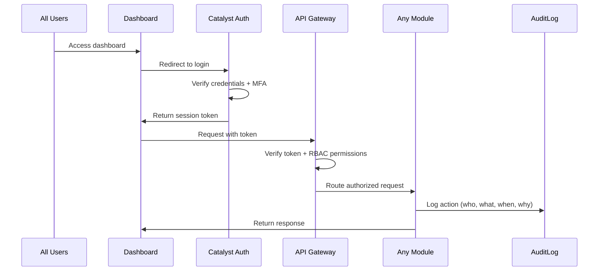

# High-Level Design

[//]: # (Document ID: BERUNDA-HLD-001 | Version: 1.1 | Status: APPROVED | Classification: INTERNAL | Owner: Berunda Team | Audience: Developers, Architects | Source: 01_Enterprise_Blueprint + ERD PDF + ADR decisions | Last Verified: 2026-07-23 | Review: Monthly)

---

## 1. Architectural Style

**Phase 1:** Modular Functions + API Gateway — NOT full microservices, NOT event-driven. A limited number of deployable units with explicit module boundaries and contracts. This is the smallest credible architecture for a 2-person team.

**Target State (Phase 3+):** Event-driven mesh with Catalyst Signals event bus, Circuits workflow orchestration, and CQRS read/write separation.

## 2. Module Overview

| Module | Responsibility | Deployable | MVP |
|--------|---------------|-----------|-----|
| FIR Ingestion | Parse, validate, import structured FIR data | Catalyst Function | ✅ |
| NER Extraction | Extract entities from free-text FIR narrative | Catalyst Function | ✅ |
| Entity Resolution | Match persons across cases | Catalyst Function | ✅ |
| Risk Scoring | Compute explainable repeat-offender scores | QuickML AutoML | ✅ |
| Hotspot Analysis | KDE/hexbin aggregation for hotspot detection | Catalyst Function | ✅ |
| Anomaly Detection | Z-score spike detection | Catalyst Function | ✅ |
| Link Analysis | Graph traversal over relationship edges | AppSail (NetworkX) | ✅ |
| RAG Query | Natural-language Q&A over case corpus | QuickML LLM + RAG | ✅ |
| Auth & RBAC | User authentication and role-based access | Catalyst Auth | ✅ |
| Audit Logging | Immutable audit trail | Catalyst Function | ✅ |
| Fairness Check | Verify model exclusion and role restriction | Catalyst Function | ✅ |

## 3. Data Flow: FIR Ingestion

## 4. Data Flow: Entity Resolution

## 5. Data Flow: Hotspot/Anomaly Pipeline

## 6. Data Flow: RAG Query

## 7. Data Flow: Auth/Audit

