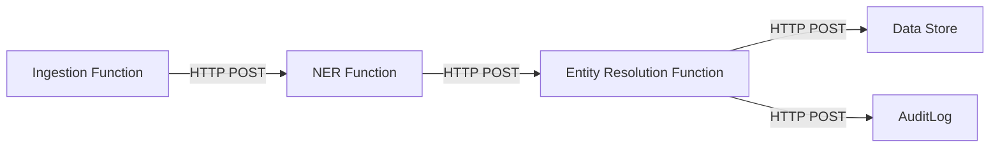
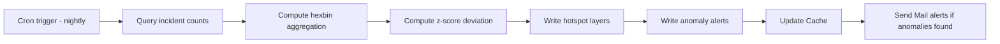
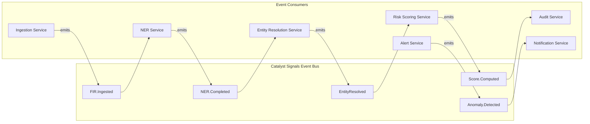

# Integration and Event Architecture

[//]: # (Document ID: BERUNDA-INT-001 | Version: 1.1 | Status: APPROVED | Classification: INTERNAL | Owner: Berunda Team | Audience: Developers, Architects | Source: 01_Enterprise_Blueprint + ERD PDF + ADR decisions | Last Verified: 2026-07-24 | Review: Monthly)

---

## Phase 1 Integration Pattern

Phase 1 uses **direct REST calls** between components. Each Catalyst Function exposes an HTTP endpoint through the API Gateway. Subsequent processing is triggered by the caller, not by an event bus.

**Why not event-driven in Phase 1:**
- Reduces complexity for a 2-person team
- Eliminates the need for async error handling and retry queues
- Synchronous flow is acceptable at demo dataset scale
- Event-driven approach is documented for Phase 3+ migration

## Phase 1 Data Flows

### FIR Ingestion Flow

```mermaid
flowchart LR
    A[Upload CSV/Excel] --> B[Validate Schema]
    B --> C[Parse CrimeNo]
    C --> D[Insert CaseMaster]
    D --> E[Insert Accused/Victim/Complainant]
    E --> F[Trigger NER on BriefFacts]
    F --> G[Extract Entities]
    G --> H[Write PersonEntityLink]
    H --> I[Trigger Entity Resolution]
    I --> J[Log to AuditLog]
    J --> K[Return Success]
```

### Hotspot/Anomaly Pipeline Flow

## Target State Event Architecture (Phase 3+)

### Migration Path from Phase 1 to Phase 3+

| Step | Change | Risk |
|------|--------|------|
| 1 | Replace direct Function-to-Function HTTP calls with Queue/Message | Service coupling reduced |
| 2 | Add Catalyst Signals event definitions for each major action | Event schema design required |
| 3 | Convert consumers to async event handlers | Error handling complexity increases |
| 4 | Add Catalyst Circuits for multi-step workflows | Orchestration logic added |
| 5 | Implement CQRS (separate read/write paths for analytics) | Data consistency challenges |
| 6 | Add distributed tracing | Observability infrastructure required |
