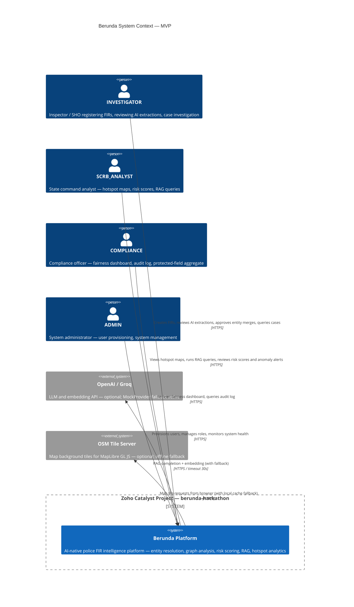
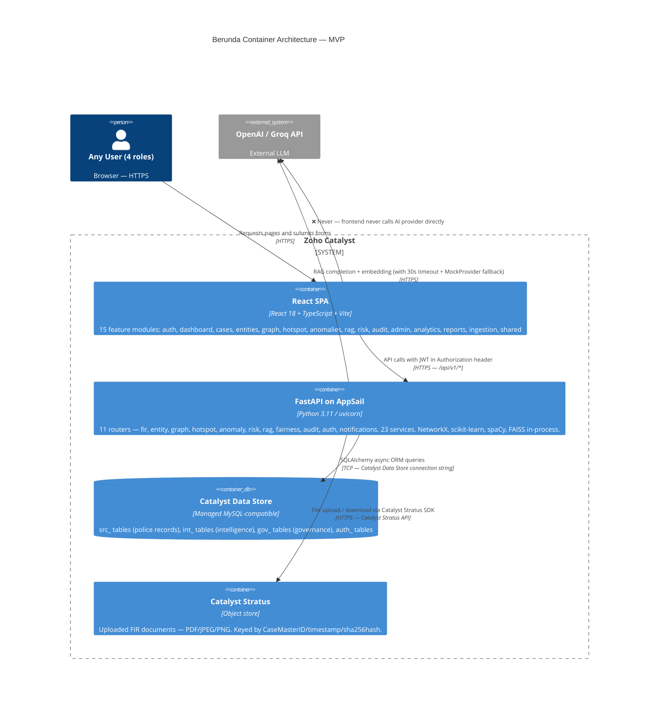
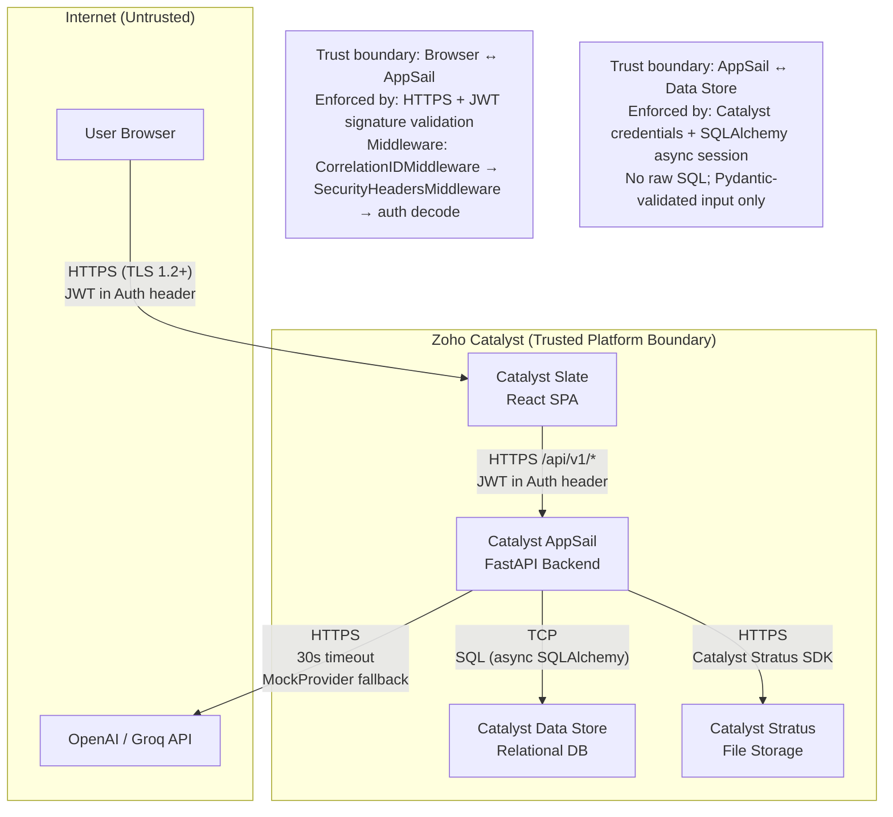

# 02 — System Context, Container Architecture, and Data Flows

**Document ID:** BERUNDA-ARCH2-SYSARCH-001
**Version:** 1.0 | **Status:** APPROVED — Phase 2 system architecture baseline
**Classification:** INTERNAL | **Owner:** Berunda Team | **Date:** 2026-07-26

> All components described here have a requirement in Phase 1 documents.
> Components without a requirement have not been approved.
> ADR references are authoritative.

---

## 1. Executive Summary

Berunda's approved MVP architecture is a **three-tier web application** deployed on Zoho Catalyst:

- **Tier 1 — Frontend:** React 18 SPA hosted on Catalyst Slate (static hosting)
- **Tier 2 — Backend:** Python FastAPI on Catalyst AppSail (primary ML/AI and business logic runtime); lightweight Catalyst Functions (Node.js) for simple CRUD endpoints (ARCH-DEC-001)
- **Tier 3 — Data:** Catalyst Data Store (relational), Catalyst Stratus (file storage)

All AI operations (NER, graph BFS, risk scoring, RAG) run on AppSail. Authorization is enforced in the backend middleware and service layers. The frontend never makes authorization decisions alone.

---

## 2. Architecture Objectives

| Objective | Requirement Source | How Achieved |
|-----------|-----------------|-------------|
| Role-based data isolation | FR-AUTH-003, FR-AUTH-004 | `require_role()` middleware + district filter at ORM level |
| Protected-field exclusion | ADR-007, FR-AUTH-005 | ORM SELECT projection excludes CasteRef/ReligionRef |
| AI human review gate | ADR-006, FR-AI-003 | Staging table (`int_AIExtractionQueue`) + officer approve/reject |
| Source-grounded RAG | ADR-006, FR-AI-013 | Guardrails service + citation required in response schema |
| Append-only audit | NFR-AUT-001 | No DELETE/UPDATE endpoint on `gov_AuditLog`; DB-level permission |
| Demo resilience | NFR-REL-001 | MockProvider for all AI services; fallback views for map/graph |
| Catalyst compliance | ADR-002 | All components on Catalyst: AppSail, Slate, Data Store, Stratus |
| Modular monolith | ADR-001 | Single FastAPI process; domain-separated modules; no inter-service calls |

---

## 3. System Actors

| Actor ID | Actor | Role | Access Level |
|---------|-------|------|-------------|
| ACT-001 | Inspector Ananya (INVESTIGATOR) | Front-line officer; FIR entry, extraction review, entity merge, search | District-scoped data only |
| ACT-002 | SHO Ramesh (INVESTIGATOR) | Supervisor; same as INVESTIGATOR with FIR assignment ability | District-scoped data only |
| ACT-003 | Analyst Priya (SCRB_ANALYST) | State command analytics; read-all; RAG; hotspot; risk scores | All districts; no protected fields |
| ACT-004 | Krishnamurthy (COMPLIANCE) | Fairness dashboard; audit log; protected-field aggregate view | All districts; aggregate CasteRef/ReligionRef |
| ACT-005 | Dev Admin (ADMIN) | User provisioning; system management; all data access | All (including individual CasteRef/ReligionRef for admin use) |

---

## 4. External Systems

| System | Purpose | Trust | Direction | MVP Status |
|--------|---------|-------|-----------|-----------|
| OpenAI API | RAG embedding + LLM completion | Untrusted — external | Outbound | Optional; MockProvider fallback |
| Groq API | Alternative LLM provider | Untrusted — external | Outbound | Optional; MockProvider fallback |
| OSM Tile Server | Map background tiles for MapLibre | Untrusted — external | Frontend fetch | Optional; offline tile cache |
| Catalyst Auth (OAuth) | Optional JWT delegation | Catalyst-internal | Inbound | Optional — self-hosted JWT preferred |

---

## 5. System-Context Diagram



---

## 6. Container Architecture

### Container Inventory

| Container | Runtime | Catalyst Service | Responsibility | ADR |
|-----------|---------|----------------|---------------|-----|
| `web` — React SPA | Node.js (build) / Static | Catalyst Slate | All user-facing screens; routes; API calls | ADR-008 |
| `api` — FastAPI on AppSail | Python 3.11+ | Catalyst AppSail | All business logic, ML/AI, graph, risk, RAG, auth, audit | ADR-001, ADR-009 |
| `data-store` — Catalyst Data Store | Managed MySQL | Catalyst Data Store | All relational data: src_, int_, gov_, auth_ tables | ADR-002 |
| `stratus` — file store | Managed object store | Catalyst Stratus | FIR document files; SHA-256 hash metadata | ADR-002 |
| `mock-ai` — MockProvider | In-process (FastAPI) | AppSail (same process) | Static responses for LLM and NER when primary AI is unavailable | ADR-006 |

Note: The `apps/api/` Node.js Catalyst Functions scaffold is retained for future lightweight CRUD migration. In the MVP demo, the FastAPI AppSail instance handles all routes.

---

## 7. Container-Level Architecture Diagram



---

## 8. Component Responsibilities

### 8.1 Frontend Components (React SPA)

| Component | Responsibility | Does NOT Do |
|-----------|--------------|-------------|
| `app/Router.tsx` | Route definitions; protected route wrapper | Authorization decisions |
| `app/ProtectedRoute.tsx` | Redirect unauthenticated users; hide routes not permitted for role | Server-side data filtering |
| `features/auth/` | Login form; JWT storage (httpOnly cookie or memory); token refresh | Role enforcement |
| `features/dashboard/` | Role-specific landing page; task list summary | Data access beyond summary |
| `features/cases/` | FIR list, FIR detail (multi-tab), new FIR form | Backend validation |
| `features/ingestion/` | Document upload with progress; extraction queue display | MIME validation (done in backend) |
| `features/entities/` | PersonEntity profile; merge review queue; side-by-side comparison | Merge decisions without API call |
| `features/graph/` | Cytoscape.js canvas; BFS path selection; path highlight | Graph computation |
| `features/hotspot/` | MapLibre GL heatmap; district click; crime-type/date filter | Density computation |
| `features/anomalies/` | Anomaly alert badge; drill-down panel | z-score computation |
| `features/rag/` | Chat interface; citation display; MockProvider banner | LLM calls |
| `features/risk/` | Risk score panel; feature importance bar chart; fairness badge | Score computation |
| `features/audit/` | Audit log table; filter by date/user/event type | Log mutation |
| `features/admin/` | User create, role assign, deactivate, unlock | Access control enforcement |
| `features/analytics/` | Temporal trend charts; crime breakdown charts | Statistical computation |
| `shared/` | API client (axios/fetch with JWT header), error boundary, loading states | Backend logic |

### 8.2 Backend Modules (FastAPI on AppSail)

| Module (Router/Service) | Responsibility | Data Owned |
|------------------------|--------------|-----------|
| `middleware/auth.py` | JWT decode; role extraction; `require_role()` dependency | None (stateless) |
| `middleware/correlation.py` | Attach correlation ID to every request | None |
| `routers/auth_router.py` + `services/auth_service.py` | Login, register, refresh, logout | `auth_User`, `auth_RefreshToken` |
| `routers/fir_router.py` + `services/fir_service.py` | FIR CRUD, CrimeNo generation, status lifecycle, upload trigger | `src_CaseMaster`, `src_Inv_OccuranceTime`, `src_EvidenceMaster`, `int_FIRProcessingState` |
| `routers/entity_router.py` + `services/entity_service.py` | PersonEntity CRUD, entity resolution pipeline, merge review | `int_PersonEntity`, `int_PersonEntityLink`, `int_AIExtractionQueue`, `int_ERMergeCandidate` |
| `routers/graph_router.py` + `services/graph_service.py` + `graph_analytics_service.py` | Graph construction, BFS shortest path | `int_RelationshipEdge`, `int_VehicleLink` (reads) |
| `routers/hotspot_router.py` + `services/hotspot_service.py` | Hotspot density, district drill-down, filter | `int_HotspotLayer` |
| `routers/anomaly_router.py` + `services/anomaly_service.py` | Anomaly detection, alert retrieval | `int_AnomalyAlert` |
| `routers/risk_router.py` + `services/risk_service.py` | Risk score compute, feature importance | `int_RiskScore`, `int_RiskScoreFeatureImportance` |
| `routers/rag_router.py` + `services/rag_service.py` | RAG query (jurisdictionally scoped), citation | `int_RAGCorpusChunk` |
| `services/embedding_service.py` | Embed FIR chunks for RAG | `int_RAGCorpusChunk.Embedding` |
| `routers/fairness_router.py` + `services/fairness_service.py` | Fairness check (pre-scoring), dashboard data | `gov_FairnessCheckResult` |
| `routers/audit_router.py` + `services/audit_service.py` | Write audit events, query audit log | `gov_AuditLog` |
| `services/guardrails_service.py` | RAG output guardrails; protected-characteristic refusal | None |
| `services/cache_service.py` | In-process response cache (hotspot, anomaly) | Redis (optional) |
| `pipelines/ner_pipeline.py` | NER extraction from BriefFacts | `int_AIExtractionQueue` (writes) |
| `ml/entity_resolution.py` (new) | Soundex blocking + weighted scoring per ADR-005 | `int_ERMergeCandidate` (writes) |
| `tasks/*.py` | Background: risk recompute, anomaly scan, RAG corpus rebuild | All intelligence tables |

---

## 9. Deployment-Boundary Mapping

| Component | Production Artifact | Runtime | Catalyst Service | Env Variables Required | Data Deps | Failure Behavior |
|-----------|-------------------|---------|----------------|----------------------|---------|-----------------|
| React SPA | Built static files (`dist/`) | Browser | Catalyst Slate | `VITE_API_BASE_URL` | None | 404 page |
| FastAPI | Python package (AppSail) | Catalyst AppSail | AppSail | `DATABASE_URL`, `JWT_SECRET_KEY`, `OPENAI_API_KEY` (optional), `STRATUS_*` | Data Store, Stratus | 503 on /health if DB unavailable |
| Data Store | Schema deployed via Catalyst console or migration script | Catalyst Data Store | Catalyst Data Store | `DATABASE_URL` | None | FastAPI returns 503 |
| Stratus bucket | Created in Catalyst console | Catalyst Stratus | Catalyst Stratus | `STRATUS_TOKEN`, `STRATUS_BUCKET` | None | Upload returns 503; file not saved |
| MockProvider | In-process with FastAPI | AppSail (same) | AppSail | None | None | None — always available |

---

## 10. Trust Boundaries



**Trust Boundary Rules:**
1. **Browser ↔ Slate:** Static files only; no secrets.
2. **Browser ↔ AppSail:** Every request must carry a valid JWT. Requests without JWT return HTTP 401. Requests with insufficient role return HTTP 403.
3. **AppSail ↔ Data Store:** SQLAlchemy parameterised queries only. No raw SQL string construction. Credential in environment variable.
4. **AppSail ↔ Stratus:** Catalyst SDK calls with stored credentials. File hash verified after upload.
5. **AppSail ↔ External AI:** All calls have 30-second timeout and MockProvider fallback. No sensitive data (real case content) is sent to external AI providers. Only `BriefFacts` text that the officer has already approved for extraction is sent.

---

## 11. End-to-End Data Flows

### Flow 1 — User Authentication

```
Browser: POST /api/v1/auth/login {username, password}
→ AppSail: CorrelationIDMiddleware adds X-Correlation-ID
→ AppSail: auth_router.py receives request
→ AppSail: auth_service.login()
  → Data Store: SELECT * FROM auth_User WHERE username = ? [parameterised]
  → bcrypt.verify(password, stored_hash)
  → If valid: JWT.encode({user_id, role, district, exp: +15min})
  → Data Store: INSERT INTO auth_RefreshToken (user_id, token_hash, expires_at)
  → audit_service.log(AUTH.LOGIN, user_id, ip_address)
→ AppSail: return {access_token, refresh_token}
Browser: Store access_token (memory); refresh_token (httpOnly cookie)
```

**Auth:** None (public endpoint) | **Audit:** AUTH.LOGIN | **Sensitive Data:** password (never logged) | **Error:** 401 on invalid credentials, 403 on lockout

---

### Flow 2 — Manual FIR Creation

```
Browser: POST /api/v1/fir {OccurrenceDate, FIRDate, DistrictRef, PoliceStationRef, CrimeHeadRef, BriefFacts}
→ AppSail: JWT decode → role = INVESTIGATOR, district = BLR_URBAN
→ AppSail: require_role([INVESTIGATOR, ADMIN])  ← 403 if not
→ AppSail: fir_router.py → fir_service.create_fir()
  → Validate PoliceStationRef ∈ user.assigned_stations  ← 403 if not
  → Data Store: SELECT next sequence for DC/SC/YEAR → CrimeNo = BLR/ECD/2026/0051
  → Data Store: INSERT src_CaseMaster (CrimeNo, status=REGISTERED, ...)
  → Data Store: INSERT src_Inv_OccuranceTime (CaseMasterID, BriefFacts, ...)
  → audit_service.log(FIR.CREATE, user_id, case_id, district)
  → BackgroundTasks.add_task(ner_pipeline.extract, case_id, brief_facts)
→ AppSail: return {case_id, crime_no, status: REGISTERED} HTTP 201
BackgroundTask:
  → ner_pipeline.extract(case_id, brief_facts)
  → spaCy NER → [Person: Venkatesh Kumar 0.85, Vehicle: KA-01-AB-9999 0.91, Location: MG Road 0.78]
  → Data Store: INSERT int_AIExtractionQueue (case_id, entity_type, text, confidence, status=PENDING)
  → Data Store: UPDATE src_CaseMaster.status = EXTRACTION_PENDING
  → audit_service.log(AI.EXTRACTION.TRIGGERED, system, case_id)
```

**Auth:** INVESTIGATOR or ADMIN | **Audit:** FIR.CREATE, AI.EXTRACTION.TRIGGERED | **Sensitive Data:** BriefFacts (logged as case_id only, not content) | **Error:** 422 on missing fields, 403 on station mismatch

---

### Flow 3 — FIR Document Upload

```
Browser: POST /api/v1/fir/{case_id}/upload (multipart/form-data; file=<PDF>)
→ AppSail: JWT decode → role check [INVESTIGATOR or ADMIN]
→ AppSail: fir_router.py → fir_service.upload_document()
  → Read file bytes into memory (≤ 10 MB)
  → python-magic: detect MIME from file content ← 415 if not PDF/JPEG/PNG
  → sha256(file_bytes) → hash string
  → Catalyst Stratus SDK: put_object(key="{case_id}/{timestamp}/{hash}", body=file_bytes)
  → Data Store: INSERT src_EvidenceMaster (CaseMasterID, StratusKey, FileHash, MIMEType, UploadedBy, UploadedAt)
  → Data Store: INSERT int_FIRProcessingState (CaseMasterID, Status=UPLOADED, DocumentType=PDF)
  → audit_service.log(FIR.UPLOAD, user_id, case_id, hash)
  → BackgroundTasks.add_task(ner_pipeline.extract_from_document, case_id, stratus_key)
→ AppSail: return {evidence_id, hash, extraction_status: TRIGGERED} HTTP 200
BackgroundTask:
  → Stratus: get_object(stratus_key) → file bytes
  → PyPDF2.extract_text(file_bytes) → text string
  → spaCy NER on extracted text → suggestions
  → Data Store: INSERT int_AIExtractionQueue per suggestion
  → Data Store: UPDATE int_FIRProcessingState.Status = EXTRACTION_PENDING
  → On PyPDF2 failure: UPDATE int_FIRProcessingState.Status = EXTRACTION_FAILED; notify officer
```

**Auth:** INVESTIGATOR or ADMIN | **Audit:** FIR.UPLOAD | **File Validation:** MIME from content (not header) | **Error:** 415 on bad type, 413 on size, 503 on Stratus unavailable

---

### Flow 4 — AI Extraction Review and Approval

```
Browser: GET /api/v1/fir/{case_id}/extraction
→ AppSail: require_role([INVESTIGATOR, ADMIN])
→ AppSail: entity_service.get_extraction_queue(case_id, user_district)
  → Data Store: SELECT * FROM int_AIExtractionQueue WHERE case_id=? AND status=PENDING [jurisdiction scoped]
→ AppSail: return [{entity_id, entity_type, text, confidence, status}, ...] with AI_SUGGESTION flag
```

```
Browser: POST /api/v1/fir/{case_id}/extraction/approve
  Body: [{queue_id, action: APPROVE|EDIT|REJECT, edited_value?: string}, ...]
→ AppSail: require_role([INVESTIGATOR, ADMIN])
→ AppSail: entity_service.process_review(case_id, decisions, reviewer_id)
  → For each decision:
      If APPROVE:
        → Data Store: INSERT into target table (src_Accused / int_VehicleLink / src_OccurrencePlace)
        → Data Store: UPDATE int_AIExtractionQueue.status = APPROVED, reviewed_by, reviewed_at
        → audit_service.log(AI.EXTRACTION.APPROVE, user_id, queue_id, confidence)
      If EDIT:
        → Data Store: INSERT into target table with edited_value
        → Data Store: UPDATE int_AIExtractionQueue.status = APPROVED_EDITED, reviewed_by, original_text, edited_text
        → audit_service.log(AI.EXTRACTION.EDIT, user_id, queue_id, {original, corrected})
        → audit_service.log(AI.EXTRACTION.APPROVE, user_id, queue_id, corrected_value)
      If REJECT:
        → Data Store: UPDATE int_AIExtractionQueue.status = REJECTED, reviewed_by
        → audit_service.log(AI.EXTRACTION.REJECT, user_id, queue_id)
  → Data Store: UPDATE src_CaseMaster.status = EXTRACTION_APPROVED (if all reviewed)
  → BackgroundTasks.add_task(entity_resolution_pipeline.run, newly_approved_person_ids)
→ AppSail: return {processed: n, approved: x, rejected: y, edited: z}
```

**Auth:** INVESTIGATOR or ADMIN | **Audit:** AI.EXTRACTION.APPROVE, AI.EXTRACTION.REJECT, AI.EXTRACTION.EDIT | **Key Rule:** Nothing written to permanent tables without APPROVE action

---

### Flow 5 — Entity Resolution and Merge Review

```
BackgroundTask: entity_resolution_pipeline.run(person_ids)
  → Data Store: SELECT persons to check (within same districts)
  → Apply Soundex blocking on CanonicalName.split()[−1] → blocking keys
  → For each blocking key: retrieve all PersonEntity records in same key
  → For each pair: compute weighted score:
      name_similarity × 0.4 + dob_match × 0.3 + address_token × 0.2 + phone_last4 × 0.1
  → If score >= 0.50: INSERT int_ERMergeCandidate (PersonA, PersonB, score, signals JSON)
  → audit_service.log(ENTITY.RESOLUTION.CANDIDATE.CREATED, system, candidate_id, score)
```

```
Browser: GET /api/v1/entities/merge-queue
→ AppSail: require_role([INVESTIGATOR, ADMIN])
→ entity_service.get_merge_queue(user_district)
  → Data Store: SELECT int_ERMergeCandidate WHERE status=PENDING AND district_in_user_scope
→ Return: [{candidate_id, person_a, person_b, score, signals}, ...]
```

```
Browser: POST /api/v1/entities/merge/{candidate_id}/approve
→ AppSail: entity_service.approve_merge(candidate_id, reviewer_id)
  → Data Store: UPDATE int_PersonEntity (non-canonical) SET status=MERGED, canonical_id=PersonA
  → Data Store: UPDATE int_PersonEntityLink SET PersonEntityID=PersonA WHERE PersonEntityID=PersonB
  → Data Store: UPDATE int_ERMergeCandidate.status = APPROVED
  → audit_service.log(ENTITY.MERGE.APPROVE, user_id, candidate_id, PersonA, PersonB, score)
→ Return: {canonical_id, linked_cases: [case_ids]}
```

**Auth:** INVESTIGATOR (own district), ADMIN (cross-district) | **Audit:** ENTITY.MERGE.APPROVE / REJECT / DEFER | **Key Rule:** ADR-005 rule-based scoring only; no ML-auto-merge

---

### Flow 6 — FIR Search

```
Browser: GET /api/v1/search?q=Venkatesh&types=persons,cases,vehicles
→ AppSail: require_role([INVESTIGATOR, SCRB_ANALYST, COMPLIANCE, ADMIN])
→ fir_service.global_search(query, types, user_role, user_district)
  → If INVESTIGATOR: add WHERE PoliceStationRef IN (user.stations) to all queries
  → Data Store: SELECT PersonEntity WHERE CanonicalName LIKE %query% OR aliases LIKE %query%
  → Data Store: SELECT VehicleLink WHERE VehicleNumber LIKE %query%
  → Data Store: SELECT CaseMaster WHERE CrimeNo LIKE %query%
  → Merge results: {persons: [...], vehicles: [...], cases: [...]}
  → audit_service.log(SEARCH.QUERY, user_id, query_redacted=true, result_counts)
→ Return: {persons: [max 100], vehicles: [max 100], cases: [max 100]}
```

**Auth:** All roles | **Audit:** SEARCH.QUERY (query not logged — just count) | **P95 target:** < 3s for 5000 FIRs

---

### Flow 7 — RAG Query (Ask Berunda)

```
Browser: POST /api/v1/rag/query {question: "What cases involve vehicle KA-01-AB-9999?"}
→ AppSail: require_role([INVESTIGATOR, SCRB_ANALYST, COMPLIANCE, ADMIN])
→ rag_service.query(question, user_role, user_district)
  → guardrails_service.check_question(question)
      → If question contains protected-characteristic keywords (caste, religion, jati, ...):
          → return REFUSED response; audit_service.log(RAG.PROTECTED_CHAR_REFUSAL)
  → embedding_service.embed(question) → query_vector
  → Data Store: SELECT top-K int_RAGCorpusChunk WHERE TenantDistrictID IN (user.districts)
      ORDER BY cosine_similarity(Embedding, query_vector) LIMIT K
  → Inject chunks into LLM system prompt as grounding context
  → LLM completion (OpenAI / Groq / MockProvider) → answer + citations
  → guardrails_service.validate_answer(answer)
      → Verify answer contains ≥ 1 citation; verify no protected-characteristic content
  → audit_service.log(RAG.QUERY, user_id, question_text, cited_case_ids)
→ Return: {answer, citations: [{crime_no, chunk_preview}, ...], disclaimer, provider: "openai|groq|mock"}
```

**Auth:** All roles | **Audit:** RAG.QUERY | **Key Rules:** ADR-006 source grounding; jurisdiction scoping on chunk retrieval; citation mandatory; protected-characteristic refusal

---

### Flow 8 — Hotspot Map and Anomaly Alert

```
Browser: GET /api/v1/hotspot?crime_head=THEFT&date_range=last_30_days
→ AppSail: require_role([INVESTIGATOR, SCRB_ANALYST, ADMIN])
→ hotspot_service.get_heatmap(crime_head, date_range, user_district)
  → If INVESTIGATOR: filter to user.districts only
  → Data Store: SELECT int_HotspotLayer WHERE CrimeHeadID=? AND WeekStart>=? GROUP BY DistrictID
  → Return: [{district_id, district_name, lat, lon, density_score, anomaly_badge?}, ...]
→ AppSail: GET /api/v1/anomaly?district=BLR_URBAN → AnomalyAlert records with ZScore, AlertLevel
→ Return to frontend: merged heatmap + anomaly overlay data
```

**Auth:** INVESTIGATOR (own district), SCRB_ANALYST and ADMIN (all)

---

### Flow 9 — Risk Score Computation and Display

```
BackgroundTask: risk_service.batch_compute()
  → fairness_service.check_pre_scoring()
      → Inspect model feature list: assert CasteRef not in features; assert ReligionRef not in features
      → If check fails: INSERT gov_FairnessCheckResult (status=FAIL); halt; audit log
      → If check passes: INSERT gov_FairnessCheckResult (status=PASS)
  → Data Store: SELECT PersonEntity with PriorCaseCount >= 2
  → For each: compute [PriorCaseCount, DaysSinceLastCase, CrimeTypeCount, AvgSeverityScore]
  → scikit-learn predict_proba(features) → score
  → SHAP or coefficient magnitudes → top 5 feature importances
  → Data Store: INSERT int_RiskScore (PersonEntityID, Score, ModelVersion, FeaturesJSON, ComputedAt)
  → Data Store: INSERT int_RiskScoreFeatureImportance per feature

Browser: GET /api/v1/risk/{person_entity_id}
→ require_role([INVESTIGATOR, SCRB_ANALYST, ADMIN])
→ return {score, severity_label, feature_importances: [{name, weight}, ...], fairness_badge: PASS, model_version}
→ audit_service.log(RISK.VIEW, user_id, person_entity_id, score)
```

**Auth:** INVESTIGATOR (own district), SCRB_ANALYST (all) | **Audit:** RISK.VIEW | **Key Rule:** Fairness check must pass before scoring run proceeds

---

### Flow 10 — Audit Event Recording

```
All sensitive endpoints → service layer → audit_service.log_event()
  → Construct AuditEvent {event_id: UUID4, event_type, user_id, resource_type, resource_id, timestamp, district, details_json}
  → Data Store: INSERT gov_AuditLog (event) — in same async DB session, before response returned
  → If INSERT fails: structured logger.error(AUDIT_WRITE_FAILURE, event); return original response
  → gov_AuditLog has no UPDATE or DELETE endpoint; DB user lacks UPDATE/DELETE on this table
```

```
Browser: GET /api/v1/audit?date_from=2026-07-26&user_id=ananya
→ require_role([INVESTIGATOR, SCRB_ANALYST, COMPLIANCE, ADMIN])
→ If INVESTIGATOR or SCRB_ANALYST: add WHERE user_id = request_user_id (own-only)
→ If COMPLIANCE or ADMIN: no restriction on user_id filter
→ Data Store: SELECT gov_AuditLog with filter params
→ Return: [{event_id, event_type, user_id, resource_id, timestamp, district}, ...]
```

---

## 12. Failure Boundaries

| Failure | Impact | Containment |
|---------|--------|------------|
| AI provider (LLM) unavailable | RAG returns mock answer; banner shown | MockProvider; NFR-REL-001 |
| spaCy model unavailable | NER extraction fails; EXTRACTION_FAILED status; manual entry offered | Error in `int_FIRProcessingState`; UI shows manual entry option |
| Data Store unavailable | All data operations fail; `/health` returns degraded | FastAPI returns 503; no crash |
| Stratus unavailable | File upload fails; FIR creation (manual) succeeds | 503 on upload; FIR record not lost |
| Background task (NER) fails | FIR exists; extraction not triggered; officer notified | Logged; status=EXTRACTION_FAILED |
| Audit write fails | Original operation succeeds; failure logged | structured logger; no blocking |
| NetworkX BFS fails | Graph renders; BFS returns empty; user sees "no path" | Error caught; fallback message |
| Risk score batch fails | No new scores; existing scores unchanged; admin alerted via health endpoint | Fairness check FAIL flag on health |

---

## 13. Scalability Assumptions

These are not production targets — these are the assumptions the MVP architecture is built on:

| Component | Demo-Scale Assumption | Growth Path |
|-----------|----------------------|------------|
| FIR records | ≤ 5000 FIRs | Pagination, index optimization |
| PersonEntity records | ≤ 10000 | Same |
| Graph edges | ≤ 20000 | Migrate to Neo4j at Phase 3+ |
| RAG corpus chunks | ≤ 50000 (5000 FIRs × ~10 chunks/FIR) | Sharded FAISS index |
| FAISS index memory | ≤ 500 MB (text-embedding-3-small, 1536 dims) | Reduce dims or chunk count |
| Concurrent users during demo | 1-3 | AppSail auto-scaling |
| Risk scoring batch time | ≤ 60 seconds for 3000 persons | Batch parallelism |

---

## 14. Availability Assumptions

| Assumption | Source |
|-----------|--------|
| Demo environment is available continuously during judging | NFR-DEP-003 |
| External LLM APIs are not required (MockProvider always available) | NFR-REL-001 |
| Catalyst Data Store is the single source of truth; no eventual consistency | ADR-002 |
| AppSail instance is started before demo begins and stays warm | ARCH-RSK-001 |
| Fallback video is available if live demo fails | NFR-REL-004 |

---

## 15. Architecture Trade-offs

| Trade-off | Decision | Rationale |
|-----------|---------|-----------|
| FastAPI (Python) vs Node.js Functions for all routes | FastAPI on AppSail for all | spaCy, scikit-learn, NetworkX require Python runtime; Node.js would require subprocess calls |
| In-process FAISS vs Catalyst NoSQL vector storage | FAISS in-process | Demo scale ≤ 50K vectors fits comfortably in AppSail memory; Catalyst NoSQL vector capability is unverified |
| Synchronous REST vs event-driven | Synchronous REST | ADR-011; 2-person team; event bus complexity not warranted |
| PostgreSQL ORM (prod) vs SQLite (dev) | Both — Alembic handles both | Local dev requires no Catalyst credentials; SQLite is sufficient for unit tests |
| Self-hosted JWT vs Catalyst Auth | Self-hosted JWT (HS256) | Catalyst Auth adds OAuth redirect complexity; JWT is simpler for demo login flow |
| Image OCR vs text-only PDF extraction | Text-only PDF | Catalyst Zia OCR capability unverified; Tesseract adds system dependency; MVP risk is high |

---

## 16. Deferred Architecture

| Component | Deferred To | Rationale |
|-----------|------------|---------|
| Neo4j graph database | Phase 3+ | ADR-004 — NetworkX in-memory is sufficient at demo scale |
| Celery + Redis task queue | Phase 3+ | ADR-011 — FastAPI BackgroundTasks sufficient for MVP |
| Catalyst Signals event bus | Phase 3+ | ADR-001 — synchronous REST sufficient |
| CCTNS real data bridge | Phase 2+ | Legal MOU required |
| Kannada NER | Phase 2 | AI4Bharat model setup > 4 days |
| Mobile app | Phase 2 | Responsive web only for MVP |
| Blockchain audit trail | Phase 3+ | Hash-chain in `gov_AuditLog` is sufficient |
| Prometheus + Grafana (observability) | Local dev only | Configured but not Catalyst-deployed in MVP |
| Catalyst Zia OCR | Phase 2 | Capability unverified for hackathon tier |

---

## 17. Open Decisions

| Decision | Status |
|----------|--------|
| ARCH-DEC-001 Deployment (AppSail vs Functions) | DECIDED: AppSail primary; ADR required |
| ARCH-OQ-001 AppSail Python 3.11+ + spaCy support | Open — verify Day 1 |
| ARCH-OQ-002 Data Store table count limits | Open — verify Day 1 |
| ARCH-OQ-004 Stratus streaming upload support | Open — verify Day 2 |
| ARCH-OQ-005 API Gateway timeout for long NER calls | Open — verify Day 1 |

---

## 18. Related ADRs

ADR-001, ADR-002, ADR-003, ADR-004, ADR-005, ADR-006, ADR-007, ADR-008, ADR-009, ADR-010, ADR-011

New ADR required: ARCH-DEC-001 (AppSail-primary deployment strategy)

---

*End of 02-SYSTEM-CONTEXT-AND-CONTAINER-ARCHITECTURE.md*
