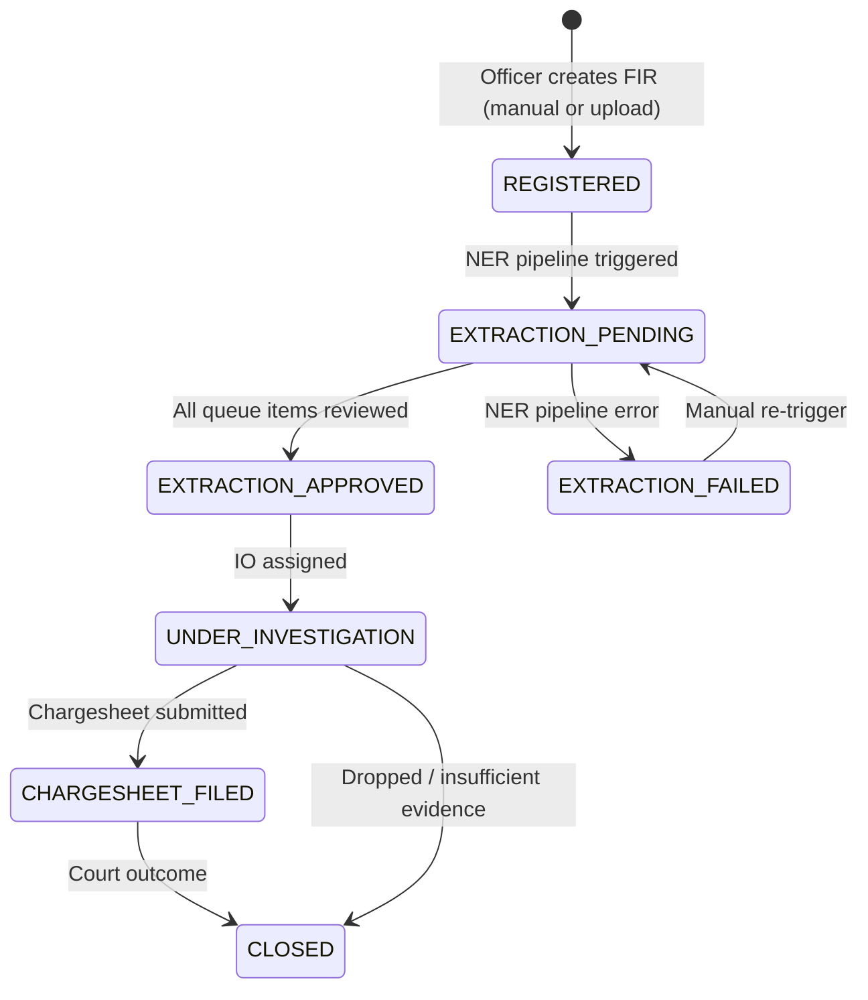
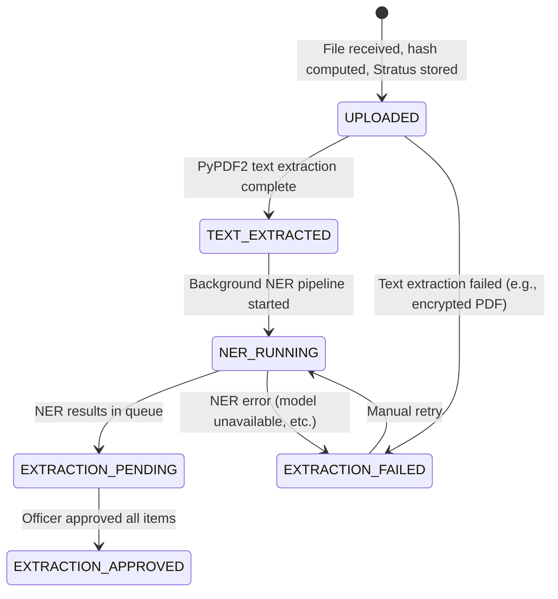
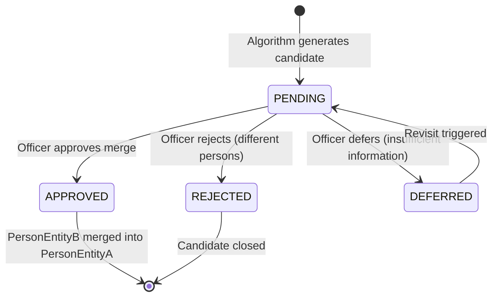

# 04 — Data Architecture and Database Design

**Document ID:** BERUNDA-ARCH2-DATDES-001
**Version:** 1.0 | **Status:** APPROVED — Phase 2 data design baseline
**Classification:** INTERNAL | **Owner:** Berunda Team | **Date:** 2026-07-26

> This document is the authoritative data design specification before any database schema changes.
> No table may be created without first being classified and specified here.
> ADR-003 is the source of truth for src_ / int_ / gov_ separation.

---

## 1. Executive Summary

Berunda's data layer uses a **two-domain schema** pattern (ADR-003):

- **`src_` tables** — police source records. These are the official source of truth. AI systems never write directly to `src_` tables except through an officer-approved action. `src_` tables mirror the FIR data structure from CCTNS/NCRB.
- **`int_` tables** — derived intelligence. AI-computed, system-generated, and investigative overlay data. These tables are written by AI pipelines, background tasks, and officer-confirmed actions.
- **`gov_` tables** — governance. Audit logs, fairness check results. Append-only.
- **`auth_` tables** — authentication. User accounts, refresh tokens.

**5 new tables** are required before P0 implementation can begin:
1. `int_AIExtractionQueue` — NER suggestions pending officer review
2. `int_ERMergeCandidate` — entity resolution merge candidates pending officer decision
3. `int_FIRProcessingState` — document processing lifecycle state
4. `src_EvidenceMaster` — uploaded FIR document metadata
5. `src_OccurrencePlace` — structured location (P1)

---

## 2. Data Design Principles

| Principle | Implication |
|-----------|------------|
| **ADR-003: src_/int_ separation** | AI never auto-writes to `src_` tables; officer review is the gate |
| **ORM exclusion for sensitive fields** | CasteRef/ReligionRef excluded at SELECT projection level, not serialisation |
| **Audit all writes** | Every INSERT or UPDATE to case-related tables generates a `gov_AuditLog` entry |
| **Soft deletion only** | No hard DELETE on any case or person record; use `Active=False` or `status=ARCHIVED` |
| **Append-only audit log** | `gov_AuditLog` has no UPDATE or DELETE; DB user lacks these permissions |
| **SYNTHETIC label mandatory** | Seed data rows must include `DataSource='SYNTHETIC'` field where possible |
| **Idempotent seed loads** | UPSERT semantics; running seed twice produces same dataset |
| **No real PII** | All person names, DOBs, addresses are synthetically generated |
| **Jurisdiction-scoped queries** | INVESTIGATOR queries always include `DistrictID IN (user.districts)` filter |
| **Optimistic concurrency** | `UpdatedAt` timestamp used as ETag for optimistic lock on FIR updates |

---

## 3. Data-Domain Map

```
auth_                    gov_                     src_                         int_
─────────────            ─────────────────        ─────────────────────────    ──────────────────────────────
auth_User                gov_AuditLog             src_State                    int_PersonEntity
auth_RefreshToken        gov_FairnessCheckResult  src_District                 int_PersonEntityLink
                                                  src_Unit (PoliceStation)     int_ERMergeCandidate   [NEW]
                                                  src_UnitType                 int_VehicleLink
                                                  src_Rank                     int_RelationshipEdge
                                                  src_Designation              int_AIExtractionQueue  [NEW]
                                                  src_Employee (Officer)       int_FIRProcessingState [NEW]
                                                  src_OccupationMaster         int_RiskScore
                                                  src_CasteMaster              int_RiskScoreFeatureImportance
                                                  src_ReligionMaster           int_MoPattern
                                                  src_GenderMaster             int_MoPatternLink
                                                  src_Court                    int_AnomalyAlert
                                                  src_CaseCategory             int_HotspotLayer
                                                  src_GravityOffence           int_RAGCorpusChunk
                                                  src_CaseStatusMaster
                                                  src_CrimeHead
                                                  src_CrimeSubHead
                                                  src_Act
                                                  src_Section
                                                  src_CrimeHeadActSection
                                                  src_CaseMaster               [Core FIR record]
                                                  src_Inv_OccuranceTime        [Occurrence + BriefFacts]
                                                  src_ComplainantDetails
                                                  src_Victim
                                                  src_Accused
                                                  src_ArrestSurrender
                                                  src_ActSectionAssociation
                                                  src_ChargesheetDetails
                                                  src_EvidenceMaster           [NEW — file upload]
                                                  src_OccurrencePlace          [NEW — P1 location]
```

---

## 4. Entity Catalogue

### P0 Required Tables (must exist before demo)

| Table | Domain | Priority | Classification |
|-------|--------|---------|--------------|
| auth_User | auth | P0 | Existing — modify role enum |
| auth_RefreshToken | auth | P0 | Existing |
| src_CaseMaster | src | P0 | Existing |
| src_Inv_OccuranceTime | src | P0 | Existing |
| src_ComplainantDetails | src | P0 | Existing — add PII classification |
| src_Victim | src | P0 | Existing |
| src_Accused | src | P0 | Existing — add nullable CasteRef/ReligionRef |
| src_EvidenceMaster | src | P0 | **NEW** |
| int_FIRProcessingState | int | P0 | **NEW** |
| int_AIExtractionQueue | int | P0 | **NEW** |
| int_PersonEntity | int | P0 | Existing |
| int_PersonEntityLink | int | P0 | Existing |
| int_ERMergeCandidate | int | P0 | **NEW** |
| int_VehicleLink | int | P0 | Existing |
| int_RelationshipEdge | int | P0 | Existing |
| int_RiskScore | int | P0 | Existing |
| int_RiskScoreFeatureImportance | int | P0 | Existing |
| int_RAGCorpusChunk | int | P0 | Existing |
| int_AnomalyAlert | int | P0 | Existing |
| int_HotspotLayer | int | P0 | Existing |
| gov_AuditLog | gov | P0 | Existing |
| gov_FairnessCheckResult | gov | P0 | Existing (verify) |
| All src_ lookup tables (State, District, Unit, etc.) | src | P0 | Existing |

### P1 Tables

| Table | Priority | Classification |
|-------|---------|--------------|
| src_OccurrencePlace | P1 | **NEW** — structured location from NER |
| int_MoPattern | P1 | Existing |
| int_MoPatternLink | P1 | Existing |

### Deferred / Rejected Tables

| Table | Classification | Reason |
|-------|--------------|--------|
| Neo4j graph nodes/edges | Deferred — Phase 3+ | ADR-004 |
| Celery task registry | Deferred — Phase 3+ | ADR-011 |
| Notification delivery log | Optional — P2 | Not demo-critical |

---

## 5. Detailed Table Specifications

### Table: auth_User

| Field | Type | Constraints | Notes |
|-------|------|-------------|-------|
| UserID | Integer | PK, AUTO | — |
| Username | VARCHAR(100) | UNIQUE, NOT NULL | Login identifier |
| Email | VARCHAR(200) | UNIQUE, NOT NULL | — |
| PasswordHash | VARCHAR(255) | NOT NULL | bcrypt; never logged |
| **Role** | ENUM | NOT NULL | **`INVESTIGATOR`, `SCRB_ANALYST`, `COMPLIANCE`, `ADMIN`** — replaces 3-role model |
| PrimaryDistrictID | Integer | FK → src_District, NULLABLE | Required for INVESTIGATOR; null for cross-district roles |
| AssignedStations | TEXT (JSON) | NULLABLE | JSON array of UnitID; INVESTIGATOR jurisdiction |
| IsActive | BOOLEAN | DEFAULT TRUE | Deactivation flag |
| FailedLoginCount | Integer | DEFAULT 0 | Lockout counter |
| LastLoginAt | DATETIME | NULLABLE | — |
| CreatedAt | DATETIME | DEFAULT NOW() | — |
| UpdatedAt | DATETIME | DEFAULT NOW() | — |

**Sensitive data:** Role + DistrictID are PII-adjacent. Log by UserID only.
**Migration required:** Change `role` column enum from `admin/analyst/viewer` to 4-value enum.

---

### Table: src_CaseMaster (additions)

Existing table — additions only:

| Field | Change | Notes |
|-------|--------|-------|
| status | ADD VARCHAR(50) | FIR lifecycle state: REGISTERED → EXTRACTION_PENDING → EXTRACTION_APPROVED → UNDER_INVESTIGATION → CLOSED |
| CreatedAt | ADD DATETIME DEFAULT NOW() | — |
| UpdatedAt | ADD DATETIME DEFAULT NOW() | Used as optimistic concurrency ETag |
| CreatedBy | ADD FK → auth_User | Officer who created FIR |

---

### Table: src_EvidenceMaster (NEW)

| Field | Type | Constraints | Notes |
|-------|------|-------------|-------|
| EvidenceMasterID | Integer | PK, AUTO | — |
| CaseMasterID | Integer | FK → src_CaseMaster, NOT NULL | Parent case |
| StratusObjectKey | VARCHAR(512) | NOT NULL | Format: `{CaseMasterID}/{timestamp}/{sha256_prefix}` |
| FileHash | VARCHAR(64) | NOT NULL | SHA-256 hex string |
| MIMEType | VARCHAR(100) | NOT NULL | `application/pdf`, `image/jpeg`, `image/png` |
| OriginalFilename | VARCHAR(255) | NOT NULL | Sanitised — no path traversal |
| FileSizeBytes | Integer | NOT NULL | ≤ 10485760 (10 MB) |
| UploadedBy | Integer | FK → auth_User, NOT NULL | — |
| UploadedAt | DATETIME | DEFAULT NOW() | — |
| ProcessingStatus | VARCHAR(50) | NOT NULL | UPLOADED, TEXT_EXTRACTED, EXTRACTION_TRIGGERED, EXTRACTION_FAILED |
| TextExtractedAt | DATETIME | NULLABLE | When PyPDF2 extraction ran |
| Active | BOOLEAN | DEFAULT TRUE | Soft delete |

**Sensitive data:** FileHash is a technical field, not PII. OriginalFilename must be sanitised (strip path separators).
**Storage:** Binary content lives in Catalyst Stratus only. No binary content in Data Store.

---

### Table: int_FIRProcessingState (NEW)

| Field | Type | Constraints | Notes |
|-------|------|-------------|-------|
| ProcessingStateID | Integer | PK, AUTO | — |
| CaseMasterID | Integer | FK → src_CaseMaster, UNIQUE, NOT NULL | One processing state per FIR |
| DocumentType | VARCHAR(50) | DEFAULT 'PDF' | PDF, IMAGE, MANUAL |
| Status | VARCHAR(50) | NOT NULL | UPLOADED → TEXT_EXTRACTED → NER_RUNNING → EXTRACTION_PENDING → EXTRACTION_APPROVED → EXTRACTION_FAILED |
| StratusObjectKey | VARCHAR(512) | NULLABLE | Link to document for re-processing |
| ErrorMessage | TEXT | NULLABLE | Last error if status = EXTRACTION_FAILED |
| NERRunAt | DATETIME | NULLABLE | When NER pipeline ran |
| ExtractionApprovedAt | DATETIME | NULLABLE | When officer approved all extractions |
| CreatedAt | DATETIME | DEFAULT NOW() | — |
| UpdatedAt | DATETIME | DEFAULT NOW() | — |

---

### Table: int_AIExtractionQueue (NEW)

| Field | Type | Constraints | Notes |
|-------|------|-------------|-------|
| QueueID | Integer | PK, AUTO | — |
| CaseMasterID | Integer | FK → src_CaseMaster, NOT NULL | — |
| EntityType | VARCHAR(50) | NOT NULL | `PERSON`, `VEHICLE`, `LOCATION`, `LEGAL_SECTION` |
| ExtractedText | VARCHAR(500) | NOT NULL | Raw text extracted by NER |
| NormalisedValue | VARCHAR(500) | NULLABLE | Normalised form (e.g., vehicle plate format) |
| Confidence | FLOAT | NOT NULL, CHECK 0–1 | NER confidence score |
| ModelVersion | VARCHAR(50) | NOT NULL | spaCy model version used |
| Status | VARCHAR(50) | NOT NULL DEFAULT 'PENDING' | `PENDING`, `APPROVED`, `APPROVED_EDITED`, `REJECTED` |
| ReviewedBy | Integer | FK → auth_User, NULLABLE | Officer who reviewed |
| ReviewedAt | DATETIME | NULLABLE | — |
| EditedValue | VARCHAR(500) | NULLABLE | Officer correction (if APPROVED_EDITED) |
| TargetTable | VARCHAR(100) | NULLABLE | Where approved suggestion was written: `src_Accused`, `int_VehicleLink`, etc. |
| TargetRecordID | Integer | NULLABLE | PK of the created target record |
| CreatedAt | DATETIME | DEFAULT NOW() | — |

**Cardinality:** One FIR → many QueueItems; one QueueItem → at most one target record.
**Index:** (CaseMasterID, Status) for extraction review queries.

---

### Table: int_ERMergeCandidate (NEW)

| Field | Type | Constraints | Notes |
|-------|------|-------------|-------|
| CandidateID | Integer | PK, AUTO | — |
| PersonEntityA | Integer | FK → int_PersonEntity, NOT NULL | Canonical record (higher-confidence) |
| PersonEntityB | Integer | FK → int_PersonEntity, NOT NULL | Candidate for merging into A |
| Score | FLOAT | NOT NULL, CHECK 0–1 | Weighted composite score from ADR-005 |
| SignalsJSON | TEXT | NOT NULL | JSON: {name_similarity, dob_match, address_token, phone_last4, blocking_key} |
| DistrictID | Integer | FK → src_District | For jurisdiction scoping |
| Status | VARCHAR(50) | NOT NULL DEFAULT 'PENDING' | `PENDING`, `APPROVED`, `REJECTED`, `DEFERRED` |
| ReviewedBy | Integer | FK → auth_User, NULLABLE | — |
| ReviewedAt | DATETIME | NULLABLE | — |
| ReviewNotes | TEXT | NULLABLE | Officer free-text justification |
| AlgorithmVersion | VARCHAR(50) | NOT NULL | Entity resolution algorithm version |
| CreatedAt | DATETIME | DEFAULT NOW() | — |
| UpdatedAt | DATETIME | DEFAULT NOW() | — |

**Unique constraint:** (PersonEntityA, PersonEntityB) — no duplicate candidate pairs.
**Index:** (Status, DistrictID) for merge queue queries.

---

### Table: int_PersonEntity (additions)

Existing table — additions:

| Field | Change | Notes |
|-------|--------|-------|
| AliasesJSON | ADD TEXT | JSON array of name variants known for this entity |
| PhoneLastFour | ADD VARCHAR(4) | For entity resolution — last 4 digits only (data minimisation) |
| Status | ADD VARCHAR(50) DEFAULT 'ACTIVE' | `ACTIVE`, `MERGED` |
| MergedIntoID | ADD FK → int_PersonEntity NULLABLE | Set when status=MERGED |

---

### Table: gov_AuditLog (verify/confirm)

| Field | Type | Constraints | Notes |
|-------|------|-------------|-------|
| EventID | VARCHAR(36) | PK (UUID4) | — |
| EventType | VARCHAR(100) | NOT NULL, INDEX | AUTH.LOGIN, FIR.CREATE, AI.EXTRACTION.APPROVE, ENTITY.MERGE.APPROVE, RAG.QUERY, RISK.VIEW, etc. |
| UserID | Integer | FK → auth_User, NULLABLE (system events) | — |
| ResourceType | VARCHAR(50) | NOT NULL | FIR, PERSON, VEHICLE, EVIDENCE, AUDIT, etc. |
| ResourceID | VARCHAR(100) | NOT NULL | CrimeNo or entity ID |
| DistrictID | Integer | FK → src_District, NULLABLE | For jurisdiction-scoped audit queries |
| IPAddress | VARCHAR(45) | NULLABLE | IPv4/IPv6 — for auth events only |
| DetailsJSON | TEXT | NULLABLE | Event-specific metadata; never contains passwords or full text |
| CreatedAt | DATETIME | NOT NULL DEFAULT NOW() | — |

**Immutability:** No UPDATE or DELETE endpoint exists. DB user account for application has INSERT only on this table.
**Retention:** All audit records retained for the lifetime of the hackathon project.

---

## 6. Entity Relationships

```mermaid
erDiagram
    auth_User {
        int UserID PK
        string Username
        string Role
        int PrimaryDistrictID FK
        string AssignedStationsJSON
        bool IsActive
    }

    src_CaseMaster {
        int CaseMasterID PK
        string CrimeNo
        string Status
        int PoliceStationRef FK
        int DistrictID FK
        int CreatedBy FK
        datetime CreatedAt
        datetime UpdatedAt
    }

    src_Inv_OccuranceTime {
        int CaseMasterID PK_FK
        float Latitude
        float Longitude
        text BriefFacts
    }

    src_EvidenceMaster {
        int EvidenceMasterID PK
        int CaseMasterID FK
        string StratusObjectKey
        string FileHash
        string MIMEType
        string ProcessingStatus
        int UploadedBy FK
    }

    int_FIRProcessingState {
        int ProcessingStateID PK
        int CaseMasterID FK
        string Status
        string ErrorMessage
    }

    int_AIExtractionQueue {
        int QueueID PK
        int CaseMasterID FK
        string EntityType
        string ExtractedText
        float Confidence
        string Status
        int ReviewedBy FK
    }

    int_PersonEntity {
        int PersonEntityID PK
        string CanonicalName
        string AliasesJSON
        int PrimaryDistrictID FK
        string Status
        int MergedIntoID FK
    }

    int_ERMergeCandidate {
        int CandidateID PK
        int PersonEntityA FK
        int PersonEntityB FK
        float Score
        string SignalsJSON
        string Status
        int ReviewedBy FK
    }

    int_PersonEntityLink {
        int PersonEntityLinkID PK
        int PersonEntityID FK
        int CaseMasterID FK
        string SourceTable
        float Confidence
        int IsReviewed
    }

    int_RelationshipEdge {
        int RelationshipEdgeID PK
        int PersonEntityA FK
        int PersonEntityB FK
        string RelationshipType
        int SourceCaseID FK
        float Confidence
    }

    int_VehicleLink {
        int VehicleLinkID PK
        string VehicleNumber
        int CaseMasterID FK
        float Confidence
    }

    int_RiskScore {
        int RiskScoreID PK
        int PersonEntityID FK
        float Score
        string ModelVersion
        string FeaturesJSON
    }

    int_RAGCorpusChunk {
        int ChunkID PK
        int CaseMasterID FK
        int ChunkIndex
        text ChunkText
        text Embedding
        int TenantDistrictID FK
    }

    int_AnomalyAlert {
        int AnomalyAlertID PK
        int DistrictID FK
        int CrimeHeadID FK
        float ZScore
        int AlertLevel
    }

    int_HotspotLayer {
        int HotspotLayerID PK
        int DistrictID FK
        float DensityScore
        datetime WeekStart
    }

    gov_AuditLog {
        string EventID PK
        string EventType
        int UserID FK
        string ResourceType
        string ResourceID
        datetime CreatedAt
    }

    src_CaseMaster ||--o{ src_Inv_OccuranceTime : "1-to-1"
    src_CaseMaster ||--o{ src_EvidenceMaster : "1-to-many"
    src_CaseMaster ||--|| int_FIRProcessingState : "1-to-1"
    src_CaseMaster ||--o{ int_AIExtractionQueue : "1-to-many"
    src_CaseMaster ||--o{ int_PersonEntityLink : "via links"
    src_CaseMaster ||--o{ int_VehicleLink : "1-to-many"
    src_CaseMaster ||--o{ int_RAGCorpusChunk : "1-to-many"
    int_PersonEntity ||--o{ int_PersonEntityLink : "1-to-many"
    int_PersonEntity ||--o{ int_RelationshipEdge : "A or B"
    int_PersonEntity ||--o{ int_RiskScore : "1-to-many"
    int_ERMergeCandidate }o--|| int_PersonEntity : "PersonEntityA"
    int_ERMergeCandidate }o--|| int_PersonEntity : "PersonEntityB"
    gov_AuditLog }o--o| auth_User : "actor"
```

---

## 7. Index Strategy

| Table | Index | Type | Justification |
|-------|-------|------|-------------|
| src_CaseMaster | `CrimeNo` | UNIQUE | Lookup by crime number |
| src_CaseMaster | `(PoliceStationRef, status)` | COMPOSITE | INVESTIGATOR list query |
| src_CaseMaster | `CreatedAt` | BTREE | Date range filters |
| int_AIExtractionQueue | `(CaseMasterID, Status)` | COMPOSITE | Extraction review query |
| int_ERMergeCandidate | `(Status, DistrictID)` | COMPOSITE | Merge queue query |
| int_PersonEntity | `CanonicalName` | BTREE + FULL TEXT | Entity search |
| int_PersonEntityLink | `(PersonEntityID, CaseMasterID)` | COMPOSITE | Cross-case lookup |
| int_RelationshipEdge | `(PersonEntityA, PersonEntityB)` | COMPOSITE | BFS traversal |
| int_VehicleLink | `VehicleNumber` | BTREE + FULL TEXT | Vehicle search |
| int_RAGCorpusChunk | `(TenantDistrictID, CaseMasterID)` | COMPOSITE | Jurisdiction-scoped retrieval |
| int_RiskScore | `PersonEntityID` | BTREE | Profile lookup |
| int_AnomalyAlert | `(DistrictID, WeekStart)` | COMPOSITE | Temporal anomaly query |
| int_HotspotLayer | `(DistrictID, WeekStart)` | COMPOSITE | Heatmap query |
| gov_AuditLog | `(UserID, CreatedAt)` | COMPOSITE | Own-only audit query |
| gov_AuditLog | `(EventType, CreatedAt)` | COMPOSITE | Admin audit filter |
| auth_User | `Username` | UNIQUE | Login lookup |

---

## 8. Data-State Models

### FIR Lifecycle



### FIR Document Processing Lifecycle



### AI Extraction Queue Item Lifecycle

```mermaid
stateDiagram-v2
    [*] --> PENDING : NER suggestion inserted
    PENDING --> APPROVED : Officer approves as-is
    PENDING --> APPROVED_EDITED : Officer corrects and approves
    PENDING --> REJECTED : Officer rejects suggestion
    APPROVED --> [*] : Target record created in src_ or int_ table
    APPROVED_EDITED --> [*] : Target record created with edited value
    REJECTED --> [*] : No target record; suggestion discarded
```



### Entity Resolution Merge Candidate Lifecycle



### Evidence File Lifecycle

```mermaid
stateDiagram-v2
    [*] --> UPLOADED : File stored in Stratus; metadata in DB
    UPLOADED --> TEXT_EXTRACTED : PyPDF2 success
    UPLOADED --> EXTRACTION_FAILED : PDF encrypted or corrupt
    TEXT_EXTRACTED --> EXTRACTION_TRIGGERED : NER pipeline queued
    EXTRACTION_TRIGGERED --> [*] : AI queue items created
```



---

## 9. File-Storage Architecture

| Category | Storage | Notes |
|----------|---------|-------|
| FIR uploaded documents | Catalyst Stratus (primary) | PDF/JPEG/PNG |
| AI processing results | Data Store (int_ tables) | Never in Stratus |
| Audit log | Data Store (gov_AuditLog) | — |
| FAISS vector index | AppSail in-process memory | Rebuilt on AppSail restart from int_RAGCorpusChunk |
| Application logs | AppSail stdout → Catalyst logging | Structured JSON |

### Stratus Object Naming

```
{CaseMasterID}/{ISO8601_UTC_timestamp}/{sha256_first_16_chars}.{ext}

Example:
1042/2026-07-26T11-30-00Z/a3f9b2c7e1d4f820.pdf
```

### Stratus Metadata (stored alongside object)

```json
{
  "case_master_id": 1042,
  "crime_no": "BLR/ECD/2026/0051",
  "uploaded_by_user_id": 23,
  "mime_type": "application/pdf",
  "file_size_bytes": 1048576,
  "sha256_hash": "a3f9b2c7e1d4f820...",
  "upload_timestamp": "2026-07-26T11:30:00Z"
}
```

**Access restrictions:** Stratus objects accessible only via AppSail SDK using server-side credentials. No pre-signed URLs exposed to frontend. No direct Stratus access from browser.

**Retention:** Files retained for the lifetime of the hackathon project.

---

## 10. AI Data Separation

This section enforces ADR-003.

| Category | Storage | Who Writes | Who Reads | Can Auto-Update src_? |
|----------|---------|-----------|----------|---------------------|
| NER suggestions | `int_AIExtractionQueue` | NER pipeline | entity_service, officer | No |
| Officer-approved extractions | `src_Accused`, `int_VehicleLink`, `src_OccurrencePlace` | entity_service (after officer APPROVE) | All | Only after human APPROVE |
| Entity resolution candidates | `int_ERMergeCandidate` | entity_resolution.py | entity_service, officer | No |
| Merge-approved links | `int_PersonEntityLink` | entity_service (after officer APPROVE merge) | graph_service, risk_service | Only after human APPROVE |
| Risk scores | `int_RiskScore` | risk_service (background) | entity_service, risk_router | Never — advisory only |
| RAG answers | Never persisted | rag_service (transient) | None | Never |
| Hotspot density | `int_HotspotLayer` | hotspot_service (background) | hotspot_router | Never |
| Anomaly alerts | `int_AnomalyAlert` | anomaly_service (background) | anomaly_router | Never |
| FIR narrative | `src_Inv_OccuranceTime.BriefFacts` | Officer (human input) | NER pipeline (read-only) | Always officer-entered |

**Rule:** AI systems may read `src_` tables. AI systems may write `int_` tables. Only the officer's approve action — via the services layer — causes a write to `src_` tables from AI-derived data.

---

## 11. Audit Data

### Mandatory Audit Events

| Event | Trigger | Logged Fields |
|-------|---------|-------------|
| AUTH.LOGIN | Successful login | user_id, ip (not password) |
| AUTH.LOGOUT | Session end | user_id |
| AUTH.FAILED_LOGIN | Bad credentials | username (not password), ip |
| FIR.CREATE | POST /fir | user_id, case_id, crime_no, district |
| FIR.VIEW | GET /fir/:id | user_id, case_id |
| FIR.UPLOAD | POST /fir/:id/upload | user_id, case_id, file_hash |
| FIR.STATUS_CHANGE | Status transition | user_id, case_id, from_status, to_status |
| AI.EXTRACTION.TRIGGERED | NER pipeline start | system, case_id |
| AI.EXTRACTION.APPROVE | Officer approves suggestion | user_id, queue_id, entity_type, confidence |
| AI.EXTRACTION.REJECT | Officer rejects suggestion | user_id, queue_id, entity_type |
| AI.EXTRACTION.EDIT | Officer corrects and approves | user_id, queue_id, original, corrected |
| ENTITY.MERGE.APPROVE | Officer approves merge | user_id, candidate_id, PersonA, PersonB, score |
| ENTITY.MERGE.REJECT | Officer rejects merge | user_id, candidate_id |
| ENTITY.MERGE.DEFER | Officer defers | user_id, candidate_id |
| RAG.QUERY | RAG query submitted | user_id, question (hashed), cited_case_ids |
| RAG.PROTECTED_CHAR_REFUSAL | Protected characteristic in question | user_id, refusal_reason |
| RISK.VIEW | Risk score viewed | user_id, person_entity_id, score_value |
| RISK.BATCH_COMPUTED | Batch risk scoring run | system, entity_count, fairness_status |
| SEARCH.QUERY | Global search | user_id, query_hash, result_counts |
| ADMIN.USER_CREATED | New user provisioned | admin_id, new_user_id, role, district |
| ADMIN.ROLE_CHANGED | User role updated | admin_id, target_user_id, old_role, new_role |
| ADMIN.USER_DEACTIVATED | User deactivated | admin_id, target_user_id |
| FAIRNESS.CHECK.PASS | Fairness pre-check passes | system, model_version, feature_list |
| FAIRNESS.CHECK.FAIL | Fairness pre-check fails | system, model_version, disallowed_feature |

**Content prohibited in audit log:** Passwords, JWT tokens, API keys, BriefFacts full text, full person names linked to suspected criminal activity, individual-level CasteRef/ReligionRef values.

---

## 12. Data Integrity

| Constraint | Enforcement |
|-----------|------------|
| FIR CrimeNo is unique | UNIQUE constraint in Data Store; application-level sequence generation |
| AI suggestions cannot self-approve | Application: officer must call approve endpoint; no background auto-approve |
| Merge candidate pair is unique | UNIQUE(PersonEntityA, PersonEntityB) constraint |
| Risk score range | CHECK 0 ≤ Score ≤ 1.0 (all score tables) |
| Confidence range | CHECK 0 ≤ Confidence ≤ 1.0 (all confidence columns) |
| gov_AuditLog immutable | DB application user has INSERT only (no UPDATE, no DELETE) |
| File hash matches content | hash computed after full file read; verified on download |
| Optimistic concurrency on FIR update | Application checks `UpdatedAt` before commit; returns 409 on mismatch |
| Jurisdiction filter on INVESTIGATOR | SQLAlchemy service-layer filter; not relying on row-level security |
| Partial failure in batch task | Each entity in risk_batch is independently committed; failure of one does not rollback others |

---

## 13. Data Governance

| Policy | Rule |
|--------|------|
| Data ownership | All case data is owned by the Karnataka State Police (simulated). No external sharing. |
| Access scope | INVESTIGATOR: own district only. SCRB_ANALYST: all districts. COMPLIANCE: all (aggregate sensitive fields only). ADMIN: all including sensitive. |
| Sensitive data categories | Category A (highest): CasteRef, ReligionRef, individual risk scores. Category B: BriefFacts, accused names, victim names. Category C: case metadata (CrimeNo, dates, crime head). |
| Data minimisation | API responses include only fields required for the operation. No full BriefFacts text in list endpoints. |
| SYNTHETIC label | All seed data must have `DataSource='SYNTHETIC'` where column exists; banner mandatory in UI. |
| AI training restriction | Operational case data must not be used for AI training without explicit approval. MockProvider uses pre-scripted responses. No case data sent to external ML training endpoints. |
| Export restriction | No CSV/JSON bulk export endpoint in MVP. Report generation (P2) must apply jurisdiction and role filters. |
| Audit retention | All audit records retained for duration of hackathon project. No automated purge. |

---

## 14. Retention and Archival Assumptions

| Data Category | Retention | Archival |
|--------------|---------|---------|
| src_ case records | Indefinite (hackathon) | No archival in MVP |
| int_ intelligence | Indefinite | Risk scores may be recomputed; old scores retained |
| gov_AuditLog | Indefinite | No archival |
| File uploads (Stratus) | Indefinite | No deletion in MVP |
| FAISS index | In-memory only | Rebuilt on AppSail restart from DB |
| auth_RefreshToken | Expired tokens cleaned up > 30 days | Background sweep on login |

---

## 15. Seed and Synthetic Data

### Seed Data Requirements

| Dataset | Records | Planted Patterns |
|---------|---------|----------------|
| src_District (Karnataka) | 31 | — |
| src_Unit (Police stations) | 250 | — |
| src_CrimeHead | 30 | — |
| src_CaseMaster + related | 2000 FIRs | HOTSPOT: 10 stations × 3 crime types; SERIAL-MO: 5 cases linked by same MO; LINKED-CASES: case-001 ↔ case-042 via vehicle; REPEAT-OFFENDER: 1 person in 4 cases |
| int_PersonEntity | ~3000 | 1 canonical person with 4 name variants (Raju Kumar / R. Kumar / Raj Kumar / Rajukumar) |
| auth_User | 5 | 1 per role: INVESTIGATOR (ananya, BLR_URBAN), INVESTIGATOR (ramesh, BLR_RURAL), SCRB_ANALYST (priya, all), COMPLIANCE (krishna, all), ADMIN (admin, all) |

### Planted Pattern Specification

| Pattern | What Is Planted | Demo Step |
|---------|----------------|----------|
| REPEAT_OFFENDER | PersonEntity `Raju Kumar` appears in 4 FIRs across 2 stations with 4 name variants; entity resolution produces 3 merge candidates | DEMO-STEP-06 |
| HIDDEN_LINK | Case BLR/ECD/2026/0001 and BLR/ECD/2026/0042 share vehicle KA-01-AB-9999 with PersonEntity `Raju Kumar` — link discoverable by BFS at depth 3 | DEMO-STEP-08 |
| HOTSPOT | Indiranagar station has 40+ theft FIRs in last 30 days — density anomaly | DEMO-STEP-07 |
| ANOMALY_SPIKE | Weekend spike: MG Road station has 3× baseline assault cases on Saturdays (z-score > 2.5) | DEMO-STEP-07 |
| RISK_SCORE | `Raju Kumar` has PriorCaseCount=4, AvgSeverityScore=0.8 → computed risk score 0.87 (CRITICAL) | DEMO-STEP-09 |
| RAG_REHEARSED | FIR BLR/ECD/2026/0042 describes vehicle details → RAG can answer "What vehicle is linked to case 042?" | DEMO-STEP-10 |

### Seed Script Rules

1. Script must be idempotent (UPSERT or INSERT OR IGNORE)
2. All records include `DataSource='SYNTHETIC'` where column exists
3. Script must complete in < 120 seconds on a standard laptop
4. Planted patterns are documented in `data/synthetic/SYNTHETIC_GROUND_TRUTH_*.json`
5. Seed script must validate against AC-SEED-001 after completion

---

## 16. Migration Strategy

### Existing Migrations (6 versions in `src/alembic/versions/`)

All existing migrations are retained as-is.

### New Migrations Required

| Migration | Tables | Priority |
|-----------|--------|---------|
| Migration 007 | `src_EvidenceMaster` (new), `int_FIRProcessingState` (new), `int_AIExtractionQueue` (new), `int_ERMergeCandidate` (new) | P0 — Day 1 |
| Migration 008 | `auth_User.role` — change enum from 3 to 4 values; add `PrimaryDistrictID`, `AssignedStations` | P0 — Day 1 |
| Migration 009 | `src_CaseMaster` — add `status`, `CreatedBy`, `CreatedAt`, `UpdatedAt` | P0 — Day 1 |
| Migration 010 | `src_Accused` — add nullable `CasteRef` FK → `src_CasteMaster`, `ReligionRef` FK → `src_ReligionMaster` | P0 — Day 1 |
| Migration 011 | `int_PersonEntity` — add `AliasesJSON`, `PhoneLastFour`, `Status`, `MergedIntoID` | P0 — Day 2 |
| Migration 012 (P1) | `src_OccurrencePlace` — new table for structured locations | P1 — Day 4+ |

### Migration Safety Rules

1. Every migration runs `alembic upgrade head` — tested locally before Catalyst deployment.
2. Migrations are additive only for existing tables (ADD COLUMN, not DROP COLUMN).
3. Role enum change (Migration 008) requires data migration: UPDATE auth_User SET role = 'INVESTIGATOR' WHERE role = 'analyst'; etc.
4. No migration may drop a table or column without explicit team approval.

---

## 17. Backup and Recovery Assumptions

| Assumption | Note |
|-----------|------|
| Catalyst Data Store provides automated backups | Per Catalyst documentation — not verified for hackathon tier |
| FAISS index is reconstructible | Rebuild from `int_RAGCorpusChunk.Embedding` on AppSail restart |
| Seed data is reproducible | Script is idempotent; can re-run from `scripts/data/generate_synthetic.py` |
| File uploads are primary in Stratus | If Stratus unavailable, EvidenceMaster has hash and key for later recovery |
| No point-in-time recovery required | Demo reset via re-running seed script |

---

## 18. Open Decisions

| Decision | Status |
|----------|--------|
| Catalyst Data Store: does it support full-text search on VarChar columns? | Open — affects PersonEntity search implementation; LIKE fallback if not |
| Catalyst Data Store: does it support composite UNIQUE constraints? | Open — affects int_ERMergeCandidate (PersonEntityA, PersonEntityB) UNIQUE |
| Catalyst Data Store: does it support CHECK constraints? | Open — affects confidence range enforcement; application-level CHECK as fallback |
| pgvector extension: available in Catalyst Data Store? | Open — VectorFallback in int_models.py handles PostgreSQL vs TEXT fallback; FAISS in-process used regardless |
| auth_User.AssignedStations: JSON in VarChar or separate join table? | Recommend VarChar JSON for MVP simplicity; join table if > 10 stations per officer |

---

## 19. Database Creation Readiness Checklist

Before creating any new table in Catalyst Data Store:

| Criterion | Status |
|-----------|--------|
| Purpose defined | ✅ Sections 4–5 |
| Relationships verified | ✅ Section 6 + ERD |
| Required fields known | ✅ Section 5 |
| Security classification known | ✅ Section 13 |
| API ownership identified | ✅ Document 03 §10 Domain Ownership |
| Index strategy defined | ✅ Section 7 |
| Audit requirement confirmed | ✅ Section 11 |
| Migration script planned | ✅ Section 16 |
| Seed data plan exists | ✅ Section 15 |
| Sensitive field exclusion rule applied | ✅ Sections 5, 10, 13 |

**All criteria met for 5 new P0 tables. Catalyst schema deployment may proceed on Day 1.**

---

*End of 04-DATA-ARCHITECTURE-AND-DATABASE-DESIGN.md*
