# 06 — AI Architecture and Evaluation Design

**Document ID:** BERUNDA-ARCH2-AI-001
**Version:** 1.0 | **Status:** APPROVED — Phase 2 AI architecture baseline
**Classification:** INTERNAL | **Owner:** Berunda Team | **Date:** 2026-07-26

> Only AI capabilities in the approved MVP scope are defined here.
> Evaluation results are not invented — evaluation methodology is specified and must be run against actual outputs.
> ADR-006 (RAG safety) and ADR-005 (entity resolution) are binding.

---

## 1. AI Capability Inventory

| AI-CAP-ID | Capability | Feature IDs | Status |
|-----------|-----------|------------|--------|
| AI-CAP-001 | Named Entity Recognition (NER) from BriefFacts | FEAT-020 | APPROVED |
| AI-CAP-002 | Human review of NER extractions | FEAT-021 | APPROVED |
| AI-CAP-003 | Entity resolution (rule-based blocking + scoring) | FEAT-022 | APPROVED |
| AI-CAP-004 | Entity merge review workflow | FEAT-023 | APPROVED |
| AI-CAP-005 | Relationship graph construction (NetworkX) | FEAT-030 | APPROVED |
| AI-CAP-006 | Hidden-link BFS discovery | FEAT-031 | APPROVED |
| AI-CAP-007 | Risk scoring (scikit-learn) | FEAT-060 | APPROVED |
| AI-CAP-008 | Fairness check (pre-scoring gate) | FEAT-062 | APPROVED |
| AI-CAP-009 | RAG query with citations | FEAT-050 | APPROVED |
| AI-CAP-010 | MockProvider fallback (all AI features) | FEAT-056 | APPROVED |
| AI-CAP-011 | Related-case suggestion | FEAT-031 + API-FIR-009 | APPROVED |
| AI-CAP-012 | Corpus embedding and chunk indexing | FEAT-050 | APPROVED |
| AI-CAP-013 | Hotspot density computation | FEAT-040 | APPROVED (non-ML; spatial aggregation) |
| AI-CAP-014 | Anomaly detection (z-score) | FEAT-043 | APPROVED (statistical; not ML) |

---

## 2. AI Capability Specifications

### AI-CAP-001 — Named Entity Recognition (NER)

| Field | Value |
|-------|-------|
| **Business purpose** | Extract structured entities (persons, vehicles, locations, legal sections) from free-text FIR BriefFacts |
| **Input** | `BriefFacts` text from `src_Inv_OccuranceTime`; string; max 5000 chars |
| **Output schema** | `[{ entity_type: PERSON/VEHICLE/LOCATION/LEGAL_SECTION, extracted_text: string, normalised_value: string\|null, confidence: float 0–1, span_start: int, span_end: int, model_version: string }]` |
| **Technology** | spaCy `en_core_web_md` — NER for PERSON, ORG (mapped → LOCATION), LOC; custom regex for vehicle plates (KA-XX-XX-XXXX) and IPC sections |
| **Context sources** | BriefFacts text only; no other case fields used in NER input |
| **Auth boundary** | NER runs server-side in AppSail; BriefFacts never sent to external LLM for NER |
| **Sensitive data** | BriefFacts contains PII (names, addresses); NER output stored in `int_AIExtractionQueue` — not logged in plaintext |
| **Confidence** | spaCy `.ent_kb_id_` score or span score; stored per suggestion |
| **Human review** | MANDATORY — PRINCIPLE-004; all suggestions in PENDING state until officer acts |
| **Failure** | `int_FIRProcessingState.status` = EXTRACTION_FAILED; UI offers manual entry fallback |
| **Retry** | Officer triggers via API-FIR-008 |
| **Versioning** | `ModelVersion` stored per queue item; spaCy model version pinned in requirements.txt |
| **Logging** | Log case_id, entity_type_counts, confidence_mean; never log extracted_text or entity names |
| **Evaluation dataset** | 200 synthetic FIRs with known entities (from SYNTHETIC_GROUND_TRUTH JSON) |
| **Evaluation metrics** | Precision, Recall, F1 per entity type |
| **Acceptance threshold** | F1 ≥ 0.70 for PERSON; F1 ≥ 0.85 for VEHICLE (regex-based, high precision); F1 ≥ 0.60 for LOCATION |
| **Fallback** | If spaCy unavailable: EXTRACTION_FAILED state; officer enters entities manually |

---

### AI-CAP-003 — Entity Resolution (Rule-Based Blocking + Weighted Scoring)

| Field | Value |
|-------|-------|
| **Business purpose** | Identify duplicate person records across FIRs using name variants; surface candidates for officer review |
| **Input** | `int_PersonEntity` records within same blocking keys |
| **Algorithm (ADR-005)** | Step 1: Soundex blocking on last token of CanonicalName → blocking keys; Step 2: For each pair within blocking key, compute weighted score: `name_similarity × 0.40 + dob_match × 0.30 + address_token_overlap × 0.20 + phone_last4_match × 0.10`; name similarity = Levenshtein ratio on normalised name |
| **Output schema** | `int_ERMergeCandidate` with score, signals_json, algorithm_version |
| **Threshold** | Candidates with score ≥ 0.50 inserted into queue |
| **Human review** | MANDATORY — officer approve/reject/defer; no auto-merge |
| **Sensitive data** | No CasteRef/ReligionRef used in scoring features; DOB used for scoring only (not displayed beyond age) |
| **Failure** | Log error; existing PersonEntity records unchanged |
| **Versioning** | `AlgorithmVersion` field in `int_ERMergeCandidate`; increment on algorithm change |
| **Evaluation metrics** | Precision at K (candidates with score ≥ 0.5 that are true positives); Recall (true duplicates found in merge queue) |
| **Acceptance threshold** | Precision@K ≥ 0.65 on planted duplicate dataset; Recall ≥ 0.80 for same-name variants |
| **Planted test** | `Raju Kumar`, `R. Kumar`, `Raj Kumar`, `Rajukumar` → all 4 must produce ≥ 1 merge candidate with score ≥ 0.65 |

---

### AI-CAP-007 — Risk Scoring

| Field | Value |
|-------|-------|
| **Business purpose** | Compute a recidivism risk indicator for persons with ≥ 2 prior cases — for investigative prioritisation only |
| **Input features (approved set — EXACTLY 4)** | 1. `prior_case_count` (int); 2. `days_since_last_case` (int); 3. `crime_type_count` (int — distinct crime heads across cases); 4. `avg_severity_score` (float — GravityOffenceID mapped to 0–1 scale) |
| **Prohibited features** | CasteRef, ReligionID, GenderID, Age, Name, District, any protected characteristic |
| **Technology** | scikit-learn `LogisticRegression` or `RandomForestClassifier`; trained on synthetic data only |
| **Output** | `{ score: float 0–1, severity_label: LOW/MEDIUM/HIGH/CRITICAL, feature_importances: [{name, weight}] }` |
| **Fairness gate** | `fairness_service.check_pre_scoring()` must return PASS before batch runs; inspects model feature list against prohibited list |
| **Human review** | Score is advisory — no automated action taken from score alone |
| **Disclaimer** | "AI-generated — verify before investigative action" mandatory in response |
| **Failure** | Score not computed; `reason: "Insufficient case history"` for < 2 cases |
| **Evaluation** | Calibration score (Brier); AUC-ROC on held-out synthetic set; discrimination ratio across GenderID groups ≤ 1.2 |
| **Acceptance threshold** | Brier ≤ 0.20; AUC-ROC ≥ 0.65; fairness ratio ≤ 1.2 |

---

### AI-CAP-008 — Fairness Check (Pre-Scoring Gate)

| Field | Value |
|-------|-------|
| **Business purpose** | Verify risk model does not use protected characteristics before batch scoring |
| **Mechanism** | Programmatic: inspect model's `feature_names_in_` or custom feature list; assert CasteRef, ReligionID, GenderID not in set |
| **Output** | `gov_FairnessCheckResult { status: PASS/FAIL, checked_at, model_version, disallowed_features_found }` |
| **Trigger** | Before every batch risk computation run |
| **On FAIL** | Batch computation halted; FAIRNESS.CHECK.FAIL audit event; admin notified via /health status |
| **Demographic distribution** | Aggregate counts only — no individual-level protected data returned |

---

### AI-CAP-009 — RAG Query

| Field | Value |
|-------|-------|
| **Business purpose** | Answer investigator natural-language questions about cases using FIR corpus |
| **Input** | `question` text (string, max 500 chars); user role and district_id for jurisdiction scoping |
| **Processing** | 1. Guardrails check (protected char refusal); 2. Embed question via embedding_service; 3. FAISS similarity search over `int_RAGCorpusChunk` WHERE `TenantDistrictID IN (user.districts)`; 4. Top-K chunks injected into LLM system prompt; 5. LLM completion; 6. Guardrails validate answer (citation present, no protected-char content); 7. Return answer + citations |
| **Provider abstraction** | `ai/providers/base.py` abstract class; OpenAI → Groq → MockProvider chain |
| **MockProvider** | Pre-scripted for 3 rehearsed demo questions; activated automatically on LLM API failure |
| **Context sources** | Only retrieved `int_RAGCorpusChunk.ChunkText` for user's districts; no other data injected |
| **Jurisdiction** | `TenantDistrictID` filter on FAISS retrieval index; INVESTIGATOR sees only own district chunks |
| **Protected char refusal** | Guardrails keyword list (caste, jati, religion, dharma + IPC-sensitive terms) → refuse without LLM call; return 403 |
| **Citation** | At least 1 `crime_no` citation mandatory; no citation → response blocked by guardrails |
| **Failure** | LLM timeout → MockProvider; MockProvider provides pre-scripted answer |
| **Rate limit** | 5 req/min per user (slowapi) |
| **Logging** | Log question SHA-256 hash (not plaintext); log cited crime_nos |
| **Evaluation metrics** | Citation precision (cited chunks actually support answer); answer faithfulness (no hallucinated case facts); refusal rate for protected-char queries |
| **Acceptance threshold** | Citation present in ≥ 90% of answers; no prohibited content in any answer |

---

### AI-CAP-010 — MockProvider

| Field | Value |
|-------|-------|
| **Purpose** | Ensure demo continuity when external LLM providers are unavailable |
| **Activation** | Automatic: LLM API returns error or timeout exceeds 30s |
| **Pre-scripted responses** | 3 rehearsed demo questions must be pre-scripted (see Demo Story doc §DEMO-STEP-10): Q1: "What vehicle is linked to case BLR/ECD/2026/0042?"; Q2: "Show all theft cases in Indiranagar last 30 days"; Q3: "What is the MO pattern in case BLR/ECD/2026/0001?" |
| **Fallback chain** | OpenAI → Groq → MockProvider |
| **Banner** | Frontend MockProvider banner must be visible when `provider=mock` |
| **Logging** | Log activation as WARNING; log provider=mock in RAG response |

---

### AI-CAP-011 — Related-Case Suggestion

| Field | Value |
|-------|-------|
| **Business purpose** | Surface other FIRs likely related to the current case based on shared entities |
| **Algorithm** | For a given FIR, retrieve shared entities: (a) persons in int_PersonEntity linked to this case who also appear in other cases; (b) vehicles in int_VehicleLink that appear in other cases; (c) MoPattern similarity (int_MoPatternLink); sort by signal strength |
| **Output** | `[{ related_fir_id, crime_no, signals: [{type, description, confidence}], similarity_score, disclaimer }]` |
| **Disclaimer** | "AI-generated — verify before action" mandatory |
| **No guilt assertion** | Output describes signals only; does not state "this person committed this crime" |
| **Auth** | INVESTIGATOR sees only own-district related cases |

---

### AI-CAP-013 — Hotspot Density (Spatial Aggregation)

| Field | Value |
|-------|-------|
| **Purpose** | Compute weekly crime density per district/tile for heatmap |
| **Algorithm** | COUNT(CaseMasterID) WHERE DistrictID AND WeekStart grouped by district tile; normalise by district area (from seed data lat/lon bounds) |
| **Technology** | Pure SQL aggregation + Python; no ML model |
| **Schedule** | BackgroundTask on FIR create + nightly rebuild |
| **Output** | `int_HotspotLayer` rows |

---

### AI-CAP-014 — Anomaly Detection (z-score)

| Field | Value |
|-------|-------|
| **Purpose** | Detect unusual spikes in crime rate per district/crime-head |
| **Algorithm** | Compute rolling baseline (8-week mean, stddev) per (DistrictID, CrimeHeadID); current week z_score = (observed - mean) / stddev; AlertLevel: 1 (z>1.5), 2 (z>2.0), 3 (z>2.5) |
| **Technology** | scipy.stats or pure Python rolling window; no ML model |
| **Planted pattern** | MG Road weekend Saturday z_score > 2.5 for assault → AlertLevel=3 |

---

## 3. AI Processing Lifecycle

```mermaid
stateDiagram-v2
    [*] --> REQUESTED : Officer submits FIR or triggers AI analysis
    REQUESTED --> QUEUED : BackgroundTask accepted
    QUEUED --> PROCESSING : NER pipeline or resolution algorithm starts
    PROCESSING --> COMPLETED : Pipeline finishes; queue items written
    PROCESSING --> FAILED : Pipeline error (model unavailable, OOM, etc.)
    COMPLETED --> REVIEW_REQUIRED : Officer notified; items in PENDING
    REVIEW_REQUIRED --> PARTIALLY_APPROVED : Some items approved, some pending
    PARTIALLY_APPROVED --> APPROVED : All items reviewed and approved/rejected
    REVIEW_REQUIRED --> APPROVED : All items approved in one action
    REVIEW_REQUIRED --> REJECTED : All items rejected
    FAILED --> REQUESTED : Manual re-trigger via API-FIR-008
    APPROVED --> [*] : Target records created; FIR status → EXTRACTION_APPROVED
    REJECTED --> [*] : FIR status unchanged; manual entry required
```



### Allowed State Transitions

| From | To | Who |
|------|-----|-----|
| REQUESTED | QUEUED | System (BackgroundTasks) |
| QUEUED | PROCESSING | System |
| PROCESSING | COMPLETED | System |
| PROCESSING | FAILED | System (exception caught) |
| COMPLETED | REVIEW_REQUIRED | System (after writing to queue) |
| REVIEW_REQUIRED | PARTIALLY_APPROVED | Officer (partial review) |
| REVIEW_REQUIRED / PARTIALLY_APPROVED | APPROVED | Officer |
| REVIEW_REQUIRED / PARTIALLY_APPROVED | REJECTED | Officer |
| FAILED | REQUESTED | Officer (via API-FIR-008) |

---

## 4. Related-Case Signal Design

| Signal Type | Detection Method | Data Source | Confidence |
|-------------|-----------------|-------------|-----------|
| SHARED_PERSON | PersonEntityID appears in multiple cases via int_PersonEntityLink | int_PersonEntityLink | High (direct link) |
| SHARED_VEHICLE | VehicleNumber (normalised) matches across int_VehicleLink | int_VehicleLink | High (direct match) |
| SIMILAR_MO | MoPatternLink cosine similarity ≥ 0.75 | int_MoPatternLink | Medium |
| SIMILAR_LOCATION | Incident lat/lon within 1km radius | src_Inv_OccuranceTime | Medium |
| TEMPORAL_PATTERN | Cases within 7 days in same district, same crime head | src_CaseMaster | Low |

**No guilt assertion.** All related-case outputs include: "These are investigative leads. No inference of guilt is made."
**Authorization:** Related-case suggestions respect INVESTIGATOR district scope.

---

## 5. Evaluation Plans

### 5.1 NER Evaluation

**Dataset:** 200 synthetic FIRs from `data/synthetic/` with `SYNTHETIC_GROUND_TRUTH_*.json` annotations.

| Metric | Method | Acceptance |
|--------|--------|-----------|
| Person F1 | Exact span match against ground truth | ≥ 0.70 |
| Vehicle F1 | Regex pattern + exact match | ≥ 0.85 |
| Location F1 | Token overlap (partial match allowed) | ≥ 0.60 |
| False positive rate | Extracted entities not in ground truth | ≤ 0.15 |
| Processing time | Time per FIR on AppSail hardware | ≤ 5s p95 |
| Failure rate | % FIRs where NER pipeline errors | ≤ 2% |

**Evaluation script:** `scripts/validation/eval_ner.py` (to be created)
**Data:** Evaluation must use SYNTHETIC data only.

### 5.2 Entity Resolution Evaluation

| Metric | Method | Acceptance |
|--------|--------|-----------|
| Precision@K | % of candidates with score ≥ 0.5 that are true duplicates | ≥ 0.65 |
| Recall | % of planted duplicates found in queue | ≥ 0.80 |
| Planted case | Raju Kumar 4 variants produce ≥ 1 candidate | MUST PASS |
| False merge rate | Distinct persons incorrectly merged after officer approval | 0 (officer-approved only) |

### 5.3 Risk Scoring Evaluation

| Metric | Method | Acceptance |
|--------|--------|-----------|
| Brier score | `sklearn.metrics.brier_score_loss` on held-out synthetic set | ≤ 0.20 |
| AUC-ROC | `sklearn.metrics.roc_auc_score` | ≥ 0.65 |
| Fairness ratio | score_mean(gender=M) / score_mean(gender=F) | ≤ 1.20 |
| Fairness check PASS | No prohibited feature in model | MUST PASS |
| Feature count | Exactly 4 approved features used | MUST PASS |

### 5.4 RAG Evaluation

| Metric | Method | Acceptance |
|--------|--------|-----------|
| Citation presence | Answers with ≥ 1 citation / total answers | ≥ 90% |
| Answer faithfulness | Manual: answer claims supported by cited chunks | ≥ 85% (manual review of 20 answers) |
| Protected-char refusal | Protected-char questions refused / total such queries | 100% |
| Jurisdiction isolation | INVESTIGATOR A cannot retrieve INVESTIGATOR B's district chunks | MUST PASS |
| Mock quality | Pre-scripted mock answers are factually correct | Manual verify |
| P95 latency | Time from query to response (including LLM call) | ≤ 10s |
| P95 latency (mock) | MockProvider response time | ≤ 500ms |

### 5.5 Related-Case Evaluation

| Metric | Method | Acceptance |
|--------|--------|-----------|
| Planted HIDDEN_LINK | Case 001 ↔ Case 042 found via vehicle in related-cases | MUST PASS |
| Signal accuracy | Signals match actual shared entity | Manual verify |
| No-cross-district leak | INVESTIGATOR A cannot see related cases from district B | MUST PASS |

### 5.6 Unauthorized Data Leakage Evaluation

| Test | Method | Acceptance |
|------|--------|-----------|
| CasteRef in RAG answer | Submit query about caste; check response | Never present |
| Cross-district FIR in RAG chunks | FAISS retrieval for INVESTIGATOR includes only own-district chunks | MUST PASS |
| Protected-char in risk features | Model feature list does not contain prohibited fields | MUST PASS |

---

## 6. AI Provider Abstraction

```python
# Abstract interface — ai/providers/base.py
class LLMProvider(ABC):
    @abstractmethod
    async def complete(self, system: str, user: str) -> str: ...

    @abstractmethod
    async def embed(self, text: str) -> list[float]: ...

    @property
    @abstractmethod
    def provider_name(self) -> str: ...

# Fallback chain — resolved at runtime
providers = [OpenAIProvider(), GroqProvider(), MockProvider()]
for provider in providers:
    try:
        result = await provider.complete(...)
        return result
    except (ProviderTimeoutError, ProviderUnavailableError):
        logger.warning(f"Provider {provider.provider_name} failed, trying next")
raise AllProvidersFailedError()  # Should never occur if MockProvider always succeeds
```

---

## 7. AI Governance Rules

| Rule | Enforcement |
|------|------------|
| No AI output auto-saved to official record | Application code; officer approval required for all APPROVE actions |
| No real case data sent to external LLM training | MockProvider preferred; OpenAI/Groq called with BriefFacts only on explicit need |
| Model version pinned | requirements.txt pins spaCy, scikit-learn versions |
| Evaluation run before deployment | CI gate: `make evaluate` must pass before demo |
| Fairness check run before every batch | risk_service checks fairness before batch; FAIL halts batch |
| AI disclaimer mandatory | All AI-derived fields have `is_ai_generated: true` in API response |
| Human review gate | All extraction queue items start as PENDING; no auto-approve |
| Audit all AI actions | Every AI.EXTRACTION.* event logged to gov_AuditLog |
| MockProvider pre-scripted responses must be factually correct | Manual review required before demo day |

---

*End of 06-AI-ARCHITECTURE-AND-EVALUATION-DESIGN.md*
