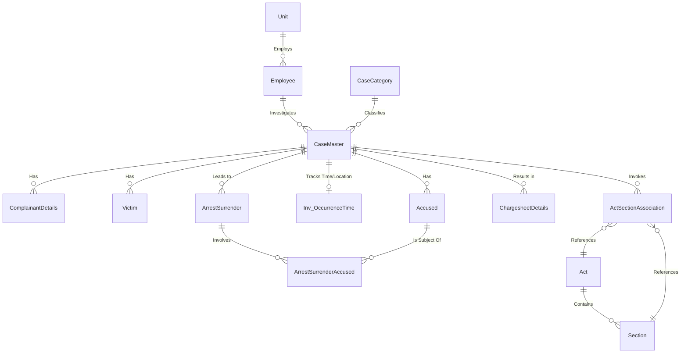

# 02 Target Data Model

The final schema is exclusively optimized for Zoho Catalyst Data Store constraints. 

## Key Architectural Decisions
1. **ROWID primary keys**: Catalyst automatically injects a `ROWID` (BigInt) primary key for every table. All Foreign Key relationships resolve to the parent's `ROWID`.
2. **Foreign Key Limitations**: Catalyst enforces a strict limitation on `Unique Foreign Key` columns per table on the free tier. Therefore, junction tables and highly connected entities use a raw `BigInt` fallback column mapped to the parent's `ROWID` when the limit is hit.
3. **Storage Abstraction**: Relational data (e.g., FIRs, Complainants, Alerts) goes to Data Store. Large blobs/text (e.g., PDFs, AI JSON traces) go to Stratus or NoSQL.

## Complete Schema Mapping
The precise 32-table table mapping is documented in `CATALYST_DATASTORE_SCHEMA_MAPPING.md`. It has been formally verified and deployed to Catalyst in previous sprints (see `CATALYST_SCHEMA_VERIFICATION_REPORT.md`).

## High Level Entity-Relationship Diagram

## Security & PII Rules
All fields containing identity information (such as `Name` and `Age` in the `ComplainantDetails`, `Victim`, and `Accused` tables) require application-level authorization layers. The direct database query mechanisms must restrict users from querying entities outside their assigned `UnitID` or `DistrictID`.
