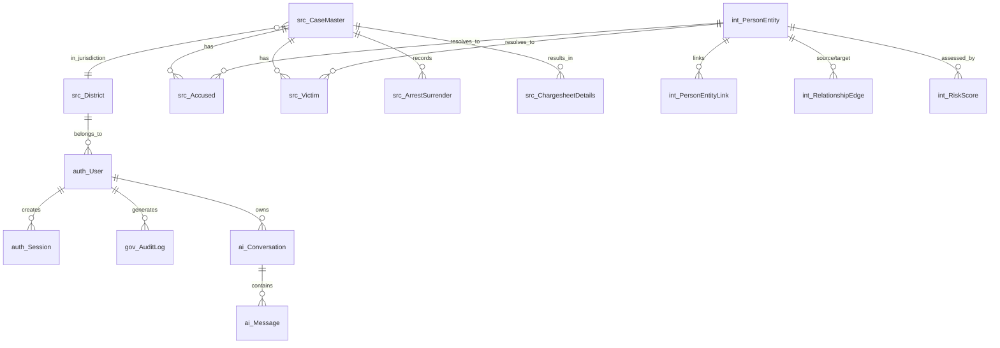

# 02 - Target Data Architecture

## Overview
This document describes the Target Data Architecture for the Berunda project, mapped to Zoho Catalyst Services.

### 1. Catalyst Data Store (Relational)
Used for structured, relational, highly-queried data.

**Auth & Users**
- `auth_User`
- `auth_Session`
- `auth_Permission`

**Source Data (FIRs)**
- `src_CaseMaster`
- `src_Victim`
- `src_Accused`
- `src_ArrestSurrender`
- `src_ChargesheetDetails`
- `src_Act`, `src_Section`, `src_CrimeHead`, `src_State`, `src_District`

**Intelligence (Graph/Geo)**
- `int_PersonEntity`
- `int_PersonEntityLink`
- `int_RelationshipEdge`
- `int_VehicleLink`
- `int_HotspotLayer`
- `int_AnomalyAlert`
- `int_RiskScore`

**AI Metadata & Audit**
- `ai_Conversation`, `ai_Message`, `ai_UsageRecord`
- `gov_AuditLog`, `gov_FairnessCheckResult`

### 2. Catalyst Stratus (File Storage)
Used for unstructured blob data:
- `FIR Scans (PDF)`
- `Crime Scene Images`
- `Uploaded Datasets for processing`
- `Generated Reports (PDF/CSV exports)`

*Note: References to Stratus Object IDs will be stored in Catalyst Data Store (e.g. `src_CaseMaster.FIRDocumentStratusID`).*

### 3. Catalyst QuickML
- `Knowledge Base Chunks` (Replaces `int_RAGCorpusChunk` relational table, handled natively by QuickML vector storage).
- `Prediction Models` for Anomaly Alerts.

### 4. Catalyst NoSQL / Cache
- **Cache**: Sub-graph traversals, dashboard aggregates, API rate limit counters.
- **NoSQL**: Webhooks, streaming geo-event payloads, temporary raw document ingestion logs.

---

## Entity Relationship Diagram

## Field Level Policies
- **Soft Deletes**: Must be implemented via `IsActive` or `DeletedAt` columns for all tables, particularly `auth_User` and `src_CaseMaster`.
- **Timestamps**: Every table must have `CreatedAt` and `UpdatedAt`.
- **Ownership**: Analytical and AI outputs must reference `UserID` to restrict access.
