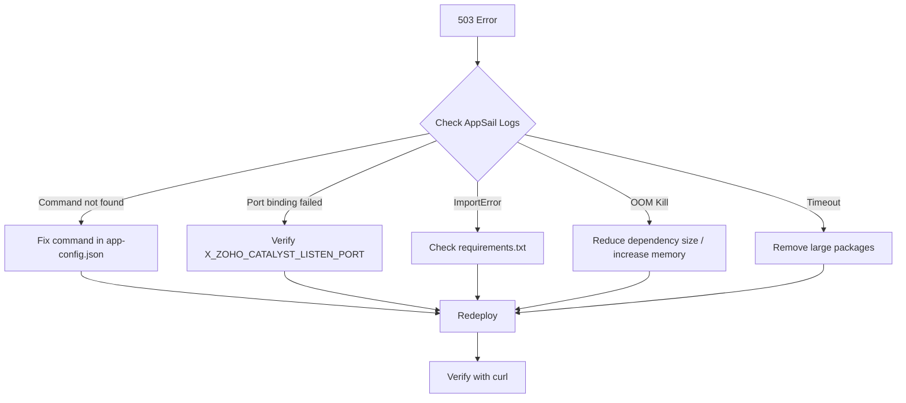

# Phase 11: Rollback, Recovery, and Operations Runbook

**Document ID:** BERUNDA-PHASE11-11
**Status:** APPROVED
**Date:** 2026-07-27
**Review Cycle:** Every deployment or environment change

---

## 1. Quick-Reference Decision Matrix

| Situation | Action | Document Section |
|---|---|---|
| Backend 503 persists > 2 hours | ROLLBACK backend to previous commit | §3.1 |
| Frontend broken after deploy | ROLLBACK frontend to previous dist | §3.2 |
| Data corruption in Catalyst Data Store | RESTORE from last known good snapshot | §4.1 |
| Complete environment failure | FULL DISASTER RECOVERY to local development | §5 |
| Need to restart from clean state | REBUILD from scratch on Catalyst | §6 |

---

## 2. Pre-Rollback Checklist

Before initiating any rollback, verify:

- [ ] **Current state documented** — Run `git log --oneline -3` and record HEAD commit.
- [ ] **Backend URL tested** — `curl https://berunda-api-50044292022.development.catalystappsail.in/` records current status.
- [ ] **Frontend URL tested** — Browser loads `https://project-rainfall-60079736152.development.catalystserverless.in/app/index.html`.
- [ ] **Changes backed up** — `git stash` or `git diff > ../rollback_patch_$(date +%Y%m%d_%H%M%S).diff`.
- [ ] **Defect register updated** — Any new issues logged in `09-PHASE-11-DEPLOYMENT-DEFECT-REGISTER.md`.
- [ ] **Stakeholders notified** — At least one team member aware of rollback action.
- [ ] **No active data migrations** — Confirm no Catalyst Data Store migrations are mid-flight.

---

## 3. Rollback Procedures

### 3.1 Backend Rollback (AppSail)

#### Prerequisites
- Catalyst CLI v1.27.0 authenticated as `arun1122007@gmail.com`
- Access to the repository at `D:\Hack2Skill\Berunda`
- Previous working commit identified (e.g., `cbf8ac8`)

#### Steps

```powershell
# Step 1: Record current state
Set-Location -LiteralPath "D:\Hack2Skill\Berunda"
git log --oneline -5 > logs/pre_rollback_commit_log_$(Get-Date -Format yyyyMMdd_HHmmss).txt

# Step 2: Stash any uncommitted changes
git stash push -m "auto-stash before rollback $(Get-Date -Format yyyyMMdd_HHmmss)"

# Step 3: Reset to previous working commit
git reset --hard cbf8ac8

# Step 4: Verify the code
python3 -c "import ast; ast.parse(open('appsail/berunda_api/main.py').read())"
Get-Content appsail/berunda_api/app-config.json | python3 -m json.tool

# Step 5: Redeploy to AppSail via Catalyst CLI
catalyst deploy:appsail --project 48591000000013025 --env 60079736152 --app berunda-api

# Step 6: Wait for deployment (2–5 minutes)
Start-Sleep -Seconds 120

# Step 7: Verify backend health
$response = Invoke-WebRequest -Uri "https://berunda-api-50044292022.development.catalystappsail.in/" -UseBasicParsing -TimeoutSec 30
Write-Host "Status: $($response.StatusCode)"
# Expected: 200 OK

# Step 8: Log rollback
$logEntry = @{
    Timestamp = Get-Date -Format "yyyy-MM-dd HH:mm:ss"
    Action = "ROLLBACK_BACKEND"
    FromCommit = "3d1ca28"
    ToCommit = "cbf8ac8"
    Status = if ($response.StatusCode -eq 200) { "SUCCESS" } else { "FAILED - $($response.StatusCode)" }
}
$logEntry | ConvertTo-Json | Out-File -FilePath "logs/deployment_rollback.log" -Append
```

#### Verification
```
curl https://berunda-api-50044292022.development.catalystappsail.in/
# Expected: {"service":"Berunda","version":"0.1.0","status":"running"}

curl https://berunda-api-50044292022.development.catalystappsail.in/health
# Expected: {"status":"healthy","version":"0.4.0","checks":{...}}
```

### 3.2 Frontend Rollback (Web Client)

#### Prerequisites
- Previous working `dist/` folder backed up (recommended before every deploy)
- Catalyst CLI authenticated

#### Steps

```powershell
# Step 1: Restore previous dist from backup
Copy-Item -LiteralPath "backups/web/dist_YYYYMMDD" -Destination "apps/web/dist" -Recurse -Force

# OR rebuild from previous commit
git checkout cbf8ac8 -- apps/web/
cd apps/web
npm install --frozen-lockfile
npm run build
cd ..\..

# Step 2: Redeploy frontend via Catalyst CLI
catalyst deploy:client --project 48591000000013025 --env 60079736152

# Step 3: Verify
# Navigate to https://project-rainfall-60079736152.development.catalystserverless.in/app/index.html
# Confirm "Berunda — Crime Intelligence Platform" loads
```

### 3.3 Full Environment Rollback (Backend + Frontend)

```powershell
# Step 1: Frontend rollback (see §3.2)
# Step 2: Backend rollback (see §3.1)
# Step 3: Restore environment variables to previous known-good configuration
# Step 4: Run smoke tests (see §7)
```

---

## 4. Recovery Procedures

### 4.1 Catalyst Data Store Recovery

**Note:** Catalyst Data Store does not provide automatic point-in-time recovery. Prevention is critical.

| Scenario | Recovery Method |
|---|---|
| Accidental row deletion | Restore from application-level audit log (`audit_logs` table in SQLite/Data Store) |
| Schema corruption | Re-run Alembic migration scripts from `appsail/berunda_api/src/alembic/versions/` |
| Full table loss | Re-seed from backup CSV in `data/synthetic/` or `data/raw/` |
| Data inconsistency | Manual reconciliation via audit log replay |

**Recommended Backup Schedule:**
- Daily: Export Catalyst Data Store tables to CSV/JSON via CLI or console
- Pre-Deployment: Full export before every `catalyst deploy:*` command
- Post-Recovery: Validate row counts match pre-deployment backup

**Backup Command:**
```powershell
# Catalyst Data Store export (via Catalyst Console or SDK)
# Manual process: Console → Data Store → Select Table → Export
# Automated: Use zcatalyst-sdk Python scripts (not yet implemented)
```

### 4.2 AppSail Recovery After Crash

If the AppSail container enters a crash loop:

1. **Access Catalyst Console** → AppSail → berunda-api → Settings
2. **Edit Startup Command** — Change to `python3 -c "print('health check'); import time; time.sleep(3600)"` for diagnostic mode
3. **Verify container starts** — Check Logs tab for `health check` output
4. **Incrementally fix** — Restore original command, check logs each iteration:
   - `python3 -c "import sys; sys.path.insert(0, '.'); from src.main import app; print('import OK')"`
   - `python3 -m uvicorn src.main:app --host 0.0.0.0 --port 9000 --log-level debug`
5. **Monitor memory** — If container OOM-killed, reduce dependency footprint

### 4.3 Frontend Recovery After Broken Deploy

1. **Cause identified** — Check browser console for JS errors, verify asset paths
2. **Hotfix** — Patch the specific file in `apps/web/dist/index.html` or JS bundle
3. **Redeploy** — `catalyst deploy:client`
4. **CDN Purge** — If cached, wait TTL or use Catalyst console to invalidate

---

## 5. Fallback to Local Development

If Catalyst deployment cannot be resolved in a timely manner, fall back to local development mode.

### 5.1 Local Backend Setup

```powershell
# Terminal 1: Backend
Set-Location -LiteralPath "D:\Hack2Skill\Berunda\appsail\berunda_api"
python3 -m venv .venv
.venv\Scripts\Activate.ps1
pip install -r requirements.txt
python3 main.py
# Listening on http://localhost:9000
```

### 5.2 Local Frontend Setup

```powershell
# Terminal 2: Frontend
Set-Location -LiteralPath "D:\Hack2Skill\Berunda\apps\web"
npm install
npm run dev
# Listening on http://localhost:5173 (Vite default)
# OR http://localhost:3000 (Create React App)
```

### 5.3 Local Database

The application uses SQLite by default:
- `appsail/berunda_api/berunda.db` — Main database
- `appsail/berunda_api/src/berunda.db` — Alternative path

No external database setup required. Alembic migrations run automatically if configured.

### 5.4 Proxy Configuration (Frontend → Backend)

Ensure the frontend dev server proxies API calls to localhost:9000:

```json
// apps/web/vite.config.ts (if using Vite)
{
  server: {
    proxy: {
      '/api': 'http://localhost:9000',
      '/health': 'http://localhost:9000'
    }
  }
}
```

OR update the API base URL in the frontend config to `http://localhost:9000`.

---

## 6. Full Environment Rebuild from Scratch

If the entire Catalyst project needs to be rebuilt:

### 6.1 Initialize Catalyst Project

```powershell
catalyst init --project 48591000000013025 --env 60079736152
```

### 6.2 Deploy Data Store Tables

Use `catalyst-template.json` to create 12 tables. Note: Catalyst does not support programmatic table creation via CLI; this must be done via Console UI or Catalyst SDK scripts.

### 6.3 Deploy Backend

```powershell
catalyst deploy:appsail --project 48591000000013025 --env 60079736152 --app berunda-api
```

### 6.4 Deploy Frontend

```powershell
catalyst deploy:client --project 48591000000013025 --env 60079736152
```

### 6.5 Configure Stratus (if needed)

```powershell
catalyst stratus:create --bucket berunda-evidence-bucket --project 48591000000013025 --env 60079736152
```

### 6.6 Configure Job Scheduler (if needed)

Via Catalyst Console → Scheduler → Create Job → `ai_batch_processor_job`

---

## 7. Post-Rollback Smoke Tests

After any rollback or recovery, run the following checks:

| # | Test | Command / Action | Expected Result |
|---|---|---|---|
| ST-01 | Frontend loads | Navigate to frontend URL | "Berunda — Crime Intelligence Platform" visible |
| ST-02 | SPA routing works | Click navigation links | URL changes, pages render |
| ST-03 | Backend root | `curl <backend-url>/` | `{"service":"Berunda","version":"0.1.0","status":"running"}` |
| ST-04 | Backend health | `curl <backend-url>/health` | `{"status":"healthy","version":"0.4.0","checks":{...}}` |
| ST-05 | Backend ready | `curl <backend-url>/ready` | `{"status":"ready","checks":{...}}` |
| ST-06 | API version | `curl <backend-url>/api/v1/status` | `{"api_version":"v1","environment":"development","status":"operational"}` |
| ST-07 | CORS headers | `curl -H "Origin: https://project-rainfall-60079736152.development.catalystserverless.in" -I <backend-url>/health` | `Access-Control-Allow-Origin` header present |
| ST-08 | Database | Check `berunda.db` row counts | Tables populated |
| ST-09 | Git status | `git log --oneline -1` | Correct rollback commit |

---

## 8. Operations Runbook — Common Scenarios

### 8.1 "Backend returns 503 after deploy"



### 8.2 "Frontend shows blank page"

1. Open browser DevTools (F12) → Console tab
2. Look for JavaScript errors (uncaught exceptions, syntax errors)
3. Look for 404s on JS/CSS assets (wrong base path)
4. Check Network tab — assets loading from correct URLs?
5. Fix: Rebuild frontend with correct `PUBLIC_URL` or `homepage` setting

### 8.3 "API calls from frontend fail with CORS error"

1. Verify CORS origins in `src/main.py` (line 295):
   ```python
   cors_origins = [o.strip() for o in settings.CORS_ORIGINS.split(",") if o.strip()]
   ```
2. Check `settings.CORS_ORIGINS` environment variable
3. Ensure frontend origin is in the comma-separated list
4. Redeploy backend after fix

### 8.4 "Database connection failed on startup"

1. Check if `DATABASE_URL` env var is set in `app-config.json`
2. If using Catalyst Data Store, ensure tables are created
3. If using SQLite locally, verify `berunda.db` exists and has proper permissions
4. Check `wait_for_db()` in `src/main.py` — it retries 5 times with 2s delay

---

## 9. Communication Templates

### 9.1 Rollback Notification

```
Subject: [Berunda] Rollback Initiated — Phase 11 Deployment

Action: Rollback of {component} from commit {from} to commit {to}
Reason: {brief description of issue}
Initiated by: {name} at {timestamp}
Expected downtime: {duration}
Verification: {verification steps}

Status update will follow after smoke tests.
```

### 9.2 Recovery Completion

```
Subject: [Berunda] Recovery Complete — Phase 11 Deployment

Action: Recovery of {component} completed
Previous state: {description}
Current state: {description}
Smoke test results: {PASS/FAIL} — see §7 for details
Next steps: {follow-up actions}
```

---

## 10. Document Revision History

| Version | Date | Author | Changes |
|---|---|---|---|
| 1.0 | 2026-07-27 | Deployment Team | Initial runbook — covers rollback, recovery, local fallback, smoke tests |
