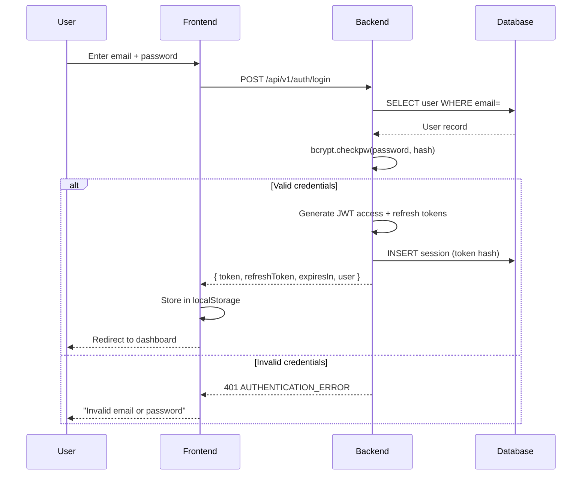

# Phase 2 — Authentication & Authorization

> **Document ID:** BERUNDA-SEC-005 | **Version:** 1.0 | **Status:** APPROVED
> **Classification:** INTERNAL | **Owner:** Berunda Team
> **Last Verified:** 2026-07-25

---

## Authentication Flow



## Token Lifecycle

| Token | Duration | Storage | Purpose |
|-------|----------|---------|---------|
| Access Token | 60 minutes | localStorage | API authorization |
| Refresh Token | 7 days | localStorage | Get new access token |

## Token Structure (JWT)

**Access Token Payload:**
```json
{
  "user_id": 1,
  "role": "admin",
  "district_id": 5,
  "type": "access",
  "exp": 1712345678,
  "iat": 1712342078,
  "jti": "uuid-v4"
}
```

**Refresh Token Payload:**
```json
{
  "user_id": 1,
  "role": "admin",
  "district_id": 5,
  "type": "refresh",
  "exp": 1712946878,
  "iat": 1712342078,
  "jti": "uuid-v4"
}
```

## Password Storage

- Algorithm: bcrypt
- Salt: auto-generated per password (gensalt)
- Hash format: `$2b$12$...` (12 rounds)
- Never stored in plain text
- Never logged

## Session Management

- Refresh tokens: stored in `auth_Session` table
- Token hash: last 64 characters of the refresh token
- On logout: `RevokedAt` is set (soft revocation)
- On refresh: old session revoked, new session created

## Authorization Enforcement

| Layer | Mechanism |
|-------|-----------|
| Router | `get_current_user` dependency extracts JWT |
| Router | `require_role(["admin", "analyst"])` for protected endpoints |
| Service | District-scoped queries for `officer` role |
| Frontend | ProtectedRoute component redirects to /login |
| Frontend | Role-based UI elements (optional display) |

## Role Model

| Role | Permissions |
|------|-------------|
| admin | Full access — CRUD all entities, user management |
| analyst | Read all cases, create cases, limited update |
| officer | Read own district cases only, cannot create |

## CSRF Protection

- JWT tokens stored in `localStorage` (not cookies)
- Bearer token sent in `Authorization` header
- No CSRF vulnerability because browser does not auto-send headers

## Known Limitations

1. Token rotation on refresh — old refresh token revoked, but if compromised within window, attacker can still use it once
2. No MFA — deferred to Phase 3
3. No brute-force protection — deferred to Phase 3
4. Frontend token stored in localStorage — accessible to same-origin XSS (mitigated by Content Security Policy)
